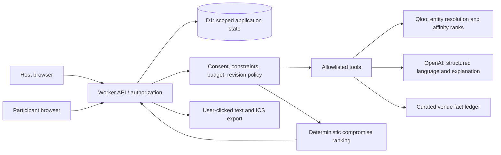

# Architecture and data contracts

This is an implementation specification, not an assertion that these files or services already exist. Provider contracts are verified in the [Qloo chapter](03-qloo-and-ranking.md); application interfaces below are our proposed design.

## System boundary

Use a single TypeScript repository: React + Vite for the web UI, a small Cloudflare Worker for API/tool execution, and Cloudflare D1 for application state. Serve built assets through the Worker. Use the OpenAI Responses API for constrained language handling when it materially helps. Use a bounded model/tool workflow for agent mode and a deterministic state machine for policy enforcement. A purely deterministic fallback is labeled guided planning; it does not substantiate the agent-mode demonstration.

Use ordinary HTTPS requests and polling only while a run is active. Avoid websocket servers, Redis, vector stores, Kubernetes, queues, and extra SaaS dashboards. Each operation has a deadline; network latency and Worker CPU are measured separately. Free-tier feasibility is an acceptance gate, not an architectural assumption.



## Proposed repository map

```text
apps/web/src/
  routes/                  # host, join, shortlist, review, export
  features/taste/           # search/disambiguation, consent
  features/planning/        # run state, cards, veto, revision
  features/feedback/        # optional outcomes and deletion
  components/              # accessible shared UI
  styles/                  # tokens, base, components
worker/src/
  index.ts                 # request router and security middleware
  auth/capabilities.ts     # scoped token mint/hash/claim/revoke
  auth/authorize.ts        # event and participant authorization
  db/repository.ts         # parameterized application queries
  providers/qloo.ts        # documented query allowlist and normalization
  providers/openai.ts      # schema-constrained language requests
  venues/facts.ts          # provenance and freshness policy
  planning/contracts.ts   # input/output schemas and domain types
  planning/constraints.ts # deterministic feasibility predicates
  planning/rank.ts         # disclosed rank-based compromise policy
  planning/machine.ts      # state transitions and revision checks
  planning/tools.ts        # named tool registry, permitted inputs
  planning/budget.ts       # atomic usage reservations and reconciliation
  export/ics.ts            # safe calendar generation
  privacy/delete.ts       # scope-aware removal and retention
  telemetry/events.ts     # redacted events and latency/cost counters
packages/contracts/       # shared runtime validation schemas
migrations/               # forward-only D1 migrations, rollback notes
tests/unit/               # ranking, constraints, calendar, budgets
tests/integration/        # authorization, providers, transitions, storage
tests/e2e/                # host/member real browser workflows
eval/                     # consented/private evaluation harness and reports
fixtures/synthetic/       # original, explicitly synthetic public test fixtures
scripts/                  # verification, redaction, release utilities
docs/                     # API, setup, privacy, rights ledger, operations
```

Choose and pin supported dependency versions at phase 06 after checking runtime compatibility. The plan deliberately does not invent future package version numbers. Commit the package-manager lockfile and use frozen installs in CI.

## Domain contracts

```ts
type ID = string;
type FactState = 'confirmed' | 'unknown' | 'conflicting' | 'expired';
type EventState = 'draft' | 'collecting' | 'ready_to_plan' | 'planning'
  | 'needs_input' | 'shortlisted' | 'approved' | 'failed' | 'deleted';
type RunState = 'queued' | 'discovering' | 'checking' | 'ranking'
  | 'explaining' | 'complete' | 'needs_input' | 'failed' | 'cancelled';
type VenueFact = {
  id: ID; venueId: ID; field: string; value: string | number | boolean | null;
  state: FactState; sourceUrl: string | null; observedAt: string;
  sourceKind: 'official_site' | 'host_confirmation' | 'qloo' | 'synthetic';
  expiresAt: string; note: string | null;
};
type Constraint = {
  id: ID; ownerId: ID; kind: 'budget' | 'radius' | 'time' | 'access'
    | 'dietary' | 'category' | 'veto';
  required: boolean; value: unknown; // narrowed by a discriminated runtime schema
};
type RankCell = {
  memberId: ID; venueId: ID; rank: number | null; slateSize: number;
  status: 'ranked' | 'missing' | 'opted_out';
  queryFingerprint: string; source: 'qloo' | 'explicit_preference';
};
type PlanInput = {
  eventId: ID; expectedVersion: number; memberIds: ID[];
  candidateVenueIds: ID[]; constraintVersion: number; policyVersion: string;
};
type PlanOutput = {
  revisionId: ID; eventId: ID; eventVersion: number;
  venueIds: ID[]; evidenceIds: ID[]; unknownFactIds: ID[];
  tasteMode: 'full' | 'mixed'; profiledMemberCount: number; totalMemberCount: number;
  readiness: 'ready_for_host_review' | 'needs_confirmation' | 'infeasible';
  mode: 'live' | 'synthetic_example';
};
```

Runtime validation restricts IDs, enums, lengths, numbers, and ownership. A TypeScript cast is not validation. Monetary values use integer minor units and an explicit currency. Times retain local datetime, IANA timezone, and resolved UTC; ambiguous/nonexistent daylight-saving times require a choice, not a silent conversion. Geographic values have latitude/longitude range validation and distances are labeled as straight-line radius, never travel time.

## State and tools

Use a durable run record with an event version, policy version, remaining budget, current stage, deadline, and last safe output. A step endpoint can execute at most two external requests and then persist the next state, only if the data-rights gate permits the required temporary state. No request holds an unbounded tool loop. The browser continues pending steps while the page is open; if the tab closes, the user resumes. We do not advertise unattended background completion without a deployed, verified scheduler.

The agent has seven tools: `request_missing_input`, `resolve_entities`, `discover_candidates`, `rank_common_slate`, `check_constraints`, `propose_revision`, and `prepare_handoff`. Tools receive typed IDs and validated inputs, not arbitrary URLs, SQL, or shell. In agent mode, the first bounded OpenAI round chooses an allowed tool intent from the current state: request specific missing information, start discovery, or propose a revision using existing evidence. The tool dispatcher executes the validated bounded pipeline. A second optional round reviews its output and proposes a permitted refinement or a grounded explanation. A model cannot invent missing data to make a state eligible. Store the visible action name and sanitized arguments, not private reasoning. Server policy authorizes and bounds every call. The same public function can have a deterministic caller for simple structured flows. Agent progress comes from actual successful stage transitions. At least one genuine schema-validated model tool choice is required for an agent-mode run and its demo trace. If OpenAI is unavailable, the labeled guided-planning fallback remains useful but is not presented as agent execution.

`prepare_handoff` creates a draft export object only after host authorization on the current version. It cannot send or book. `propose_revision` produces a proposal and diff, never an approved state. `check_constraints` is deterministic. The model cannot modify a constraint owner, consent status, budget ledger, or provider base URL.

For language calls, use strict function schemas/structured outputs, parse and validate refusals and incomplete responses, and cap output. Current official guidance distinguishes tool calls from final structured responses: [function calling](https://developers.openai.com/api/docs/guides/function-calling), [structured output](https://developers.openai.com/api/docs/guides/structured-outputs). Keep `OPENAI_MODEL` configurable; run a small quality/cost evaluation on models actually accessible to the user's account before pinning one. Do not assume the newest model is necessary.

## API surface

| Method and path | Authorization | Result / conflict semantics |
|---|---|---|
| `POST /api/events` | bounded anonymous creation or host session | New event, host session, hashed recovery capability |
| `POST /api/events/:id/invites` | host | One-time member claim link; expiry and rotation |
| `POST /api/claims` | valid unconsumed capability | Scoped session cookie; transaction consumes claim |
| `GET /api/events/:id` | participant/host | Role-filtered DTO; never raw DB row |
| `PUT /api/events/:id/brief` | host + expected version | Validated brief; increments version, invalidates approval |
| `PUT /api/events/:id/me/preferences` | participant + expected version | Own validated seeds, consent and constraints |
| `POST /api/events/:id/runs` | host, idempotency key | `202` run ID, or existing matching run |
| `POST /api/runs/:id/step` | host, step token | One bounded stage; `409` if revision stale |
| `GET /api/runs/:id` | event member | Redacted stage/result; active poll only |
| `POST /api/events/:id/vetoes` | participant | Own veto, version increment and approval invalidation |
| `POST /api/events/:id/acceptances` | participant, selected venue and exact revision | Own acceptance; invalidated by material change |
| `POST /api/events/:id/approve` | host, exact revision | Approves only current eligible result |
| `GET /api/events/:id/export` | host | Current approved or explicitly tentative export |
| `POST /api/events/:id/feedback` | participant/host | Role-scoped event feedback |
| `DELETE /api/events/:id/me` | participant | Deletes own inputs, revokes session and affected derived state |
| `DELETE /api/events/:id` | host | Deletes event and derived records; scoped cascade |

Standard errors have `{code, message, retryable, requestId}`. Never return a provider key, raw query, stack trace, another member's input, or unfiltered vendor payload. Return `429` for application quotas, `503` for provider unavailability, `409` for stale state, and `422` for actionable invalid input. Do not tell an unauthenticated requester whether a guessed private event exists.

## D1 model

Tables: `events`, `participants`, `sessions`, `claims`, `consents`, `preferences`, `constraints`, `venues`, `venue_facts`, `runs`, `revisions`, `vetoes`, `acceptances`, `approvals`, `feedback`, `usage_reservations`, `usage_daily`, `audit_events`. Use random opaque primary keys, event ownership keys, timestamps, and version numbers. Child queries always scope by event as well as row ID. Use foreign keys and explicit indexes on event/state/expiry query paths; use prepared statements.

`revisions` stores only permitted normalized output. Raw Qloo responses and rank cells are not persisted by default. Required temporary processing, normalized-result retention, entity identifiers, evidence display, and public demo rights must be resolved in phase 03. If authorization is insufficient, redesign within the allowed data contract or stop the affected path; do not hide a cache in browser storage. Preserve our policy version, timing, call count, and request hash without treating a hash as automatic permission to retain vendor data.

A proposed privacy default is event data expiry 30 days after the outing and transient run output expiry after 24 hours, **only if provider terms allow it**. These are maxima, not entitlements. Cross-event preference reuse is off by default. Synthetic fixtures are authored by us and contain no copied proprietary Qloo response.

## Authentication without paid SaaS

For a small pilot use scoped capability sessions, not a custom password system. Generate at least 32 random bytes for secrets; store hashes only. Set HttpOnly, Secure, SameSite cookies; check Origin on state-changing requests; use CSRF protection; rotate and revoke tokens. Place initial claim secrets in a URL fragment, exchange once through a POST, then erase the fragment and set `Referrer-Policy: no-referrer`. Do not load third-party scripts on claim pages. A copied capability grants access; this is a known limitation, addressed by expirations, single-use claims, and rotation.

Host recovery is an explicit recovery code saved by the host. Losing it can mean losing access; do not imply email recovery exists. Introduce stronger identity later only if pilot needs justify it. Never expose the host capability in participant invitation URLs. Public synthetic mode and real event tables remain separate.

## Concurrency, cost, and failure

Use idempotency keys and optimistic version checks. Atomically reserve provider-call and token budgets before executing. A run cannot spend a quota slot twice on retries; each attempted request counts. Refunding unknown network outcomes is unsafe: keep the reservation charged until reconciled. Rate limits must be global/per-event/per-session, not only a Worker in-memory counter that resets on another isolate.

Store deadlines and refuse stale work. Cancel prevents new outbound calls; an in-flight request may still finish and incur cost. Cap provider retries and backoff with jitter within the remaining deadline. `401/403` are configuration/access failures, not retry loops. Schema drift and omitted candidate rows are explicit failures or missing evidence. A policy-valid partial result can be shown with the missing stage disclosed.

Only admin-maintained venue URLs are evidence links. The MVP does not let a model fetch arbitrary participant URLs. This removes an avoidable SSRF and prompt-injection surface. Treat venue text as untrusted data; strip instructions and never execute embedded commands. Escape all content rendered as HTML and all calendar text.

## Privacy and observability

Log request ID, stage, status, duration, provider count, token usage, policy version, and redacted error code. Do not log names, raw taste lists, full URLs containing query seeds, keys, participant objections, or medical information. Default OpenAI calls to `store:false` and send only the minimum normalized content. This is not a zero-retention guarantee; abuse-monitoring and other provider rules still apply ([OpenAI data controls](https://developers.openai.com/api/docs/guides/your-data)).

The run trace shown to judges should demonstrate tool names, inputs in anonymized form when permitted, results counts, decisions, revisions, and actual durations. It must not expose private chain-of-thought. Public operational dashboards use aggregate counts with small-cell suppression; raw participant matrices remain private.

## Architecture decisions and reversal triggers

| Decision | Why now | Revisit when |
|---|---|---|
| Single Worker + D1 | Minimal moving parts and free infrastructure | Measured CPU/transaction requirements cannot fit after scope reduction |
| Capability sessions | Avoid paid auth/email and password risk for small pilot | Account recovery, enterprise SSO or identity assurance becomes a buyer requirement |
| Curated venue ledger | Makes practical claims auditable in one city | Maintenance time or geographic demand justifies a licensed facts provider |
| Deterministic compromise | Testable tradeoffs and honest uncertainty | Human studies justify a more complex policy |
| OpenAI only for language | Bound cost and separate affinity from storytelling | A benchmark proves more autonomous tool choice improves outcomes |
| Manual approved handoff | Avoid unavailable booking APIs and premature operations | Customers demand booking and authorized inventory/payment integrations exist |

A provider adapter gives code portability, not equivalent replacement data. If Qloo access disappears, the cultural-value proposition is blocked; generic suggestions cannot honestly preserve the same claim.
