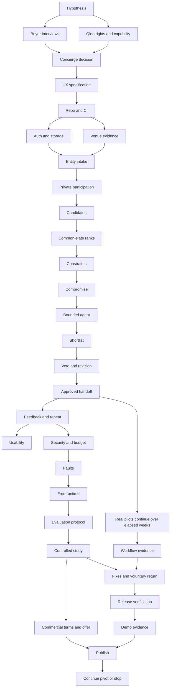

# Eight-week roadmap and dependencies

The canonical work items are the 32 files in [phases](phases/README.md) and the machine-readable [phase manifest](phases.json). Every phase is initially **planned**. This plan is not a status report claiming implementation has started.

## Capacity assumptions

One founder, 30 hours/week, eight weeks: 240 hours available. Planned work is 24 hours/week, totaling 192. Hold six hours/week, 48 total, for integration, interview rescheduling, provider delays and defects. Estimates are rounded planning judgments. Elapsed wait for a key or customer can exceed the reserved work hours; dependencies still matter.

Research and engineering role labels refer to one person's responsibilities. Optional parallel helpers can shorten independent research, but they do not remove founder obligations, provider waiting, or customer availability. Do not run four unrelated product implementations at once and assume their integration is free.

| Week | Phases | Planned hours | Demonstrable outcome | Decision gate |
|---|---|---:|---|---|
| 1 | P01–P04 | 24 + 6 reserve | Specific buyer, interviews, live Qloo spike, manual real-group plan | Pain, pilot access, data rights and capability are credible enough to build |
| 2 | P05–P08 | 24 + 6 reserve | Usable design, reproducible repo/CI, scoped sessions, venue evidence ledger | Private member data is protected; venue identity/evidence is reliable |
| 3 | P09–P12 | 24 + 6 reserve | Members join and submit confirmed seeds; candidates/rank matrix are real | Qloo coverage and common-slate comparison meet disclosed thresholds |
| 4 | P13–P16 | 24 + 6 reserve | Constraint-aware bounded agent with meaningful shortlist | No hard-constraint bypass; no fake probability or explanation |
| 5 | P17–P20 | 24 + 6 reserve | Veto/replan, approval/export, feedback, polished mobile flow | Start exploratory alpha pilots after P18; cold users can complete the task |
| 6 | P21–P24 | 24 + 6 reserve | Hardened public trial, fault recovery, measured free-runtime fit, frozen eval | Privacy, quotas and credible baseline ready before broad measurement |
| 7 | P25–P28 | 24 + 6 reserve | Controlled comparisons, workflow observations, offer/economics tests | Qloo value, repeat use and commercial path pass or remain honestly unresolved |
| 8 | P29–P32 | 24 + 6 reserve | Verified hosted release, public source, demo and decision memo | Release quality and startup evidence are evaluated separately |

## Critical path and overlap

The machine-readable manifest includes additional dependencies omitted from this overview for readability. P03 and P02 can advance in parallel; the same founder allocates time between them. Venue sourcing can continue while interviews wait. A pilot cannot be scheduled retroactively in week seven; recruit in week one and begin the exploratory alpha path after week-five P18. Formal comparative enrollment starts only after P24 freezes the protocol; early alpha results are not pooled into that analysis. Continue interviews toward 12 hosts and recruitment toward 12 independent groups throughout, within the reserved and pilot hours.

A scheduled repeated study event does not prove voluntary retention. The voluntary-return gate asks for a later event initiated without a mandatory study instruction. That observation may require more elapsed time than eight weeks; report it as unvalidated if so. Do not pad the sample with additional ratings from the same four people.

## Release levels

**R0, end week one:** evidence memo and manual concierge example. Not a product or validated business.

**R1, end week three:** scoped participants plus real candidate/rank evidence. Not safe to call a completed venue plan.

**R2, after P18:** end-to-end alpha for supervised consenting pilots. Approval/export works; public hardening still follows.

**R3, after P24:** bounded public beta candidate with hardening and pre-registered evaluation. Claims of Qloo superiority still wait for results.

**R4, week eight:** reviewed public release and evidence packet. A startup continuation decision is separate from whether software shipped.

## Cuts if reality consumes the reserve

Cut in this order: optional OpenAI prose; optional explainability enhancements; custom imagery/animation; advanced cross-event fairness; extra cultural input categories beyond the tested ones; alternative venue categories; secondary analytics; optional walkthrough video. Keep one city, the existing-group workflow and simple copy/ICS handoff.

Never cut consent, access control, hard constraints, honest missing-data states, the Qloo ablation, actual live integration, usage caps, or source/rights verification while retaining the corresponding claims. If the remaining core no longer fits, extend the hypothetical horizon or explicitly reduce the release level.

At 15 founder hours/week, the 240-hour assumption is wrong. An approximately 120-hour track should target an alpha with one host-owned venue pool, no natural-language agent input, one participant flow, deterministic explanations and a smaller exploratory evaluation. It cannot inherit the full plan's completion or ≥9 expectations.

## Daily operating cadence

Begin with the current gate and one observable outcome. Spend focused time on the smallest deliverable that advances it. End by running the relevant verification, recording evidence and failures, and updating phase status. Keep a maximum of one engineering phase and one waiting research thread in progress. Avoid polishing screens while the key or buyer hypothesis is failing.

A phase status is one of planned, in_progress, blocked, complete, or stopped. Completion requires every mandatory AC to have a passing record. A changed scope or failed experiment creates a decision record, not erased history. A provider request remains pending until answered; elapsed time is not permission.
