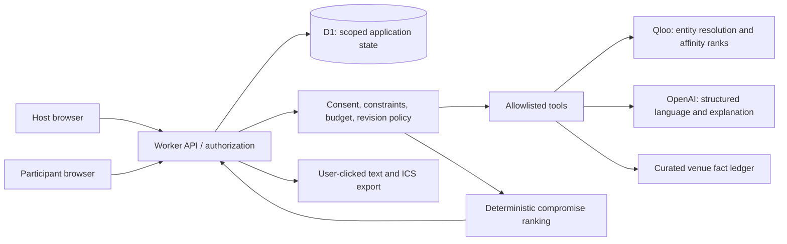
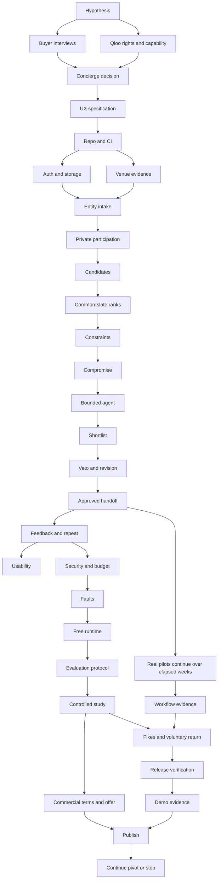

# Common Ground

## End-to-end startup and hackathon plan

Prepared 3 October 2026. Eight hypothetical weeks. All implementation phases remain planned. See README for navigation.


---

# Common Ground: the decision to test

Planning date: 3 October 2026. Horizon: eight relative weeks, as requested. Status: researched proposal; no product, customer interviews, live API tests, or revenue exist yet.

## Recommendation

Build **Common Ground**, a venue-planning agent for independent hosts of recurring paid local dinners and cultural outings. It helps a host choose somewhere a small, already-formed group can agree to go, explains the tradeoffs, handles a veto, and prepares the host's final event handoff.

The first customer is an organizer who runs at least two outings a month, regularly chooses external venues for four to eight adults, already earns revenue or controls an event budget, and can introduce consenting participants. These are recruitment criteria, not a description of a market that has already been measured. Start with one accessible city; New York City is the planning assumption, not evidence about the founder's location or customer access.

Participants privately select up to three favorite artists, films, books, or places. Qloo connects those cultural signals to real venue candidates. Common Ground compares the same shortlist for each participant, applies practical requirements, presents three distinct compromises, and asks the host to confirm the choice. A participant can object without disclosing their private taste profile to the group. The agent then revises the slate and says exactly what changed.

**The promise to test:** “Get your next small-group outing agreed, with less back-and-forth and fewer people settling for a venue they dislike.” This is positioning, not a verified performance claim.

## Why this direction

The cultural problem is visible and testable: individual preferences can differ across domains; a restaurant star rating or a generic prompt may miss that. The business problem is recurring: the host repeats the planning workflow. The product can demonstrate a complete agent loop in a few minutes: gather signals → call Qloo → apply constraints → explain → receive objection → replan → prepare an approved handoff.

The idea also has serious competition. Duddle already used Qloo for group restaurant decisions. Timeleft and 222 already combine people, restaurants, and group experiences. We are not claiming to have invented group recommendations, group matching, or taste-aware dining. The proposed difference is an organizer-controlled workflow for existing communities, with private inputs, explicit uncertainty, repeatable revision, and measured outcomes. That difference might be too small; the first week is designed to find out. See [the competition analysis](01-opportunity-and-competition.md).

We rejected a general travel planner as the default because of obvious prior art and broad operational dependencies. Boutique-hotel personalization has an identifiable buyer but stronger integration and sales friction. Venue audience development could become a bigger business but requires attribution, historical demand data, and customer access that we do not have. Medical or medication-aware recommendations introduce factual obligations Qloo affinity does not satisfy. Consumer lighting recommendations risk making Qloo decorative relative to room geometry and product specifications.

## What makes Qloo essential

The mechanism under test is Qloo's cross-domain ranking of a common venue slate from each participant's voluntarily provided cultural seeds. The LLM proposes bounded next actions and handles structured language and succinct explanations; it does not invent affinities, invent venues, or decide whether a safety-critical practical requirement is satisfied.

Removing Qloo must measurably reduce human-rated venue fit or increase time to a satisfactory decision when everything else is held constant. If the Qloo-free baseline does just as well, the central hypothesis fails. We will not rescue the pitch by showing Qloo-generated scores as proof that Qloo works.

## What we will ship in eight weeks

1. A responsive public web demo with an honest synthetic walkthrough and a bounded live path.
2. A host flow for four to eight participants, up to three confirmed seeds each, one city, and one outing at a time.
3. A small source-backed venue catalog plus Qloo candidate discovery and ranking, subject to verified coverage and data rights.
4. Three feasible alternatives, private vetoes, revision history, and host approval.
5. A copyable event summary and downloadable calendar file; the host sends invitations and makes any reservation.
6. An auditable provider trace, bounded usage, access controls, meaningful CI, and replayable failure cases.
7. A small, pre-registered human comparison and real pilot evidence, with honest uncertainty.
8. A public repository with source code, appropriate open-source license, setup instructions, and documentation that excludes proprietary data and personal records.

## What must be proven before deeper investment

| Gate | Evidence required | Consequence of failure |
|---|---|---|
| Customer | At least three qualified hosts agree to test an actual upcoming outing; understand their existing workaround | Change the customer or stop, before polishing software |
| Qloo capability | Approved key; intended seed types and local places work; candidate-filtered rankings behave as documented | Narrow the city/domain or stop this concept |
| Data and access rights | Clarify demo display, processing/storage, judging access, and whether commercial use needs another agreement | Keep work within confirmed rights; no paid service without permission |
| Incremental value | Human evaluation favors Qloo on the pre-registered primary metric, with no practical-constraint regressions | Investigate signals; pivot or reject if a second controlled iteration still fails |
| Recurrence | Hosts use the workflow again for a different event | Reconsider subscription and ongoing product value |
| Commercial path | Budget-owner intent and acceptable provider economics; actual payment only if terms permit | Do not call it a validated startup |

All numeric thresholds here and elsewhere are proposed decision rules, not external facts or accomplished results.

## The score constraint

The exact “rate my startup” skill was not found in the available local catalogs or the public source searches documented in the research. A transparent replacement rubric is provided in [the score and validation chapter](06-startup-score-and-validation.md). It does not masquerade as that skill. A 9/10 score is a graduation target, conditional on evidence; no responsible analysis can guarantee either that score or a hackathon win today.

## Scope and capacity

Assume one technical founder, 30 hours a week for eight weeks: 240 hours. The schedule assigns 192 hours to 32 concrete phases and keeps 48 hours as contingency, six hours each week. This is an estimate, not a promise. Recruitment and provider approval may take elapsed days even when they consume little engineering time. The same founder owns product, engineering, interviews, and launch; the role labels in the plan are hats, not imaginary employees.

At 15 hours a week, use the cuts in the roadmap or extend the calendar. Do not pretend automation doubles available founder time. The core deadline is the user's hypothetical week eight; the actual hackathon calendar is recorded separately in the release chapter so the two are not confused.

## Start here

Read the opportunity and validation chapters before architecture. Run the first-week customer and Qloo probes before committing to a full build. The smallest meaningful evidence is a real host, a real upcoming group decision, two comparable slates, and an honest record of which one the people prefer.


---

# 01 — Opportunity and competition

Decision: use **Common Ground** as the working hypothesis for an eight-week build. It is a taste-aware planning agent for independent paid local dinner/cultural communities that already choose outside venues for opt-in groups of 4–8. We have desk evidence that the workflow exists. We do not yet have evidence that buyers need another tool, will pay for one, or that Qloo improves their choices.

Research date: October 3, 2026. No interviews or outreach have been conducted. See [the detailed research and source ledger](research/opportunity-research.md) for evidence types and alternative wedges.

## Exact initial customer

An owner/operator or authorized community host who:

1. Already hosts at least two outside-venue dinners or cultural outings monthly.
2. Regularly selects among venues for 4–8-person groups supplied by their own community.
3. Has event/membership revenue or an explicit operations budget.
4. Can show recent planning decisions and recruit an opt-in pilot group.
5. Can approve a plan and carry out the booking/handoff themselves.

These are selection criteria, not observed market facts. Start in one compact catchment. NYC is a provisional assumption based on observed operators; use a different city if the founder has stronger access there. Coworking is eligible only when an operator passes these criteria. A coworking manager who mostly hosts events at their own space is a poor initial target.

The customer supplies an already formed group. We do not infer personalities or match strangers. We do not supply the audience, replace ticketing, promise inventory, or execute reservations in the initial product.

## The job and the proposed offer

“Help me choose an outside venue that this group can actually use, understand the tradeoffs, and finish the plan without another long round of individual messages.”

The host creates an outing and sets location, time, group size, budget, explicit needs, and a candidate pool. Guests optionally submit a few cultural seeds and explicit vetoes. Qloo supplies cross-domain venue orderings. The agent checks required facts against curated official sources, flags uncertainty, compares candidates, explains compromises, requests useful missing information, and replans when a guest vetoes or a source invalidates a candidate. The host approves the final handoff.

No available source means “unverified,” not “satisfied.” A menu, accessibility statement, or opening-hours page cannot prove table availability. Important constraints lacking adequate evidence require host verification before approval. Preference inference cannot establish diet/allergy safety, accessibility, willingness to spend, or interpersonal compatibility.

An initial commercial experiment can offer a time-saving planning pilot to the operator. Any price proposed during discovery is an experimental offer, not a researched market-clearing price. Do not use hypothetical enthusiasm as willingness to pay.

## Why this hypothesis, with its limits

[table for one(s)](https://forones.co/) advertises recurring Thursday/Sunday NYC dinners for 4–6 people at named restaurants, with observed prices of $50/$65. [Table 315](https://www.table315.com/) operates monthly 4–6-person dinner tables across restaurants. Its monthly cadence fails our frequency screener, but it confirms that independent operators organize this format. [New York Dinner Club's listing](https://www.meetup.com/meetup-group-yyedoizw/) also describes small local groups.

These pages establish observable services. They do not establish planning pain, profits, customer numbers, SaaS budgets, or repeat-member behavior. Some operators may use a fixed set of venues and care primarily about filling seats. That would kill the proposed planning wedge.

| Candidate | Qualitative assessment under eight-week, solo-founder constraints |
|---|---|
| Paid local dinner/cultural-community hosts | Selected as most directly testable: repeat external venue job, named potential buyer, opt-in data collection possible. Budget and Qloo lift unknown. |
| Independent cultural venue audience development | Clear sector pressure, but a cultural insight does not create a reachable audience. Needs campaign/channel access and enough time to measure sales. |
| Boutique hotel group concierge | Concrete named buyers of software, but Mindtrip already serves the exact small-team concierge job. Integration and procurement could exceed the build window. |
| Arts/event sponsorship prospecting | Clear revenue job and plausible cross-domain brand relevance. Contact access, budget/timing signals, seasonal demand, and established competitors weaken a free-data-only approach. |
| Coworking offsite outings | Real community-programming work, but often the venue is already their property. Keep only screened offsite operators. |

Original sector research supplies context: [NIVA's 2025 study](https://www.nivassoc.org/stateoflive) examines independent live entertainment economics, while [Wallace/University of Texas](https://wallacefoundation.org/report/search-magic-bullet-results-building-audiences-sustainability-initiative-results-building) shows audience-building is complex and slow. Neither proves demand for our product. [Mindtrip's hotel page](https://mindtrip.ai/business/hotels) includes a named small-hotel-team customer testimonial; it is vendor-selected evidence, not an independent outcome study. [Greater Manchester Chamber](https://manchester-chamber.org/taco-tour-manchester-2025-date-announced/) documents sponsorship activity; [SponsorPitch](https://www.sponsorpitch.com/how-it-works) supplies contacts and sponsorship intelligence we cannot assume are freely available.

## The serious competitors

- **[Timeleft](https://timeleft.com/dinners-with-strangers/):** already handles matching, restaurants, booking, and recurring social dinners. Its [current description](https://timeleft.com/blog/how-does-timeleft-work/) includes group and partner-venue selection. Our operator tool must prove a benefit to communities that retain their own members and operating model.
- **[222](https://partners.222.place/):** says it uses AI to match groups of six to restaurants, integrates Resy/OpenTable, sells experiences, and charges partners by checked-in guests. This is a particularly strong substitute because it promises customer flow/revenue. A planning tool that saves a few minutes may lose to a platform that fills the restaurant.
- **[Duddle](https://devpost.com/software/duddle):** prior Qloo hackathon product combines participants' preferences, group restaurant recommendations, and Claude explanations. This means the core taste-to-group-venue demo is already prior art.
- **[Partiful](https://partiful.com/ticketing) and [Meetup](https://help.meetup.com/hc/en-us/articles/39790436736525-Creating-an-event):** already provide substantial organizer operations. [Partiful collects guest answers and polls times](https://help.partiful.com/en-us/articles/15525422-can-i-poll-or-survey-my-guests). Complement existing event links instead of rebuilding RSVP, communications, or payments.
- **[Mindtrip](https://mindtrip.ai/business/hotels) and [Wanderlog](https://help.wanderlog.com/hc/en-us/articles/4625495771163-Add-friends-to-plan-together):** cover hotel concierge/trip planning and collaborative itinerary workflows. Do not pitch generic group travel.
- **[Qloo itself](https://www.qloo.com/capabilities/taste-analysis):** markets group activities and taste inference; its [recommendations offering](https://www.qloo.com/capabilities/recommendations) covers travel and events. A generic interface around Qloo is not an independent business moat.

Potential differentiation is an operator-owned workflow: traceable feasibility checks, explicit guest vetoes, accountable compromises, repeat-group preference history, replan actions, and a reviewable host handoff. This is a proposition to test. Competitors can add features, and software policy alone is weak defensibility. A later advantage would require sustained operator relationships and consented evidence about which planning decisions work—not a claim to own Qloo's graph.

## Qloo must earn its place

Run the same groups, candidates, constraints, verification process, and explanation quality through:

1. The host's current shortlist/process.
2. Explicit venue preferences plus a competent LLM or simple ranker.
3. The same workflow with Qloo cultural signals.

Collect guest choices before showing persuasive explanations where practical. Compare planning time, feasible candidates, guest completion, host acceptance, veto/replan cycles, and blind shortlist preference. Inspect failure reasons rather than collapsing everything into one flattering score.

Qloo scores/ranks are recommendation evidence, not calibrated happiness or compatibility probabilities. Aggregate ordinal choices transparently. “Minimize repeatedly giving a member their worst option” is a proposed policy; do not claim it improves fairness, attendance, retention, or satisfaction without measurement.

If option 2 performs equally well with less guest friction, Qloo is not indispensable for this workflow. Do not keep it as a decorative API call just to qualify for the hackathon.

## Ready-to-use discovery script

Ask about recent behavior before introducing Common Ground. With permission, examine screenshots, calendars, and actual planning artifacts. Avoid leading questions and requests for unnecessary personal guest information.

1. What kinds of paid/member outings did you run in the last 30 days, and how many involved choosing an outside venue?
2. Walk me through the most recent one: who was coming, how big was the group, and what decision did you have to make?
3. Which venues did you consider, and how did you find them? How often do you simply reuse the same places?
4. How much time did that choice take, including messages, checks, changes, and booking work? Can we reconstruct it from what you sent?
5. What were the hardest non-negotiable requirements, and how did you verify them?
6. When did someone reject a plan recently? What was the reason, and what happened next?
7. How do you know what guests want today? What questions do they actually answer, and what gets ignored?
8. How much does choosing a better venue matter compared with getting attendees, pricing, timing, and handling no-shows?
9. Which software or paid services do you use for this work? Who chose them, pays, and can approve an additional purchase?
10. Have you tried delegating venue research or using AI, polling, Timeleft/222, or another tool? What happened in the last attempt?
11. If we helped plan your next real outing, what information could you and guests voluntarily provide, and what result would make you use it again?
12. After showing a concrete relevant example: would you commit the next outing to a pilot, introduce the budget approver, or pay for an agreed planning service? What would block that commitment?

Do not interpret a “yes” to interest as a purchase. Record exact objections, existing costs, actual pilot dates, and the approval process.

## Seven-day falsification plan

The thresholds below are **proposed go/no-go rules**, not researched market norms. Set them before reviewing results. This document authorizes no outreach; the founder conducts or explicitly authorizes it separately.

| Day | Work | Evidence/artifact |
|---|---|---|
| 1 | Find 15 local operators from official event pages; apply the screener. Choose a catchment based on access. | Source-linked list, reason each qualifies/fails. If fewer than five plausible reachable operators qualify, reconsider city or customer. |
| 2 | Founder conducts/authorizes invitations to discovery; prepare two manual planning examples from official venue sources. | Concrete brief, source timestamps, uncertainty notes. No claimed availability. |
| 3 | Conduct behavior interviews with qualified operators, aiming for five completed over the week. | Last-three-outings evidence, time/rework, current alternatives, buyer/budget map. |
| 4 | Run manual planning on a real upcoming group for willing operators. Ask for actual opt-in preference submissions. | Submission/abandonment count, usable seeds, host candidate pool, hard constraints. |
| 5 | Compare the three evaluation arms on identical candidates; get blind guest/host choices. | Raw preferences and feasible-plan comparisons, including failures. No significance claim from tiny samples. |
| 6 | Present an approved-plan artifact and a clearly experimental commercial offer. Seek next-outing/date and payment/approver commitment. | Actual commitment or rejection; avoid projected revenue. |
| 7 | Review the predefined gates and choose continue/change/stop. | One-page evidence memo with counterexamples and remaining assumptions. |

**Continue only if:** at least three of five qualified interviews substantiate recurring planning/rework pain with a recent artifact, at least three operators commit a real next outing and can recruit opt-in guests, at least one takes a meaningful commercial step (a dated nonbinding exact-offer or budget-approver commitment; no payment or deposit before Qloo commercial rights are confirmed), and Qloo supplies useful shortlist differences that survive constraints and are preferred in the pilot comparisons. An approver commitment is weaker evidence than payment and should be reported as such.

**Stop or change if:** venues are nearly fixed; acquisition/no-shows dominate; groups will not submit signals; sources cannot verify essential constraints; manual vetting consumes all saved time; hosts want automatic inventory/booking as a prerequisite; or the explicit-preference baseline works as well. A failed test is a useful result. Do not redefine thresholds after seeing weak evidence just to preserve the idea.

At day seven, Qloo pilot comparisons can only be exploratory. Larger repeat-group tests are needed before any claim about general preference lift or attendance. If operator access is not secured, label the eventual hackathon demo as a prototype hypothesis and do not present synthetic groups as customers.


---

# Product specification

**Product:** Common Ground. Working name only; trademark/domain availability has not been researched. **Version:** proposed v0.1. **Product goal:** help a recurring host bring a known small group to a practical venue decision, using Qloo where it adds cultural signal.

## Product invariants

- The host chooses the people and the occasion. We do not match strangers or rank people.
- Participants are adults and opt in. They can skip cultural profiling and provide explicit practical preferences instead.
- A taste signal is a voluntary preference, not a personality, demographic, health, political, religious, or spending-power inference.
- Hard requirements are evaluated before taste ranking. An unknown requirement is not a passed requirement.
- Qloo affinities are ranking signals, not enjoyment probabilities or verified descriptions of an individual.
- Every current claim about a venue has a source, an observation time, and an uncertainty state.
- No tool places a reservation, charges money, contacts a venue, sends an invitation, or changes a calendar.
- A changed member, constraint, venue fact, or candidate slate invalidates the previous approval.
- No success metric can be satisfied solely by values generated by Qloo or an LLM.
- No non-OpenAI paid dependency is required for the planned prototype; Qloo access is conditional on the event program and its terms.

## Roles and permissions

| Role | Can do | Cannot see/do |
|---|---|---|
| Host | Create outing; invite participants via copied links; set date/area/budget; see aggregate alternatives; choose and approve; export | Read other participants' private seeds, reveal individual objections, infer identity from a taste matrix |
| Participant | Edit own seeds and explicit requirements; review own compatibility view; submit an objection; delete own inputs | Read another person's profile; approve as host; fetch another event by changing an ID |
| Operator/founder | Maintain verified venue facts; inspect redacted failures and aggregate costs | Browse raw member profiles as routine analytics |
| Public judge/visitor | Open a clearly labeled example; create a bounded trial when capacity is available | Consume unlimited provider calls; mistake example output for live evidence |

The host sees “one requirement needs confirmation,” not “Sam has an allergy” or “Alex dislikes your favorite place.” With four people even aggregates can reveal identity; the UI warns participants that a small group cannot guarantee anonymity. No individual ranking matrix is shown to the host. Individual views show only the viewing participant's inputs and results.

## First-session journey

**1. Create the outing.** The host enters a title, four to eight participant slots, a single date/time with timezone, a neighborhood or approved central point, a maximum radius, currency and per-person budget, and one venue category. Date polling, multi-stop route planning, multi-city trips, and ticketed-event inventory are excluded. Budget must identify whether tax, tip, and drinks are included; unknown all-in totals remain unconfirmed.

**2. Share private participation links.** The app creates one-time claim links; the host copies them into an existing channel. The host never receives raw participant credentials after they are claimed. Joining produces a scoped participant session. Links are capability credentials, not verified identities; that limitation is disclosed. For an unattended public trial, use short expiration and a strict creation budget.

**3. Collect taste and constraints.** Each participant selects up to three Qloo-resolved favorite entities. The interface shows the entity type and enough identifying detail to distinguish remakes, similarly named artists, or venue branches. A typed name is never silently accepted as a Qloo UUID. Participants can remove any suggestion. Also collect explicit desired atmosphere, optional dislikes, maximum budget, and practical needs as structured inputs. The free-text field is limited and described as optional; no diagnosis or medical history is solicited.

**4. Make the plan.** The host sees completion counts and can proceed with at least two profiled participants plus the remaining explicit-preference participants. The event remains a four-to-eight-person outing; missing profiles are named as missing evidence, not modeled as median tastes. The app asks whether the host wants to wait if inputs are incomplete. A deterministic policy determines what data is necessary; an LLM cannot waive consent or a hard constraint.

**5. Review three options.** Show a best compromise, a discovery option, and a familiar fallback when three valid candidates exist. These are different venues, not the same option relabeled. Each card contains venue name, category, location, relevant evidence, fit explanation, unknown facts, and a source link. “Familiar” requires an explicit previous visit or participant-provided familiarity; popularity alone does not establish it. If fewer than three pass, show the actual count.

**6. Handle an objection.** Participant selects “doesn't work for me,” then chooses a private reason category: taste, cost, distance, schedule, practical requirement, or prefer not to say. A hard veto removes that venue for this event. “Prefer not to say” is still respected. The agent produces a revision with an aggregate explanation: “Removed one venue after a participant objection. Two alternatives remain.” It never exposes the participant's name or reason to the group. Vetoed venues do not return unless that participant withdraws the veto.

**7. Confirm and hand off.** Every participant explicitly accepts the selected venue on the current revision; nonresponse is not acceptance. In mixed mode the UI states how many people supplied taste signals, and makes no whole-group cultural-fit claim. The host checks unresolved operational items, views the current revision, and approves. A required fact still unknown or missing participant acceptance blocks a “ready” state; the host can instead export a clearly marked tentative planning brief. The approved summary includes venue, date/time, timezone, source links, budget caveat, remaining reservation task, and revision ID. Copy and calendar download require a click. Copying text is not sending it; calendar download is not a booking.

**8. Learn from the outing.** After the event, participants can say attended/did not attend, actual venue fit, and whether they felt comfortable with the decision. A skipped event is not automatically a disliked venue. Hosts record active planning minutes and whether the group changed venue. A returning host can duplicate event settings. Reusing private taste data requires the participant's separate choice and valid retention policy.

## Core screens and acceptance behavior

| Screen | Required content | Empty/error behavior |
|---|---|---|
| Landing/demo | One-sentence use case; live/example labels; start CTA; no unsupported metrics | Provider outage leaves example available and explains live unavailability |
| Host brief | Date, zone, group size, place/category/budget; inline validation | Out-of-range or invalid time blocks continue with field-specific message |
| Member input | Search, disambiguation, three seed slots, skip path, consent | No entity match preserves text as unresolved; never fabricates a match |
| Waiting room | Completed/total; copy invitation action; deadline chosen by host | Expired claim link can be rotated by host; existing member stays private |
| Planning | Real stage labels, bounded progress, cancel | No fabricated percentages; no silent infinite retries |
| Shortlist | Up to three distinct options; sources; practical unknowns; personal view | No candidates means ask to change a specific constraint, with explicit confirmation |
| Revision | What changed; what stayed; remaining options | Conflicting edits reload current version; veto persists |
| Approval | Current summary, unknowns, readiness checklist | Approval of stale revision returns conflict and requires review |
| Export | Copy plain text; download ICS; reservation responsibility | Invalid date/zone prevents malformed calendar file |
| Feedback/deletion | Brief optional survey; delete controls; retention notice | Deletion explains future recommendations need new inputs |

## Acceptance examples

**Budget disagreement:** the host enters $50, one participant $30. The effective hard ceiling is $30 unless that participant explicitly changes it. A venue with only a broad price level cannot be represented as verified under $30.

**Missing accessibility evidence:** a participant requires step-free access. A venue without a dated source for entrance accessibility is “needs confirmation,” not accessible. The host can confirm directly and record when/how; they cannot turn the requirement off on that person's behalf.

**No perfect match:** no venue satisfies all required constraints. The UI reports infeasibility and offers a specific optional change, such as radius expansion. Each relevant participant approves relaxing their own requirement. An LLM cannot quietly downgrade it.

**Unmapped entity:** a niche artist has no Qloo result. The member can select another seed or continue with explicit preferences. The product says how many seeds were actually used.

**Provider failure:** Qloo fails during ranking. Return a recoverable state and, if rights allow, show a previously completed permitted result with its timestamp. Never label a generic fallback as Qloo-powered. A synthetic example can explain the interaction, but is not evidence of a live run.

## Design direction

Design for a host on a laptop and participants on mobile. Use a calm, editorial style: warm neutral surfaces, one strong accent, clear venue typography, and restrained motion. Avoid a blank chat interface as the primary entry. The main object is the shared plan; conversation is an optional control alongside it. Use licensed imagery only if available under known terms; text, simple shapes, and original CSS are sufficient for v0.1.

Use native labels, visible focus, semantic errors, large touch targets, keyboard-complete flows, reduced-motion support, and contrast checks. Target WCAG 2.2 AA principles; do not claim certified compliance from an automated scan. Test at 360px mobile and 1280px desktop, plus 200% browser zoom. Screen-reader checks must cover invitation, entity selection, shortlist, and export.

## Later possibilities, explicitly outside the core

Multi-event fairness based on consented explicit feedback; recurring club calendars; brand or venue partnerships; a host's own venue inventory; integrations into event platforms; broader cities; limited preference reuse. These require evidence and separate decisions. Do not add a marketplace, payment flow, native app, Spotify OAuth, WhatsApp automation, Google Maps billing, reservation automation, scraped social profiles, medical advice, or a graph database during the eight-week core.

The MVP includes simple “visited recently” avoidance and duplication. Longitudinal fairness is an optional week-five experiment after the core works; do not delay delivery for an optimization problem we cannot validate.


---

# 03 — Qloo integration and honest group compromise

This is a proposed design, verified against public documentation on 2026-10-03. It has not been run with a Qloo key. Common Ground helps recurring local community hosts plan for 4–8 people in one city, using a 20–30-venue catalog the host has checked. Qloo supplies cross-domain taste ranking; the application turns independent rankings into a transparent compromise and collects actual participant responses.

## Why Qloo is essential

A participant can name favorite artists, films, books, or brands even when they cannot name local venues. Qloo connects those cultural entities to places. The first useful proof is that changing those resolved seeds changes venue ordering in a way participants find relevant. The product's distinct contribution is preserving individual preferences while making a group decision, with a private account of each participant’s own tradeoff and a non-identifying group summary.

Removing Qloo should materially change the result. A comparison mode should keep the same venue inventory, operational eligibility rules, screen design and participants, but replace Qloo ranking with the required competent OpenAI-only baseline, which infers taste from the same inputs but must pick only existing catalog venues. A popularity/host-order baseline is an optional secondary comparison, not a substitute for the required LLM baseline. Evaluate all modes with blinded venue slates; do not let better prose masquerade as better venue selection.

## Contract to verify during the first-week spike

Use the [current hackathon guide](https://docs.qloo.com/reference/qloo-llm-hackathon-developer-guide), not old staging examples:

- Base: `https://hackathon.api.qloo.com`; header: `X-Api-Key`.
- Insights: GET `/v2/insights`, parameters in the URL. The guide rejects POST despite generic pages containing POST examples.
- Resolve cultural names with `/search`; resolve tags with `/v2/tags`. Search types and Insights types differ. Use the actual lookup results, with participant confirmation of ambiguous matches.
- Invalid parameters may be silently ignored. Test both inclusion and exclusion with deliberately contrasting inputs; a 200 response alone does not verify a filter.
- No numerical rate allowance is published. Document the approved key's scope and validity; do not assume perpetual free access.

The [Insights reference](https://docs.qloo.com/reference/insights-api-deep-dive) supports comma-separated seeds in `signal.interests.entities`, output restriction in `filter.results.entities`, and at most 50 returned records via `take`. `feature.explainability=true` can return input influence; missing explainability has a warning path. Use GET only and treat extra features as optional until verified with the issued key.

Schematic request shape, with placeholders rather than invented working IDs:

```text
GET /v2/insights
  filter.type=urn:entity:place
  signal.interests.entities=<participant's confirmed seed UUIDs>
  filter.results.entities=<the same candidate place UUIDs for every person>
  take=50
  feature.explainability=true
```

Build the query with `URLSearchParams`. Validate every parameter against the current category guide. Determine the returned affinity field and ordered entity array from an actual response before writing a parser; this plan deliberately does not invent a response schema. Schema validation should tolerate additional fields while rejecting missing identity/order data required by the ranking step.

## Venue inventory and candidate generation

Choose one city the builder can personally research. Maintain 20–30 real venues, their independently sourced name/address/website, category, approximate cost, suitable event formats, and date of host verification. Resolve each to a Qloo place ID, inspecting address and category rather than accepting the first text match. Retention of mappings depends on the applicable data rights.

The [parameter reference](https://docs.qloo.com/reference/parameters) offers location/tag restrictions, coarse price tiers and day-of-week hours. Search distance is miles, while Insights location radius is meters; WKT coordinates are longitude first. These are useful discovery filters. They do not establish current seating, reservations, exact event price, accessible facilities, or allergen safety. The host catalog and direct venue confirmation must supply those facts.

Proposed pipeline:

1. Host selects date, event format, maximum spend, travel area and explicit access/dietary requirements. Unknown material requirements need venue confirmation before a venue becomes selectable.
2. Each participant chooses up to three cultural entities from search results and can add a directly stated preference. Require equal maximum seed counts; do not flatten everyone's seeds into one large profile.
3. Form an eligible catalog slate. Optional discovery makes one call per person, then intersects returned identities with the checked catalog. Merge without prioritizing the person with the most seeds or broadening the catalog to unchecked venues.
4. Score the identical eligible slate once for each person. For a 30-venue maximum, `take=50` avoids normal top-page truncation. Check that every requested ID was returned, with no unexpected candidate admitted through ignored filters.
5. Create a common comparison set containing only candidates with known ranking for every participant who opted into Qloo profiling. Reindex each person's ordering on this same set. Report coverage and removed unknowns.
6. Compute compromise locally, present tradeoffs, request explicit participant acceptance or veto, and let the host choose the final plan.

Proposed coverage gate: at least eight operationally eligible, fully ranked venues and at least 80% coverage of the submitted eligible slate. These are product thresholds to validate, not Qloo promises. If the gate fails, show a data-coverage state and host-led choices; avoid displaying a confident group recommendation. The rank-coverage denominator is the submitted venue slate for the deliberately profiled cohort; separately display profiled members / all members. A failed query for a consenting profiled participant is a blocked run, not permission to drop that person. With at least two profiled members, an intentional opt-out creates mixed mode: all practical constraints still apply, but the taste ordering is described as based only on the profiled subset. It is never called whole-group taste coverage. Every participant, profiled or not, must explicitly accept the chosen venue on the current revision before the host can mark it ready. Missing acceptance allows only a clearly tentative handoff. Changing venue or material facts invalidates acceptances. Collecting opt-out votes does not invent missing rank values.

## Ranking without false precision

The [current affinity guide](https://docs.qloo.com/docs/interpreting-affinity-scores) uses 0–1 scores and says normalization occurs per query. They are contextual correlations, not probabilities. Raw score averages/minima across participants have no documented satisfaction interpretation. An omitted candidate is unknown, not zero.

Use relative ranks from the same candidate set. For profiled person `i` and venue `v`, let `r_i(v)` be its rank among `m` shared candidates, best rank 1. Exact ties receive their average rank. Store/display the raw affinity only when permitted and contextualized; the decision rule uses rank.

Proposed default ordering, clearly labeled as a product policy:

1. Minimize `max_i r_i(v)`: avoid a venue that falls especially low in any person's inferred list.
2. Among tied venues, minimize `mean_i r_i(v)`.
3. Use the host's independently checked suitability, then a stable venue ID, to break remaining ties.

Use mean rank internally to identify an alternative tradeoff; expose only a non-identifying summary to the host. Example: venue A ranks `[1,1,1,12]`; B ranks `[5,5,5,5]`. A wins average rank (3.75 versus 5), while B wins the proposed compromise rule. This is a hypothetical explanation of the rule, not a Qloo test result. Ranks express order, not how strongly a person prefers one venue over another; treating each participant's ranks equally is a disclosed design choice.

Do not call this mathematically optimal happiness or fairness. Call it “balances everyone's relative taste ranking,” explain the worst rank, and collect explicit acceptance. In the participant’s private view, their own rank position can be displayed as “5th of 24 options,” not “83% likely to enjoy.” Broad tastes, weak seed coverage and cultural correlations can still make the list wrong.

## Explanations, vetoes and replanning

Where verified, use Qloo's returned explainability to say which input influenced the ranking. A high influence is not permission to invent a causal story, a personality judgment, or a venue amenity. If absent, say only that Qloo ranked it using the selected cultural interests. Ground every displayed venue fact in the checked catalog, with source and verification date.

An optional OpenAI call converts already computed facts/tradeoffs into concise copy. It cannot change eligibility, create a venue, override a veto or reinterpret affinity as probability. Validate that every mentioned venue and fact exists in the allowed inputs. Template copy is the fallback if the model is unavailable.

A veto excludes the venue or a user-confirmed constraint. Do not convert a single dislike into invented demographic or personality inferences. Rerank the remaining slate. Ask for acceptance on the revised plan; the host approves venue selection, event announcement copy and ICS download. Downloading an ICS file does not send invitations, book a venue or guarantee availability.

## Bounded execution and evidence

Target 4–8 people and at most 30 candidate venues. An initial run needs at most eight discovery calls plus eight scoring calls. Reserve at most eight additional calls for one verified refinement; the application cap is 24 Qloo calls per run, including retries and optional features. Seed lookup has a separate finite budget and happens before planning. A new user-initiated run consumes a new budget; the system must also enforce a total daily budget.

No more than three external calls run concurrently. Retries consume remaining budget, use bounded backoff, and stop on repeated errors. A partial result remains partial. Permit at most two OpenAI rounds per run; the deterministic core needs none. Do not include all-pairs seed analysis, heatmaps, demographic inference, or group-comparison endpoints in the core. [Analysis Compare](https://docs.qloo.com/reference/analysis-compare) is documented for two entity groups, but does not remove the need for per-participant common-slate ranking.

First-week evidence to record without making unsupported claims:

- Coverage for the checked venue inventory and representative seed types; ambiguity rate in lookup.
- Complete common-slate scoring, filter effectiveness, response sizes and explainability availability.
- Different seed sets change ordering; participant feedback supports those differences.
- Latency, CPU, call counts, and quota/error behavior of a deployed representative run.
- Rights for public display, retention, export, OpenAI processing and paid workflow use.

Before pilot release, test the decision rule on fully known rank matrices, exact ties, one candidate, unknown results, a missing person, full veto exhaustion and contradictory hard constraints. Check that no vetoed venue can appear in copy/export, and that failures never silently substitute made-up scores. Human outcome evaluation must measure acceptance, actual event choice, decision time and repeat host use; synthetic tests establish algorithm behavior only.


---

# Architecture and data contracts

This is an implementation specification, not an assertion that these files or services already exist. Provider contracts are verified in the [Qloo chapter](03-qloo-and-ranking.md); application interfaces below are our proposed design.

## System boundary

Use a single TypeScript repository: React + Vite for the web UI, a small Cloudflare Worker for API/tool execution, and Cloudflare D1 for application state. Serve built assets through the Worker. Use the OpenAI Responses API for constrained language handling when it materially helps. Use a bounded model/tool workflow for agent mode and a deterministic state machine for policy enforcement. A purely deterministic fallback is labeled guided planning; it does not substantiate the agent-mode demonstration.

Use ordinary HTTPS requests and polling only while a run is active. Avoid websocket servers, Redis, vector stores, Kubernetes, queues, and extra SaaS dashboards. Each operation has a deadline; network latency and Worker CPU are measured separately. Free-tier feasibility is an acceptance gate, not an architectural assumption.



## Proposed repository map

```text
apps/web/src/
  routes/                  # host, join, shortlist, review, export
  features/taste/           # search/disambiguation, consent
  features/planning/        # run state, cards, veto, revision
  features/feedback/        # optional outcomes and deletion
  components/              # accessible shared UI
  styles/                  # tokens, base, components
worker/src/
  index.ts                 # request router and security middleware
  auth/capabilities.ts     # scoped token mint/hash/claim/revoke
  auth/authorize.ts        # event and participant authorization
  db/repository.ts         # parameterized application queries
  providers/qloo.ts        # documented query allowlist and normalization
  providers/openai.ts      # schema-constrained language requests
  venues/facts.ts          # provenance and freshness policy
  planning/contracts.ts   # input/output schemas and domain types
  planning/constraints.ts # deterministic feasibility predicates
  planning/rank.ts         # disclosed rank-based compromise policy
  planning/machine.ts      # state transitions and revision checks
  planning/tools.ts        # named tool registry, permitted inputs
  planning/budget.ts       # atomic usage reservations and reconciliation
  export/ics.ts            # safe calendar generation
  privacy/delete.ts       # scope-aware removal and retention
  telemetry/events.ts     # redacted events and latency/cost counters
packages/contracts/       # shared runtime validation schemas
migrations/               # forward-only D1 migrations, rollback notes
tests/unit/               # ranking, constraints, calendar, budgets
tests/integration/        # authorization, providers, transitions, storage
tests/e2e/                # host/member real browser workflows
eval/                     # consented/private evaluation harness and reports
fixtures/synthetic/       # original, explicitly synthetic public test fixtures
scripts/                  # verification, redaction, release utilities
docs/                     # API, setup, privacy, rights ledger, operations
```

Choose and pin supported dependency versions at phase 06 after checking runtime compatibility. The plan deliberately does not invent future package version numbers. Commit the package-manager lockfile and use frozen installs in CI.

## Domain contracts

```ts
type ID = string;
type FactState = 'confirmed' | 'unknown' | 'conflicting' | 'expired';
type EventState = 'draft' | 'collecting' | 'ready_to_plan' | 'planning'
  | 'needs_input' | 'shortlisted' | 'approved' | 'failed' | 'deleted';
type RunState = 'queued' | 'discovering' | 'checking' | 'ranking'
  | 'explaining' | 'complete' | 'needs_input' | 'failed' | 'cancelled';
type VenueFact = {
  id: ID; venueId: ID; field: string; value: string | number | boolean | null;
  state: FactState; sourceUrl: string | null; observedAt: string;
  sourceKind: 'official_site' | 'host_confirmation' | 'qloo' | 'synthetic';
  expiresAt: string; note: string | null;
};
type Constraint = {
  id: ID; ownerId: ID; kind: 'budget' | 'radius' | 'time' | 'access'
    | 'dietary' | 'category' | 'veto';
  required: boolean; value: unknown; // narrowed by a discriminated runtime schema
};
type RankCell = {
  memberId: ID; venueId: ID; rank: number | null; slateSize: number;
  status: 'ranked' | 'missing' | 'opted_out';
  queryFingerprint: string; source: 'qloo' | 'explicit_preference';
};
type PlanInput = {
  eventId: ID; expectedVersion: number; memberIds: ID[];
  candidateVenueIds: ID[]; constraintVersion: number; policyVersion: string;
};
type PlanOutput = {
  revisionId: ID; eventId: ID; eventVersion: number;
  venueIds: ID[]; evidenceIds: ID[]; unknownFactIds: ID[];
  tasteMode: 'full' | 'mixed'; profiledMemberCount: number; totalMemberCount: number;
  readiness: 'ready_for_host_review' | 'needs_confirmation' | 'infeasible';
  mode: 'live' | 'synthetic_example';
};
```

Runtime validation restricts IDs, enums, lengths, numbers, and ownership. A TypeScript cast is not validation. Monetary values use integer minor units and an explicit currency. Times retain local datetime, IANA timezone, and resolved UTC; ambiguous/nonexistent daylight-saving times require a choice, not a silent conversion. Geographic values have latitude/longitude range validation and distances are labeled as straight-line radius, never travel time.

## State and tools

Use a durable run record with an event version, policy version, remaining budget, current stage, deadline, and last safe output. A step endpoint can execute at most two external requests and then persist the next state, only if the data-rights gate permits the required temporary state. No request holds an unbounded tool loop. The browser continues pending steps while the page is open; if the tab closes, the user resumes. We do not advertise unattended background completion without a deployed, verified scheduler.

The agent has seven tools: `request_missing_input`, `resolve_entities`, `discover_candidates`, `rank_common_slate`, `check_constraints`, `propose_revision`, and `prepare_handoff`. Tools receive typed IDs and validated inputs, not arbitrary URLs, SQL, or shell. In agent mode, the first bounded OpenAI round chooses an allowed tool intent from the current state: request specific missing information, start discovery, or propose a revision using existing evidence. The tool dispatcher executes the validated bounded pipeline. A second optional round reviews its output and proposes a permitted refinement or a grounded explanation. A model cannot invent missing data to make a state eligible. Store the visible action name and sanitized arguments, not private reasoning. Server policy authorizes and bounds every call. The same public function can have a deterministic caller for simple structured flows. Agent progress comes from actual successful stage transitions. At least one genuine schema-validated model tool choice is required for an agent-mode run and its demo trace. If OpenAI is unavailable, the labeled guided-planning fallback remains useful but is not presented as agent execution.

`prepare_handoff` creates a draft export object only after host authorization on the current version. It cannot send or book. `propose_revision` produces a proposal and diff, never an approved state. `check_constraints` is deterministic. The model cannot modify a constraint owner, consent status, budget ledger, or provider base URL.

For language calls, use strict function schemas/structured outputs, parse and validate refusals and incomplete responses, and cap output. Current official guidance distinguishes tool calls from final structured responses: [function calling](https://developers.openai.com/api/docs/guides/function-calling), [structured output](https://developers.openai.com/api/docs/guides/structured-outputs). Keep `OPENAI_MODEL` configurable; run a small quality/cost evaluation on models actually accessible to the user's account before pinning one. Do not assume the newest model is necessary.

## API surface

| Method and path | Authorization | Result / conflict semantics |
|---|---|---|
| `POST /api/events` | bounded anonymous creation or host session | New event, host session, hashed recovery capability |
| `POST /api/events/:id/invites` | host | One-time member claim link; expiry and rotation |
| `POST /api/claims` | valid unconsumed capability | Scoped session cookie; transaction consumes claim |
| `GET /api/events/:id` | participant/host | Role-filtered DTO; never raw DB row |
| `PUT /api/events/:id/brief` | host + expected version | Validated brief; increments version, invalidates approval |
| `PUT /api/events/:id/me/preferences` | participant + expected version | Own validated seeds, consent and constraints |
| `POST /api/events/:id/runs` | host, idempotency key | `202` run ID, or existing matching run |
| `POST /api/runs/:id/step` | host, step token | One bounded stage; `409` if revision stale |
| `GET /api/runs/:id` | event member | Redacted stage/result; active poll only |
| `POST /api/events/:id/vetoes` | participant | Own veto, version increment and approval invalidation |
| `POST /api/events/:id/acceptances` | participant, selected venue and exact revision | Own acceptance; invalidated by material change |
| `POST /api/events/:id/approve` | host, exact revision | Approves only current eligible result |
| `GET /api/events/:id/export` | host | Current approved or explicitly tentative export |
| `POST /api/events/:id/feedback` | participant/host | Role-scoped event feedback |
| `DELETE /api/events/:id/me` | participant | Deletes own inputs, revokes session and affected derived state |
| `DELETE /api/events/:id` | host | Deletes event and derived records; scoped cascade |

Standard errors have `{code, message, retryable, requestId}`. Never return a provider key, raw query, stack trace, another member's input, or unfiltered vendor payload. Return `429` for application quotas, `503` for provider unavailability, `409` for stale state, and `422` for actionable invalid input. Do not tell an unauthenticated requester whether a guessed private event exists.

## D1 model

Tables: `events`, `participants`, `sessions`, `claims`, `consents`, `preferences`, `constraints`, `venues`, `venue_facts`, `runs`, `revisions`, `vetoes`, `acceptances`, `approvals`, `feedback`, `usage_reservations`, `usage_daily`, `audit_events`. Use random opaque primary keys, event ownership keys, timestamps, and version numbers. Child queries always scope by event as well as row ID. Use foreign keys and explicit indexes on event/state/expiry query paths; use prepared statements.

`revisions` stores only permitted normalized output. Raw Qloo responses and rank cells are not persisted by default. Required temporary processing, normalized-result retention, entity identifiers, evidence display, and public demo rights must be resolved in phase 03. If authorization is insufficient, redesign within the allowed data contract or stop the affected path; do not hide a cache in browser storage. Preserve our policy version, timing, call count, and request hash without treating a hash as automatic permission to retain vendor data.

A proposed privacy default is event data expiry 30 days after the outing and transient run output expiry after 24 hours, **only if provider terms allow it**. These are maxima, not entitlements. Cross-event preference reuse is off by default. Synthetic fixtures are authored by us and contain no copied proprietary Qloo response.

## Authentication without paid SaaS

For a small pilot use scoped capability sessions, not a custom password system. Generate at least 32 random bytes for secrets; store hashes only. Set HttpOnly, Secure, SameSite cookies; check Origin on state-changing requests; use CSRF protection; rotate and revoke tokens. Place initial claim secrets in a URL fragment, exchange once through a POST, then erase the fragment and set `Referrer-Policy: no-referrer`. Do not load third-party scripts on claim pages. A copied capability grants access; this is a known limitation, addressed by expirations, single-use claims, and rotation.

Host recovery is an explicit recovery code saved by the host. Losing it can mean losing access; do not imply email recovery exists. Introduce stronger identity later only if pilot needs justify it. Never expose the host capability in participant invitation URLs. Public synthetic mode and real event tables remain separate.

## Concurrency, cost, and failure

Use idempotency keys and optimistic version checks. Atomically reserve provider-call and token budgets before executing. A run cannot spend a quota slot twice on retries; each attempted request counts. Refunding unknown network outcomes is unsafe: keep the reservation charged until reconciled. Rate limits must be global/per-event/per-session, not only a Worker in-memory counter that resets on another isolate.

Store deadlines and refuse stale work. Cancel prevents new outbound calls; an in-flight request may still finish and incur cost. Cap provider retries and backoff with jitter within the remaining deadline. `401/403` are configuration/access failures, not retry loops. Schema drift and omitted candidate rows are explicit failures or missing evidence. A policy-valid partial result can be shown with the missing stage disclosed.

Only admin-maintained venue URLs are evidence links. The MVP does not let a model fetch arbitrary participant URLs. This removes an avoidable SSRF and prompt-injection surface. Treat venue text as untrusted data; strip instructions and never execute embedded commands. Escape all content rendered as HTML and all calendar text.

## Privacy and observability

Log request ID, stage, status, duration, provider count, token usage, policy version, and redacted error code. Do not log names, raw taste lists, full URLs containing query seeds, keys, participant objections, or medical information. Default OpenAI calls to `store:false` and send only the minimum normalized content. This is not a zero-retention guarantee; abuse-monitoring and other provider rules still apply ([OpenAI data controls](https://developers.openai.com/api/docs/guides/your-data)).

The run trace shown to judges should demonstrate tool names, inputs in anonymized form when permitted, results counts, decisions, revisions, and actual durations. It must not expose private chain-of-thought. Public operational dashboards use aggregate counts with small-cell suppression; raw participant matrices remain private.

## Architecture decisions and reversal triggers

| Decision | Why now | Revisit when |
|---|---|---|
| Single Worker + D1 | Minimal moving parts and free infrastructure | Measured CPU/transaction requirements cannot fit after scope reduction |
| Capability sessions | Avoid paid auth/email and password risk for small pilot | Account recovery, enterprise SSO or identity assurance becomes a buyer requirement |
| Curated venue ledger | Makes practical claims auditable in one city | Maintenance time or geographic demand justifies a licensed facts provider |
| Deterministic compromise | Testable tradeoffs and honest uncertainty | Human studies justify a more complex policy |
| OpenAI only for language | Bound cost and separate affinity from storytelling | A benchmark proves more autonomous tool choice improves outcomes |
| Manual approved handoff | Avoid unavailable booking APIs and premature operations | Customers demand booking and authorized inventory/payment integrations exist |

A provider adapter gives code portability, not equivalent replacement data. If Qloo access disappears, the cultural-value proposition is blocked; generic suggestions cannot honestly preserve the same claim.


---

# 05 — Free infrastructure, bounded usage and commercial conditions

Verified 2026-10-03. This is a budgeted architecture proposal, not a deployed cost measurement. The claim is **zero incremental infrastructure subscription cost for a small pilot**, conditional on staying inside the listed free allowances. Existing OpenAI access remains metered; owning a key does not make inference free. Qloo access depends on hackathon approval and terms; perpetual free production access is unverified.

## Recommended minimal stack

| Component | Choice | Why / cost condition |
|---|---|---|
| UI | React + Vite + TypeScript | Build static assets; browser handles ordinary interaction and presentation |
| Hosting/API | Cloudflare Workers Free with Static Assets | One provider, server-side secrets, no paid domain required for demo |
| Persistence | Cloudflare D1 Free | Rooms, consent, host-owned constraints, catalog facts, usage counters; output retention only if permitted |
| CI/source | Public GitHub repo + standard Linux Actions runner | Public CI minutes free; include an open-source license for app code |
| Taste inference | Approved Qloo hackathon key | Essential; access duration/quotas/rights must be confirmed |
| Agent decisions / language | Existing OpenAI project/key | At most two bounded rounds; one tool-choice round required in agent mode; labeled guided fallback works without a model |
| Identity | Anonymous invite/member/host capabilities | No paid auth, email delivery, SMS, or calendar integration |
| Distribution | Copy link, approved announcement text, ICS file download | No send API, booking API or messaging bill |
| Location UI | Catalog list, addresses, optional outbound map links | No maps API, route engine or paid geocoding |

Avoid Redis, vector storage, queues, file-upload services, recommendation frameworks and extra analytics vendors in the MVP. No background cultural-profile crawler or social-account imports. A host can share an invitation through their existing channel manually. No external message is sent automatically.

## Verified allowances and practical implications

Cloudflare's [Workers limits](https://developers.cloudflare.com/workers/platform/limits/) specify 100,000 dynamic requests per day, 10 ms CPU per request, 128 MB memory, 50 external subrequests and six simultaneously waiting outgoing connections on Free. Network/database waiting does not consume CPU; JSON parsing, validation, sorting and serialization do. Static upload limits are 20,000 files/version and 25 MiB/file.

The [Static Assets billing page](https://developers.cloudflare.com/workers/static-assets/billing-and-limitations/) says normal asset requests are free/unlimited and asset storage has no added charge. Invoke the Worker for `/api/*` only. Do not put every asset behind `run_worker_first`; that spends dynamic quota and can make assets fail when the account allowance is exhausted.

[D1 pricing](https://developers.cloudflare.com/d1/platform/pricing/) includes 5 million rows read/day, 100,000 written/day and 5 GB account storage. Scanned rows count, not just returned records. Index room IDs, membership tokens, expiry and usage-counter keys. Index maintenance also writes rows. [D1 limits](https://developers.cloudflare.com/d1/platform/limits/) cap each Free database at 500 MB and each Free account at ten databases; seven-day Time Travel and a 50-query-per-invocation bound also apply. The [release notes](https://developers.cloudflare.com/d1/platform/release-notes/) say daily quota exhaustion returns errors until the 00:00 UTC reset.

Use separate production and preview D1 databases initially and retain little data. [Cloudflare's official workshop](https://developers.cloudflare.com/labs/workers) states free-account signup needs no credit card. The account provides a [workers.dev subdomain](https://developers.cloudflare.com/workers/configuration/routing/workers-dev/); it is suitable for a hobby/demo, with no domain purchase. Cloudflare recommends custom domains for business-critical production, so a commercial deployment may change this assumption.

[GitHub Actions billing](https://docs.github.com/en/billing/concepts/product-billing/github-actions) makes standard public-repository runners free; larger runners are always charged. GitHub Free includes 500 MB artifact storage and 10 GB cache storage per repo. Keep short retention for screenshots/test reports, avoid routine bulky uploads, and use standard `ubuntu-latest`. Paid runner classes are unnecessary.

## Plan limits are application policy, not provider quotas

The [current Qloo hackathon guide](https://docs.qloo.com/reference/qloo-llm-hackathon-developer-guide) gives no numeric request limit and makes access conditional on approval. It says all documented endpoints are available during the event. It also warns that output field suppression is unavailable and invalid parameters can be silently ignored. Treat Qloo response size and issued-key behavior as first-week measurements.

Proposed limits:

- Room: 4–8 participants; each confirms up to three cultural seeds; candidate inventory 20–30 verified venues in one city.
- Planning run: at most 24 Qloo requests, including retries; normally up to eight discovery plus eight fixed-slate scoring calls, with up to eight reserved refinements.
- Lookup: proposed ceiling of 20 requests/member/day and 60/room/day, plus the configurable global allowance. These are application caps, to lower if the issued key needs it. Debounce typing, require a minimum query length, and reuse the participant's current selection within the live session where permitted. Do not issue a query per keystroke.
- Outbound concurrency: three calls at a time; failed requests consume the reservation. Stop cleanly at the cap.
- OpenAI: zero required for the ranking calculation; one tool-choice round required for agent mode, maximum two bounded rounds per run, finite input/output and timeout; no open-ended agent loop.
- Daily global usage: a configurable backend ceiling below the approved Qloo allowance and the owner's OpenAI spend envelope. Start the pilot conservatively; provider approval determines its final value.
- No periodic background replanning or live group polling every second. Replan only when a person deliberately changes the decision.

Reserve request budget atomically before making an external call. Record consumed/refunded reservations consistently, use idempotency keys for accidental repeat submissions, and release expired reservations only when no outbound request was issued; uncertain outcomes remain charged until reconciled. Count retries and model tool calls; UI counters alone cannot enforce spend. A capability token plus server-side room membership and per-room/global counters restricts a public trial without buying an auth service.

## Handling the 10 ms CPU constraint

A single Worker request fetching and parsing 24 full Qloo responses is an unnecessary risk. Use small API steps that fetch one response or a small bounded batch, validate/trim it immediately, and send only a narrow DTO to the browser. The UI can coordinate these steps under a server-issued run budget. Keep final rank aggregation over at most `8 × 30` entries. Do not persist the matrix unless rights permit it.

Measure CPU on deployed representative requests using actual verbose responses. Start with lightweight fetch/schema code, avoid SSR, large SDK startup, rich full-response logging and per-request library initialization. If a response is too large, reduce discovery `take`, split participant scoring across invocations, or use a smaller catalog. Full field projection is unavailable, so merely requesting fewer output fields is not a solution.

The free runtime is a hypothesis until measured. Ship a reduced bounded configuration that meets the CPU budget if necessary; do not silently move to a paid plan. Display partial/failure states if an upstream provider fails, and preserve manually verified host choices. Templates should render an approved result even if OpenAI is unavailable.

## Illustrative accounting, not a traffic forecast

For `R` planning runs/day, `Q` Qloo requests/run, `L` separately capped lookups, total Qloo demand is `R × Q + L`. With 100 runs, a worst-case `Q=24` yields 2,400 planning calls plus lookups. This arithmetic does **not** establish that the issued Qloo key permits that load.

If a run generates 50 dynamic HTTP requests including room/member steps, 100 runs consume about 5,000 dynamic requests/day: 5% of the Workers allowance, before ordinary trial traffic. If it performs 100 D1 row writes including index overhead, the same volume uses about 10,000 writes/day: 10% of that allowance. Actual scans, indexes, user revisits, errors and abuse must be measured; these are capacity examples, not guarantees. Do not use a budget model as evidence of demand.

Define an owner-approved OpenAI envelope before publishing. Let `P_in`, `P_cached`, and `P_out` be the chosen model's verified USD/million-token prices. Cost is `(uncached_input × P_in + cached_input × P_cached + output × P_out) / 1,000,000`. Multiply by rounds and runs, then include bounded retry reserve. No model price is invented here. Verify the selected model and current price at implementation time; build a per-run token cap and global application spend counter. Account alerts are supplementary controls.

## Persistence, exports and paid pilots

The [public Qloo terms](https://www.qloo.com/legal/terms) incorporate additional account terms, claim rights in output, restrict redistribution/resale of Services, and grant broad usage rights over anonymized input signals. They do not establish a generic cache TTL. Obtain written, use-case-specific terms before charging or retaining/redistributing outputs; app-code open sourcing does not license Qloo's dataset.

Default storage design: keep independently researched venue facts, participant consent, host-owned constraints, random room/run IDs, expiry and aggregate operational counters. Treat Qloo mappings, request hashes derived from Qloo identities, scores, ranks, explanation objects and output-derived announcement/ICS content as requiring an explicit retention/display/export policy. Hashing does not make a license restriction or privacy obligation disappear. Keep processing ephemeral while that policy is unresolved; do not commit raw API responses as public fixtures.

Resolve these questions before a public paid pilot: permission for multi-user demo and commercial workflow; key lifetime through judging and beyond; numerical quotas/concurrency; client display and image rights; allowed output retention/TTL; export and screenshots; attribution; sending minimized output to OpenAI. Public terms alone are insufficient to price a sustainable Qloo-backed business.

The free infrastructure pilot can establish demand. A later commercial business case must include Qloo's actual license quote, permitted usage, OpenAI marginal cost, support effort and any paid production hosting requirement. Do not describe an indefinitely free startup or recurring revenue until those dependencies are known.

## Launch acceptance checks

Measure representative CPU, payloads, fan-out and actual counters on Free. Exercise duplicates, exhausted budgets, failed calls, timeouts, concurrent members, expired invitations and cross-room access. Verify static assets survive deliberate API budget refusal. Audit bundles/logs for secrets and explanations for unsupported claims. Test deletion, expiry and the agreed output policy; export only permitted, host-approved content. Increase usage only when confirmed limits, rights and measured costs support it. The detailed test cases and evidence requirements are in chapters 07 and the phase files.


---

# Common Ground: startup score and validation

Research checked October 3, 2026. This document uses the user's relative eight-week planning horizon. All experimental counts, prices, and thresholds below are proposed decision rules, not observed results or market facts.

## Current verdict

**Common Ground is a promising hackathon project and an unvalidated startup hypothesis. The current evidence supports 4.7/10 on the explicit weighted startup rubric below. A ≥9/10 rating is a graduation target requiring new evidence.** Arithmetic precision does not make the judgment objective. No interviews, repeat-use outcomes, paid commitments, or live API measurements are claimed here.

The intended buyer is a paid recurring local community/dinner host serving an existing, opt-in group of 4–8. Start with NYC and a curated pool of 20–30 venues. Members supply interests and practical constraints; Qloo informs taste ranking; a deterministic policy makes group tradeoffs visible; vetoes cause a replan; the host reviews practical evidence and approves the handoff. The decisive startup question is whether this removes enough repeated work to justify another tool.

### Requested skill limitation

The exact `rate my startup` skill was not available in the session catalog or the local skill searches reported by the parent agent. Public exact-name and `SKILL.md` searches did not locate a verified source. A related skill called `evaluate` contains that phrase as a trigger but is not the requested exact skill: https://www.skillsdirectory.com/skills/neotherapper-evaluate . It was not installed or silently substituted. This document uses a clearly identified evidence-constrained fallback rubric.

## Facts, competitors, and inference

- **Prior Qloo project:** Duddle already collects participant preferences, generates group restaurant candidates through Qloo, and explains them with Claude. A generic group-restaurant recommender therefore has direct demo overlap. Source: https://devpost.com/software/duddle
- **Adjacent operator:** 222's partner page describes compatible groups of six, restaurant matching, reservations, and restaurant feedback. It already operates the people-plus-place workflow. Source: https://partners.222.place/
- **Adjacent consumer product:** Timeleft describes small-group matching, venue selection based on vibe/zone/budget, and repeat social experiences. Source: https://timeleft.com/about/
- **Existing organizer substitutes:** Partiful advertises free event coordination, polls, RSVP tracking, guest updates, and dietary information. Luma offers free event hosting and reserves API access for Plus. Sources: https://partiful.com/ and https://luma.com/pricing
- **Qloo overlap:** Qloo itself markets cross-category recommendations and place facts plus taste for agents. It also describes Tablet Hotels personalization and a client event recommender. Sources: https://www.qloo.com/capabilities , https://www.qloo.com/use-cases/overcome-cold-start-challenges , https://www.qloo.com/team-spotlights/tala-khoury

**Inference:** Common Ground's testable distinction is helping existing independent hosts make repeated, inspectable decisions for known groups. Fairness, veto recovery, verified local inventory, and saved host effort form a coherent wedge. None is yet a proven moat. Do not pitch “AI matches people to restaurants” as novel, or use a Qloo affinity as a percentage chance of a successful evening.

## Weighted rubric

Scores are editorial judgments of the evidence available today. Anchor meanings: 0 = unsupported or incoherent; 3 = specific hypothesis; 5 = coherent design with indirect evidence; 7 = observed pilot evidence; 9 = repeated direct evidence sufficient for a bounded go/no-go decision; 10 = unusually strong evidence within the tested scope. The anchor is adapted to each category; published product capability can support technical design but does not establish buyer behavior.

Formula: overall score = sum(weight × category score) / 100.

| Category | Weight | Today / 10 | Evidence and missing proof |
|---|---:|---:|---|
| Recurring buyer pain | 15% | 5 | Specific host workflow; actual workload and urgency unobserved. |
| Willingness to pay | 15% | 3 | Paid host is a plausible buyer; no purchase evidence or agreed offer. |
| Incremental value of Qloo | 10% | 6 | Cross-domain ranking is central; no fair ablation yet. |
| Agent behavior and task completion | 10% | 8 | Stateful missing-input collection, veto replan, and host approval are well specified. |
| Technical feasibility in eight weeks | 10% | 7 | Bounded web scope; live key, venue coverage, and deployment still need testing. |
| Differentiation and competitive position | 10% | 5 | Host workflow is more specific; Duddle/222/Timeleft and free tools overlap. |
| Distribution access | 10% | 4 | Reachable buyer type; no demonstrated founder channel or recruited cohort. |
| Sustainable rights and unit economics | 10% | 2 | Post-hackathon permission/pricing and real cost per plan unknown. |
| Repeat use and retention | 5% | 3 | Recurring use is built into the hypothesis; no returning host observed. |
| Defensibility | 5% | 3 | Potential trusted host venue pool and outcome history; easy to copy today. |
| **Weighted score** | **100%** | **4.7** | **A hypothesis to validate, not a proven ≥9 business.** |

## Pre-register the experiments

Write the protocol and analysis sheet before viewing formal-study outcomes. Week-five alpha observations are exploratory usability data, explicitly separate and excluded from the later pre-registered confirmatory/comparative analysis. The formal study starts only after P24 freezes the protocol; if alpha observations inform its design, record that fact. Record recruitment channel, eligibility, member overlap, exclusions, model/prompt version, venue-pool version, evidence timestamp, and missing-data handling. Freeze the primary metric and decision thresholds; disclose deviations. Keep failed sessions and withdrawals in the denominator. Synthetic personas can test software, but they cannot count as customers.

### A. Problem and buyer interviews

Target **12 independent recurring paid hosts**. Ask for the last event and next scheduled event, actual tools used, minutes spent choosing/replanning, specific vetoes, missed attendance, and money already spent. Avoid leading with the product or asking whether an idea sounds useful. Qualify hosts who own venue decisions and run repeated events for opt-in known groups. Record whether their group is actually recurring rather than inferring it from a job title.

Provisional continuation gate: at least **8 of 12** describe repeated venue/replanning pain and provide a concrete recent example, and at least **6** offer a real upcoming planning session. If the strongest problem is acquiring attendees or filling seats, the current ranking wedge is wrong; either pivot explicitly to that buyer's problem or stop the startup claim.

### B. Isolate Qloo ranking value

Target **12 independent groups**, with two eligible planning occasions per group where feasible. Existing members must opt in. Group members may overlap within their group's repeated occasions; count the group as the independent unit, not every rating as an independent customer.

Hold fixed:

- The same feasible candidate slate drawn from the curated NYC pool, same explicit member constraints, same taste inputs, same verified venue facts and freshness labels.
- The same deterministic fairness policy, veto rule, and shortlist size.
- The same explanation template; hide condition labels and model-generated persuasion.

Compare:

1. **LLM-only ranking baseline:** the fixed LLM receives member interests and the same candidate facts, ranks candidates for each member, and then uses the shared deterministic fairness policy. It cannot invent venues or receive less useful factual context.
2. **Qloo ranking condition:** Qloo ranks the identical candidate slate for each member; within-person ranks feed that same fairness policy. Additional Qloo factual enrichment must either be given to both conditions or evaluated separately.

Randomize shortlist display order, blind members to the condition, and freeze the LLM version/prompt. Score venues from neutral cards before revealing which method chose them. If a venue appears in both shortlists, collect its rating once rather than letting repetition change the response. Resolve no-match cases with the pre-registered rule and log them as coverage failures.

**Primary external metric:** the lowest member's explicit 1–5 willingness-to-attend rating for the method's first recommendation, using member ratings rather than Qloo affinity. A useful secondary metric is whether every member accepts at least one top-three option. Capture host blind preference, veto reason, constraint violations, and actual event attendance/feedback where available.

Proposed bounded graduation signal: the Qloo condition improves the group-level lowest-member score in **at least 8 of 12 groups**, with a median paired improvement of **at least 0.5 points**, and no increase in verified hard-constraint failures. Compute each group's result across its repeated occasions before aggregating. Report ties, losses, raw group differences, and uncertainty; a small exploratory study cannot establish a general performance guarantee. If taste has no incremental value against this baseline, drop the Qloo-value thesis or change the use case.

### C. Evaluate the whole workflow

Run the deployed intake → candidate ranking → veto → replan → evidence review → host-approved handoff for **12 independent groups**, seeking two real planning occasions per group. These repeated occasions are observed workflow trials; the 8-of-12 voluntary return measure is assessed on a subsequent, unprompted event, not a researcher-mandated second session. Compare against the host's existing manual/LLM/poll process, counterbalancing order across hosts when possible. Dates, venue availability, and learning differ across occasions; report those limits and keep this evidence separate from the controlled same-slate test.

Measure active host minutes to an acceptable plan, total elapsed coordination time, intake completion, abandoned sessions, number/reason of vetoes, explicit member acceptance, confirmed practical facts, and subsequent voluntary use. Stop the timer consistently; do not subtract manual checking or troubleshooting from the product condition.

Proposed gate: **8 of 12 hosts voluntarily use the product for a second real event**, median paired active-host-time reduction is **at least 20%**, and member acceptance does not decline. At least **10 of 12 groups** must complete member intake without the researcher entering responses for them. Distinguish planned event acceptance from actual attendance and satisfaction. If the tool saves no effort, remove friction or simplify before adding integrations.

### D. Payment intent without unauthorized charging

Choose a concrete offer only after measuring actual service costs; a **$19/month** organizer offer can be an initial **pricing hypothesis**, not a market fact. Seek **five dated, nonbinding paid-pilot commitments** naming the exact offer, buyer, start condition, and budget owner. Ask for a commitment conditional on commercial Qloo permission, not a generic survey “yes.” Keep counts of declines and reasons. This is stronger than praise and weaker than collected revenue.

Do not collect subscription money, deposits, or sell access until the actual Qloo agreement allows the intended service. Once rights are clear, replace intent with observed payments and continued use. If hosts repeat but will not agree to a specific price, try a bounded service/package or a different buyer; do not count free usage as proven monetization.

## Technical, permission, and economic gates

Qloo's public terms allow bespoke Additional Terms and negotiated agreements. They prohibit resale/redistribution or charging third parties for access to Services and disclaim data accuracy. The intended SaaS permission must therefore be confirmed against the actual key agreement; the public page alone does not establish approval. Source: https://www.qloo.com/legal/terms

By the end of week one, prove actual key access, entity resolution, city coverage, supported candidate scoring, missing-field behavior, quota handling, and a public deployment. Pre-register a **40-case technical suite** including no-match interests, sparse member inputs, no feasible venue, conflicting constraints, veto-all, stale evidence, vendor timeout, rate limit, and replan. Ship only with **zero hard-constraint bypasses** and **at least 38/40 correctly completed or explicitly blocked cases**. Explicitly blocking unsupported constraints is successful behavior; silently treating them as verified is failure.

Before commercial graduation, record written permission and actual price for the intended application, storage/caching/display rules, access duration, quotas, and public demo users. Preserve identity separately from anonymous taste inputs. Capacity, dietary accommodation, accessibility, hours, and actual booking status need source/time evidence and appropriate host confirmation. A correlated taste signal does not verify these facts.

Measure requests per completed plan, requests per failed/replanned session, token use, hosting/storage, and support effort. Model cost per paid host using observed typical usage plus a heavier scenario; include support time and replacement of temporary credits. The provisional economic gate is **at least 70% projected contribution margin under the confirmed commercial quote at the tested price**, after variable support and vendor costs, with a hard spend cap. Label this forecast, not realized margin. If it fails, change the price/scope/buyer or stop; a free infrastructure tier cannot rescue unknown paid API economics.

## ≥9/10 graduation and kill rules

A future rating can reach ≥9 only after re-scoring the same weighted rubric from the evidence ledger, reaching **at least 90/100 weighted points**. Passing the targets does not automatically assign every category 9: explain why each score changed. Buyer/payment, Qloo incremental value, repeat use, technical reliability, and sustainable rights/economics must each score at least **8/10**; a serious unresolved permission or reliability issue blocks graduation regardless of the total.

For a credible bounded ≥9 assessment, require all of the following: the interview gate; the controlled ranking gate; the full-workflow and voluntary repeat gates; five exact-price paid-intent commitments; explicit commercial permission and acceptable forecast costs; a functioning public app; and an observable acquisition channel that recruits the tested hosts without unsustainable individual researcher labor. Build a defensibility case from first-party, consented host workflow/venue/outcome data and trusted distribution. Do not call an algorithm or open-source UI a moat.

Pivot to an organizer-owned venue-pool copilot if public discovery coverage is weak but hosts already maintain reliable inventory. Pivot buyer only after repeated evidence points to a budget owner with a more urgent use case. Kill the commercial thesis if Qloo adds no value, hosts do not voluntarily return, intake friction persists, permission is unavailable, or costs fail at a realistic tested price. Complete a useful hackathon artifact separately if desired; do not convert that accomplishment into unearned business evidence.

**Factual calendar footnote only:** the currently published hackathon cutoff is October 30, 2026, with judging November 2–16. The main plan intentionally follows the user's requested relative eight weeks. Source: https://qloo.devpost.com/rules


---

# Quality, CI, and verification

**AC** means acceptance criteria: observable conditions required to accept a phase. **CI** means continuous integration: automated checks run on proposed software changes. Research and customer phases also have a manual evidence gate; passing a file-format check cannot prove customer demand.

This repository currently contains a plan. The commands below define the future product's verification contract and become runnable during phase 06. The only implemented check at planning time is `python3 plan/tools/verify_plan.py`, which validates the planning package itself. Do not report future product tests as passed.

## Evidence hierarchy

1. A successful real user workflow and independently rated outcome is product evidence.
2. Live provider tests establish access and response behavior for the tested account, location, and date.
3. Integration/browser tests establish behavior under their fixtures and environment.
4. Unit/property tests establish specific invariants; they do not establish recommendation usefulness.
5. Type checking, linting, and static scans find narrower classes of defects.
6. A written plan, screenshot, model-generated score, or synthetic trace does not establish a working live product.

Each phase closes with its AC IDs mapped to a command output, inspectable artifact, or signed-off human observation. Record the exact revision, environment, time, data mode, evaluator, result, and limitations. A screenshot without a setup description is not a reproducible test.

## CI profiles

| Profile | Planned command | When and secrets | Failure policy |
|---|---|---|---|
| C0: documentation | `python3 plan/tools/verify_plan.py` | Every planning change; no secrets | Missing phase field, broken local link, invalid dependency, schedule mismatch blocks merge |
| C1: static | `pnpm lint && pnpm typecheck && pnpm build` | Every product PR; no secrets | Any error blocks merge |
| C2: domain | `pnpm test:unit` | Every product PR; synthetic inputs | Constraint, budget, privacy DTO, state or ranking invariant failure blocks merge |
| C3: integration | `pnpm test:integration` | Every product PR; local D1 and mock providers | Authorization, migration, schema, idempotency failure blocks merge |
| C4: browser | `pnpm test:e2e` | Every merge candidate; local app, synthetic data | Broken core journey, inaccessible primary controls, stale approval blocks release |
| C5: release | `pnpm verify:release` | Release candidate; no live provider credentials by default | Missing license/setup, secret leakage, bundle check, migration or artifact failure blocks release |
| C6: live contract | `pnpm test:live:qloo` | Manually approved protected environment, bounded budget | Access/contract/coverage mismatch blocks claims dependent on that behavior |
| C7: performance | `pnpm test:performance` | Before pilot/release; deploy preview and synthetic load | Free-plan CPU failures, uncontrolled quota use, unbounded latency blocks release |
| C8: evaluation | `pnpm eval:report --manifest eval/manifest.json` | Explicitly run on consented private dataset | Protocol deviations or missing arms block comparative marketing claim |

The command names are deliverables, not magic existing tools. Phase 06 implements scripts that invoke chosen test runners; phase 24 implements the evaluation runner. Freeze the scripts before relying on their outputs. Use Vitest for pure/integration tests, Playwright for browser paths, and axe-core as one accessibility aid, with manual keyboard/screen-reader checks. Pin action commit SHAs or reviewed immutable versions, use minimal permissions, and never expose secrets to untrusted fork PRs.

## Required test inventory

| Test ID | Scenario and actual assertion | Level |
|---|---|---|
| AUTH-01 | Participant A requests participant B preferences by guessed ID; response contains no B data and uses generic unauthorized/not-found behavior | Integration |
| AUTH-02 | Host requests private seed fields through event DTO; fields are absent, including nested objects | Integration |
| AUTH-03 | Claim token consumed concurrently; exactly one session is issued | Integration |
| AUTH-04 | Rotated or expired invite and revoked cookie cannot mutate event | Integration |
| AUTH-05 | Wrong-origin write rejected; same-site authenticated write succeeds | Integration |
| DATA-01 | Deleting a participant invalidates derived revisions and removes own raw inputs and outstanding capabilities | Integration |
| DATA-02 | Expiry removes vendor-derived data at the permitted deadline; aggregate metadata excludes profiles | Integration |
| DATA-03 | Fixture/recording contains no key pattern, consented live input, or copied proprietary response | Static/manual |
| QLOO-01 | HTTP request uses current hackathon host, GET path and X-Api-Key; no key in URL or log | Unit/live |
| QLOO-02 | Unsupported application parameter is rejected before provider request | Unit |
| QLOO-03 | Filtered output contains only submitted candidate IDs; unexplained extras fail closed | Integration/live |
| QLOO-04 | 401/403 produces setup state with zero retries; 429 uses bounded retry policy | Integration |
| QLOO-05 | Empty result is no evidence, never a fabricated zero-affinity row | Unit/integration |
| QLOO-06 | Missing rank cells remain unknown and block unsupported all-member fit claims | Unit |
| RANK-01 | A hard-vetoed venue never appears in any valid slate | Property |
| RANK-02 | Permuting participant order does not change ranking under equal weights | Property |
| RANK-03 | Raw Qloo scores from separate queries are never averaged or interpreted as probability | Unit/code review |
| RANK-04 | Same ordered preferences under a monotonic score transform produce same output | Property |
| RANK-05 | Every participant is compared on the same candidate universe; candidate changes trigger full reranking | Unit |
| RANK-06 | All ties have a documented stable tie break independent of member identity | Unit |
| RANK-07 | A missing profiled response blocks the run; mixed mode shows profiled/total counts and requires every person’s explicit acceptance | Unit |
| FACT-01 | Required unknown, conflicting, or expired fact prevents ready status | Unit |
| FACT-02 | Dietary tag alone never confirms allergy suitability or medication compatibility | Unit/copy review |
| FACT-03 | Radius uses validated coordinates and is labeled straight-line, never route duration | Unit/browser |
| FLOW-01 | Changing a constraint after approval invalidates export-ready state | Integration/browser |
| FLOW-02 | A stale approval returns conflict; no state mutation occurs | Integration |
| FLOW-03 | Duplicate run request with same idempotency key returns same run and one budget reservation | Integration |
| FLOW-04 | Concurrent budget reservations never exceed global cap | Integration/property |
| FLOW-05 | Cancellation blocks future provider calls and records possible in-flight cost | Integration |
| FLOW-07 | Missing participant acceptance blocks ready approval; revision changes invalidate all acceptances | Integration/browser |
| FLOW-06 | Closing/reopening page resumes only a still-valid run; expired version cannot continue | Browser |
| LLM-01 | Model invents candidate ID; output rejected, deterministic output remains available | Integration |
| LLM-02 | Venue text contains “ignore rules”; no additional tools or secret-bearing action occurs | Integration |
| LLM-03 | Schema violation/refusal/incomplete response causes bounded repair or plain template fallback | Integration |
| AGENT-01 | Agent mode executes a real validated model-selected tool; model-off fallback is labeled guided planning and cannot show a fake agent trace | Integration/live |
| LLM-04 | Explanation lacks provenance for a factual clause; clause removed or output rejected | Integration/manual |
| EXPORT-01 | ICS CRLF and delimiter injection cannot create extra calendar properties/events | Unit |
| EXPORT-02 | Ambiguous/nonexistent DST time prompts user; valid event opens correctly in two calendar clients | Unit/manual |
| EXPORT-03 | Export labels reservation as unconfirmed; never claims a booking | Browser |
| UI-01 | Host and member complete flow by keyboard at desktop and mobile width | Manual/browser |
| UI-02 | Core pages work at 200% zoom; no hidden CTA or clipped validation | Manual/browser |
| UI-03 | Screen reader announces errors and run status without reading hidden private data | Manual |
| OPS-01 | Qloo or OpenAI unavailable yields honest recoverable status and no live success banner | Fault/browser |
| OPS-02 | Synthetic example is labeled on input, output and trace; contains no fake live timestamp | Browser |
| OPS-03 | All budgets exhausted: fail closed before new provider request; example remains available | Integration |

## Concrete domain-test examples

The following examples define intended behavior; they are not a claim that the proposed imports exist yet. The implementation phases create the named modules and tests.

```ts
// tests/unit/constraints.test.ts
import { describe, it, expect } from 'vitest';
import { evaluateRequiredFact } from '../../worker/src/planning/constraints';
describe('required venue facts', () => {
  it('does not pass an unknown accessibility requirement', () => {
    expect(evaluateRequiredFact({required: true, state: 'unknown', matches: null}))
      .toEqual('needs_confirmation');
  });
  it('rejects a known mismatch', () => {
    expect(evaluateRequiredFact({required: true, state: 'confirmed', matches: false}))
      .toEqual('infeasible');
  });
});
```

`evaluateRequiredFact(input)` returns `pass | needs_confirmation | infeasible`; non-required unknowns do not block readiness but remain visible. Each code task follows a red/green cycle on the meaningful behavior, then integration where appropriate. Do not create snapshot tests that merely freeze accidental markup.

## Planned CI skeleton

Store an executable workflow during phase 06, after selecting reviewed action versions. Use `pull_request` and pushes to the main branch for C1–C4, with concurrency cancellation on superseded runs. Use a separate manually triggered protected job for C6. Do not use `pull_request_target` with untrusted checked-out code and secrets. Keep CI artifact retention short and ensure reports contain synthetic data. Standard hosted public-repository runners are the default; do not choose paid larger runners.

The deployment job runs only after relevant checks pass. Keep application deployment and database migration staged. Preview uses a distinct D1 database and keys from production. A rollback reverts the Worker version; schema rollback needs an explicit migration plan and backup/restore procedure. A successful HTTP health check is necessary but insufficient: run an end-to-end synthetic smoke after deployment.

## Performance budgets: targets, not observed results

Target input validation below 500ms excluding user network, first visible progress within 1s, and a typical completed live recommendation below 20s. Treat p95 below 30s as a provisional product target measured over at least 30 bounded staging runs; report sample size and provider effects. Do not claim statistical stability from that sample. Cloudflare Free CPU limits must be met per request, including JSON parsing and schema validation; wall-clock waiting does not make CPU free.

Abort a run at its configured 45s deadline and expose retry. If provider latency makes this unrealistic, increase the labeled user-facing budget only after measuring it and updating AC; do not silently keep a spinner alive. Slice provider stages to fit runtime limits. Reduce candidates/results and trim payloads before adding infrastructure. If the Free plan still fails, reduce scope or stop the public live path rather than quietly upgrade billing.

## Release signoff

Engineering signs C1–C7; product verifies the real core flow; data review checks consent/rights; the founder reviews the four judging criteria and all public claims. These may be the same person, but record the checks separately. A real user or independent reviewer should perform the final cold-start test because the builder knows shortcuts.

Store release evidence under `docs/verification/<release-id>/`: command outputs, redacted live contract summary, limitations, screenshots with data mode, tested commit SHA, measured costs, and rollback rehearsal result. Do not mark all phases complete based on a green CI badge.


---

# Business, discovery, and go-to-market

## Buyer and job

Initial buyer hypothesis: an independent local dinner/cultural-community organizer who operates recurring paid outings, controls the event budget, and personally spends time reconciling group preferences and venue constraints. The participant is an end user; the host is the operator; the budget owner may be a separate club founder. Record all three in discovery instead of assuming that praise from a participant proves willingness to pay.

Qualification requires an actual upcoming event, a known four-to-eight-person group, at least two relevant outings per month, external venue choice, and willingness to collect opt-in inputs. A coworking manager qualifies only if they already organize such offsite outings. A host who exclusively uses their own room does not fit this first product.

The buyer's job is to finish a group plan with confidence and less coordination. Their alternatives include choosing personally, recycling known venues, messaging the group, running a simple poll, using general AI, or choosing a platform that runs the whole dinner. Our adoption hurdle includes those free and familiar workflows.

## Discovery without selling the answer

Recruit 12 qualified hosts as a target, expecting outreach conversion to be unknown. Start from communities the founder can actually access; then public organizer pages and introductions. Build a researched prospect list of 30 potential hosts with source URLs, city, qualifying evidence, and a reason each might have the problem. These are targets, not acquired users. Stop mass outreach if replies indicate poor fit; revise the screener.

Ask about the most recent event before showing the concept. Request a walk-through of the actual planning sequence, with private details removed. Capture time ranges and evidence rather than demanding a falsely precise estimate. Ask which decision was hard, who vetoed, what was changed, what made the final venue acceptable, what happened on the day, and who had budget authority. Ask for contrary cases where choosing a venue was easy.

Interview template and outreach drafts are in [templates](templates/README.md). They are prepared for the founder to use; no messages have been sent during this planning task. Obtain consent for any notes or recording and never turn an interview into a claimed pilot without the host's agreement.

## Concierge pilot before software

For three qualified hosts, run the same process manually: collect voluntary seed choices, resolve them, retrieve a Qloo-supported slate if access permits, check venue facts, present alternatives, handle one revision, and record the decision. A spreadsheet is not required; use local structured records and a plain form. Do not make up live Qloo results if the key is delayed.

Collect a baseline from their preceding comparable planning workflow or a timed task with the current workaround. Baseline recall is weaker than direct timing; label it. Manual labor can mask product friction, so record all founder minutes as well as host minutes. A concierge success does not prove the automated version succeeds.

Give the host a usable artifact on each visit: a three-option plan with evidence, not a hypothetical pitch deck. Ask them to use the next event without being chased. In week five, transition willing hosts to the product. By week eight, measure whether they returned for another distinct event.

## Pricing and willingness to pay

No price is validated. Proposed interview anchors, used only after problem discovery, are **$19 / $49 / $99 per organizer per month**. These are experimental offers, not market facts or revenue forecasts. Rotate which anchor is shown first across interviews and record it to reduce anchoring bias. Ask what budget it would come from, what would be displaced, and who would approve. Compare against per-event pricing only if event frequency makes subscriptions unnatural.

Do not charge for a Qloo-backed service before the applicable provider terms permit the intended commercial arrangement. Qloo's public terms include restrictions on resale/charging for access and refer to additional agreements; the interpretation for a value-added application needs confirmation ([Qloo terms](https://www.qloo.com/legal/terms)). Use nonbinding written intent during unresolved access/rights work. Such intent is weaker evidence than a paid pilot; report it honestly.

The first commercially useful offer might be a host workspace with a capped number of events, shared participant links, private inputs, decision history, and exports. Do not promise unlimited AI use. Per-event variable cost includes OpenAI tokens, any eventual Qloo license/usage charge, support time, venue fact maintenance, and payment processing if introduced. “Free hosting” is not equivalent to free delivery.

## Unit economics without invented forecasts

Use this model with observed values:

```text
Monthly contribution per host
  = price collected
  - payment fees
  - Qloo allocated monthly/license/usage cost
  - OpenAI measured token cost
  - other variable infrastructure cost
  - support_minutes * actual_loaded_hourly_cost / 60
  - venue_maintenance_minutes_allocated * actual_loaded_hourly_cost / 60
```

Until a Qloo commercial quote exists, leave that input unknown and mark contribution “not calculable.” Do not set it to zero to produce an attractive gross margin. Founder time is an economic cost even when it does not leave the bank account. Use ranges for uncertain support and maintenance inputs.

Do not invent TAM, conversion, CAC, LTV, or retention. A bottom-up reachable market model starts with a sourced count of qualifying operators in one city; manually deduplicate, apply the screener, and multiply only by tested pricing under explicit adoption scenarios. A sensitivity table is a scenario, not a forecast. The plan prioritizes repeat use and payable value over market-size theater.

## Distribution tests

1. **Founder-led pilot:** directly recruit qualified organizers with specific event evidence. Measure outreach attempts, replies, qualified interviews, actual pilots, and repeat events separately.
2. **Host referral:** after an actually useful event, ask whether the host would introduce another operator. A volunteered introduction is stronger than “I would recommend it.” Draft referral copy, but ask before sending any message on a user's behalf.
3. **Workflow artifact distribution:** let a host share a clean event summary; a discreet product credit links to the demo only if the host opts in. Never expose participant taste or use invites to spam them.
4. **Existing-platform complement:** copy/import/export around the host's current event platform. No integration partnership is assumed. Only build an API integration after a repeated manual step becomes the adoption bottleneck.

Organic content can demonstrate a before/after planning decision using clearly synthetic participants or consented pilots. It must show practical tradeoffs and the revision loop; unsupported “boosts retention” claims are forbidden. Paid advertising is outside the free-budget plan.

## Startup defensibility: realistic version

There is no defensible moat at launch. Qloo is available to others; LLM tool calling and ranking policies are replicable. Potential defensibility could come from relationships with repeat organizers, excellent interaction design, workflow integration, a reliable curated venue ledger, and consented outcome data. None exists today. Proprietary Qloo data cannot be claimed as our moat, redistributed freely, or used for training without rights.

An outcome dataset is only valuable if it links a real occasion, explicit preferences, chosen venue, practical constraints, and observed participant response with consent and enough context to interpret it. Small, biased early data does not justify training a personalization model. Use it first to discover failure patterns and improve the workflow.

## Pivot paths

If hosts value revisions and constraint checking but not cultural fit, the product may be a general event-planning tool; it then fails the Qloo differentiation thesis and should not be dressed up as the same hackathon concept. If Qloo improves fit but hosts do not want another tool, consider a narrowly scoped agent tool embedded in a host's existing workflow after validating access. If paid organizers reject the value but consumers like it, reassess monetization rather than assuming virality. If the practical venue data workload dominates, narrow categories and geography before adding providers.

Do not broaden to enterprise HR, hotels, health, travel, or every cultural category because the initial buyer is difficult. A pivot needs a new falsifiable customer hypothesis, a reachable distribution path, and a cheap test.


---

# Eight-week roadmap and dependencies

The canonical work items are the 32 files in [phases](phases/README.md) and the machine-readable [phase manifest](phases.json). Every phase is initially **planned**. This plan is not a status report claiming implementation has started.

## Capacity assumptions

One founder, 30 hours/week, eight weeks: 240 hours available. Planned work is 24 hours/week, totaling 192. Hold six hours/week, 48 total, for integration, interview rescheduling, provider delays and defects. Estimates are rounded planning judgments. Elapsed wait for a key or customer can exceed the reserved work hours; dependencies still matter.

Research and engineering role labels refer to one person's responsibilities. Optional parallel helpers can shorten independent research, but they do not remove founder obligations, provider waiting, or customer availability. Do not run four unrelated product implementations at once and assume their integration is free.

| Week | Phases | Planned hours | Demonstrable outcome | Decision gate |
|---|---|---:|---|---|
| 1 | P01–P04 | 24 + 6 reserve | Specific buyer, interviews, live Qloo spike, manual real-group plan | Pain, pilot access, data rights and capability are credible enough to build |
| 2 | P05–P08 | 24 + 6 reserve | Usable design, reproducible repo/CI, scoped sessions, venue evidence ledger | Private member data is protected; venue identity/evidence is reliable |
| 3 | P09–P12 | 24 + 6 reserve | Members join and submit confirmed seeds; candidates/rank matrix are real | Qloo coverage and common-slate comparison meet disclosed thresholds |
| 4 | P13–P16 | 24 + 6 reserve | Constraint-aware bounded agent with meaningful shortlist | No hard-constraint bypass; no fake probability or explanation |
| 5 | P17–P20 | 24 + 6 reserve | Veto/replan, approval/export, feedback, polished mobile flow | Start exploratory alpha pilots after P18; cold users can complete the task |
| 6 | P21–P24 | 24 + 6 reserve | Hardened public trial, fault recovery, measured free-runtime fit, frozen eval | Privacy, quotas and credible baseline ready before broad measurement |
| 7 | P25–P28 | 24 + 6 reserve | Controlled comparisons, workflow observations, offer/economics tests | Qloo value, repeat use and commercial path pass or remain honestly unresolved |
| 8 | P29–P32 | 24 + 6 reserve | Verified hosted release, public source, demo and decision memo | Release quality and startup evidence are evaluated separately |

## Critical path and overlap



The machine-readable manifest includes additional dependencies omitted from this overview for readability. P03 and P02 can advance in parallel; the same founder allocates time between them. Venue sourcing can continue while interviews wait. A pilot cannot be scheduled retroactively in week seven; recruit in week one and begin the exploratory alpha path after week-five P18. Formal comparative enrollment starts only after P24 freezes the protocol; early alpha results are not pooled into that analysis. Continue interviews toward 12 hosts and recruitment toward 12 independent groups throughout, within the reserved and pilot hours.

A scheduled repeated study event does not prove voluntary retention. The voluntary-return gate asks for a later event initiated without a mandatory study instruction. That observation may require more elapsed time than eight weeks; report it as unvalidated if so. Do not pad the sample with additional ratings from the same four people.

## Release levels

**R0, end week one:** evidence memo and manual concierge example. Not a product or validated business.

**R1, end week three:** scoped participants plus real candidate/rank evidence. Not safe to call a completed venue plan.

**R2, after P18:** end-to-end alpha for supervised consenting pilots. Approval/export works; public hardening still follows.

**R3, after P24:** bounded public beta candidate with hardening and pre-registered evaluation. Claims of Qloo superiority still wait for results.

**R4, week eight:** reviewed public release and evidence packet. A startup continuation decision is separate from whether software shipped.

## Cuts if reality consumes the reserve

Cut in this order: optional OpenAI prose; optional explainability enhancements; custom imagery/animation; advanced cross-event fairness; extra cultural input categories beyond the tested ones; alternative venue categories; secondary analytics; optional walkthrough video. Keep one city, the existing-group workflow and simple copy/ICS handoff.

Never cut consent, access control, hard constraints, honest missing-data states, the Qloo ablation, actual live integration, usage caps, or source/rights verification while retaining the corresponding claims. If the remaining core no longer fits, extend the hypothetical horizon or explicitly reduce the release level.

At 15 founder hours/week, the 240-hour assumption is wrong. An approximately 120-hour track should target an alpha with one host-owned venue pool, no natural-language agent input, one participant flow, deterministic explanations and a smaller exploratory evaluation. It cannot inherit the full plan's completion or ≥9 expectations.

## Daily operating cadence

Begin with the current gate and one observable outcome. Spend focused time on the smallest deliverable that advances it. End by running the relevant verification, recording evidence and failures, and updating phase status. Keep a maximum of one engineering phase and one waiting research thread in progress. Avoid polishing screens while the key or buyer hypothesis is failing.

A phase status is one of planned, in_progress, blocked, complete, or stopped. Completion requires every mandatory AC to have a passing record. A changed scope or failed experiment creates a decision record, not erased history. A provider request remains pending until answered; elapsed time is not permission.


---

# Demo, release, and operations

## What judges should experience

The product should make a complete decision loop legible without requiring a pitch. A first-time visitor can open a labeled example immediately, then try a bounded live path with real inputs when provider access is available. The example teaches the interaction; it does not substitute for a functioning hosted app.

Use a four-person synthetic scenario with explicit “fictional participants” labeling. Give them overlapping cultural interests, different price ceilings, and one practical requirement. Do not preclaim that real artists or movies imply a specific real venue; populate live affinities only from real permitted provider responses, or use obviously synthetic identifiers in example mode.

Suggested guided sequence, with durations as a storytelling target rather than measured timing:

| Segment | What happens | What it proves |
|---|---|---|
| Opening, ~20s | Host's actual job and upcoming outing appear | Specific audience and concrete task |
| Inputs, ~30s | Voluntary cultural seeds plus constraints | Cultural grounding and user control |
| First plan, ~35s | Tool trace resolves IDs, calls Qloo, checks constraints, ranks common slate | Real Qloo integration and bounded agent workflow |
| Objection, ~25s | Participant veto; plan revises, old approval invalidates | Agent responds to feedback rather than one-shot generation |
| Handoff, ~20s | Host sees remaining practical task and approves copy/ICS | Complete product experience |
| Evidence, ~30s | Show real baseline comparison and limitations | Honest potential impact |

If an evaluation is inconclusive, show that result and what was learned. Never put fictional lifts, testimonials, customer logos, or a mock live trace into the demo as if real.

## Map the product to judging

The event lists four equally weighted criteria: technological implementation, design, potential impact, and quality of idea ([official rules](https://qloo.devpost.com/rules)). Build an evidence packet for each:

- **Implementation:** reviewed Qloo adapter; entity disambiguation; identical-slate per-member queries; constraints; state transitions; bounded retries; live contract evidence and meaningful tests.
- **Design:** coherent host/member experience, mobile input, honest uncertainty, privacy, accessible controls, readable revised plan and a usable export.
- **Impact:** qualified host interviews, actual upcoming events, measured active planning time, human-rated venue fit, repeat use and budget-owner intent. Distinguish exploratory results from proven business outcomes.
- **Idea:** explain the existing organizer workflow, acknowledge Duddle/Timeleft/222, and demonstrate the specific improvement rather than calling taste-aware group planning novel by itself.

The overview currently requires an externally hosted functional demo, public code, a description, and an open-source license; it explicitly says a demo video is not required ([event overview](https://qloo.devpost.com/)). A short optional walkthrough can help, but it must not displace a usable live product.

## Release checklist

- [ ] All must-have requirements have AC evidence; unresolved limitations are visible.
- [ ] A fresh user completes the public flow without the founder narrating.
- [ ] Live path works with the actual approved Qloo key and permitted OpenAI model.
- [ ] Production has no development keys or synthetic/live data ambiguity.
- [ ] The source repository includes code, lockfile, migrations, setup, architecture, privacy notice, license, `.env.example` with empty values, and synthetic fixtures only.
- [ ] The chosen code license is compatible with dependencies; proprietary provider data and third-party assets are excluded from that license.
- [ ] No secret appears in source, git history, browser bundle, source map, test artifact, or URL.
- [ ] Demo usage caps and provider usage counters are visible to the operator.
- [ ] Public judges can try the required functionality without a founder-only allowlist or payment; application safety limits are explained and sized for judging.
- [ ] Provider approval covers the intended public demo and duration; the free-tier quota plan has been measured.
- [ ] Export says reservation unconfirmed and requires no paid external account.
- [ ] Production rollback and deletion are rehearsed with disposable data.
- [ ] Submission copy makes only claims supported by evidence IDs.

If free quotas cannot support a usable public demo, resolve that with the provider before claiming the submission is ready. A quota-exhausted static replay alone is not equivalent to a live end-to-end application. No alternate billing account, auto-upgrade, or paid plan is a fallback under the user's constraint.

## Submission description template

**Problem:** Independent hosts repeatedly reconcile a small group's preferences and practical needs when choosing venues. Our pilot work will establish whether this is costly enough to matter.

**Product:** Common Ground collects voluntary cultural signals, uses Qloo to rank venue alternatives for the same group, applies practical requirements, and revises the plan after a private objection. The host controls the final handoff.

**Qloo contribution:** State exactly which endpoints were tested and how per-person rankings enter the policy. Explain why raw affinity values are not enjoyment percentages.

**Evidence:** Insert only completed experiment outcomes, denominator, study setup, date, and caveats. If no measured result exists, say “evaluation pending” and do not imply a benefit was established.

**Limitations:** One city, limited group size, curated facts, no booking, small evaluation sample, provider availability and rights conditions. Explain what would be needed to expand.

This is a structure to populate at release, not finished factual marketing copy. Submission itself is an external action the founder reviews and performs or explicitly authorizes.

## Operations runbooks

**Qloo authentication fails:** distinguish wrong hackathon base URL, missing header, expired key, and unsupported type. Disable live creation, preserve private state within its retention rules, show a clear setup/outage message, and investigate without exposing the key. Do not retry 401/403 repeatedly.

**Qloo rate-limits:** count the failed attempt; honor Retry-After within remaining deadline; reduce concurrent runs; stop at the application cap. Contact the event support route only when the founder authorizes an outgoing message. Never rotate identities to evade limits.

**OpenAI unavailable or over budget:** use deterministic templates for explanatory prose if the underlying Qloo result is valid. Say language assistance is unavailable. Do not charge ahead with extra model retries.

**No feasible venue:** report the constraint conflict, identify what confirmation or participant-approved change would help, and keep “ready” disabled. This is a valid outcome, not a system error to hide.

**Bad venue fact:** mark conflicting/expired, invalidate affected approvals, request host confirmation, record source correction. Do not send automatic attendee messages. Provide a clear notice the host can share.

**Credential exposure:** immediately disable affected routes, revoke/rotate provider or capability keys, inspect redacted usage, remove exposed artifacts and history as appropriate, and document impact. Do not claim rotation erases an earlier leak.

**Database or migration failure:** stop writes, retain safe read-only behavior, restore a verified backup within provider capabilities, and deploy the previous compatible Worker. Test restored foreign keys, version checks and deletion. Keep the outage record and explain lost state honestly.

**Abusive public traffic:** apply bounded creation, per-event and global reservations, and additional anti-abuse friction if needed. Avoid collecting unnecessary personal data. Keep the clearly labeled example available, but retain enough live capacity for legitimate judging.

## Real calendar, separate from the requested plan

The actual current event lists a submission deadline of **30 October 2026, 11:45pm America/New_York**, and judging through **16 November 2026** ([rules](https://qloo.devpost.com/rules)). The main roadmap intentionally uses the user's requested hypothetical eight weeks and does not compress the scope to that real deadline. Starting an eight-week build on 3 October would not meet the listed submission date. If actual participation becomes the priority, select and schedule a smaller release separately; do not relabel the eight-week plan as calendar-compatible.

## Eight-week exit

Produce a release, evidence packet, current startup score, unresolved risks, and a written continue/pivot/stop decision. A hackathon result is not proof of product-market fit. A polished product with no repeat use is not a startup success. Continue only with a credible customer and provider path.


---

# Risks and decision log

Severity is qualitative judgment, not measured probability. The founder owns every unresolved risk until another named owner accepts it. The linked phase is where evidence or mitigation must exist.

| ID | Risk / early signal | Consequence | Mitigation and stop trigger | Phase |
|---|---|---|---|---|
| R01 | Hosts say filling seats matters more than choosing venues | Weak buyer problem | Last-event interviews; stop this wedge if recurring selection pain is absent | P02/P04 |
| R02 | Timeleft/222/free polls solve enough of the job | Weak differentiation | Demonstrate organizer control and saved effort; do not claim group matching is novel | P02/P25 |
| R03 | Participants ignore taste intake | Product adds coordination | Measure unassisted completion; reduce questions; stop if signal collection erases benefit | P10/P26 |
| R04 | Qloo rankings do not beat strong baseline | API is decorative | Same-slate blinded test; a second failed registered iteration kills the core thesis | P24/P25 |
| R05 | Venue/seed coverage sparse | Unreliable recommendations | Test one catchment early; host-owned inventory fallback only when supported | P03/P12 |
| R06 | Raw query scores treated as comparable probabilities | Misleading product | Common-slate ordinal policy and copy audit | P12/P14 |
| R07 | Unknown practical fact treated as safe/available | Harmful or unusable plan | Three/four-state fact model, source dates, no readiness for required unknowns | P08/P13 |
| R08 | Qloo approval or key expiration delays | No live product | Request early; measure only real access; synthetic work remains labeled | P03/P31 |
| R09 | Public or commercial rights unsupported | Cannot operate intended service | Actual key terms and written clarification; no charges before permission | P03/P28 |
| R10 | Cache/output/derivative retention prohibited | Architecture must change | Resolve exact fields/TTL/processing first; do not hide browser caches | P03/P07 |
| R11 | Free Worker CPU cannot parse response | Hosted flow fails | Small stages, reduced take/catalog, real measurements; no silent paid upgrade | P03/P23 |
| R12 | Public trial burns provider quota | Demo inaccessible or cost exposure | Atomic global reservations and metered attempts; independent static example | P15/P21 |
| R13 | Capability link shared or leaked | Unauthorized access | One-time claim, scoped cookie, rotation, no-referrer, short expiry | P07/P21 |
| R14 | Host infers sensitive individual preferences | Trust loss | Private profiles, aggregate summaries, small-group limitation disclosure | P10/P17 |
| R15 | Generated explanations invent venue facts | Misleading confidence | Evidence-ID allowlist, template fallback, factual clause review | P16 |
| R16 | Concurrent changes preserve stale approval | Wrong final plan | Optimistic versions and reapproval on material edits | P15/P18 |
| R17 | Qloo instructions ignored or drift silently | Incorrect filters/coverage | Contrastive live contract probes, schema warnings and parameter allowlist | P03/P11 |
| R18 | Researcher assistance manufactures success | False product-market signal | Separate founder labor, unassisted intake and voluntary return | P26/P27 |
| R19 | Small sample/overlapping people exaggerated | Invalid comparative claims | Group-level unit, denominators, failures/ties, descriptive uncertainty | P24/P25 |
| R20 | Quote/support costs break margins | No sustainable startup | Unknown values remain unknown; actual quote and support time | P28 |
| R21 | Founder access absent | Pilot sample unreachable | One-week recruitment test; choose accessible buyer/city or stop | P02 |
| R22 | Eight weeks exceed real event deadline | Missed eligibility window | Maintain requested hypothetical horizon; separately choose smaller actual-event release if requested | P31 |
| R23 | Public source includes private or proprietary data | Privacy/IP exposure | Original synthetic fixtures, secret/data audit, explicit license exclusions | P06/P29 |
| R24 | Repeat events occur after week eight | Retention unobserved | Leave score unchanged and extend observation; do not count scheduled trials as organic return | P27/P32 |

## Decision records required

| Decision | Current choice | What could reverse it |
|---|---|---|
| D01 initial customer | Paid recurring local dinner/cultural hosts with known groups | Recent-behavior interviews show another job dominates |
| D02 city | NYC provisional | Founder access or Qloo coverage better elsewhere |
| D03 candidate pool | 20–30 curated venues, maximum 30 per slate | Coverage/fact maintenance requires narrower category/catchment |
| D04 rank policy | Minimize worst ordinal rank, then mean and stable tie breaks | Human evaluation favors a simpler shared policy |
| D05 agency | Bounded tool state machine and deterministic policy | Measured benefit justifies additional model choice, still bounded |
| D06 data retention | No raw Qloo persistence by default; permitted normalized output only | Actual terms require stricter behavior or explicitly allow a needed cache |
| D07 architecture | React/Vite + Worker + D1 | Measured free-tier/runtime failure with no scope reduction solution |
| D08 monetization | Test bounded organizer subscription hypotheses | Buyer prefers a per-event offer; rights/economics require another model |
| D09 startup score | 4.7/10 today on disclosed judgment rubric | Direct evidence changes individual categories; never because the user asked for 9 |

Each reversal records date, evidence, considered alternatives, consequences, affected files/phases, and who decided. Do not keep contradictory rules in different chapters after a change.

## Escalation rules for future implementation

Reversible local code/document changes can proceed within the agreed phase. Use explicit human authorization for outreach, invitations, reservations, charges, publication or submission where the implementation request has not already authorized those actions. A model-proposed action is not authorization. Keep drafts concrete so a founder can approve the actual content, recipient and effect.

The current user asked for planning, research and local plan files. This task has not registered accounts, contacted hosts or Qloo, purchased services, charged customers, deployed an app, or submitted to the hackathon.


---

# Research method and claim register

## What was actually done

Research conducted on 3 October 2026. Read the supplied challenge, checked current official event pages and Qloo documentation, compared existing products and past projects, examined free infrastructure documentation, and challenged the proposed business with independent research perspectives. The workspace began empty. This deliverable is a plan, not a deployed product.

**Agent Reach:** read its skill and platform routing instructions; ran its doctor; attempted Exa via its documented CLI; network-enabled Exa returned a free MCP rate-limit message. Jina Reader succeeded for the current Qloo hackathon guide after network access was approved. Official web search/read tools supplied additional source access. Logged-in social backends were unavailable; no claim is made to have exhaustively searched Reddit, X, Instagram or private communities. The parent process completed `agent-reach check-update`: installed v1.5.0 reported current. Child processes with restricted DNS could not complete the same check; those failures do not override the successful parent result.

**Superpowers:** found and read the local using-superpowers, brainstorming, writing-plans, dispatching-parallel-agents and verification-before-completion skills under `/Users/atharvraotole/Desktop/david/.vendor/superpowers/skills/`. Used separate research tasks for API/free-stack feasibility, opportunity research and startup critique. Their reports are retained under `research/`. The user's request authorized the complete plan; no implementation approval gate was used to stop halfway through drafting it.

**OpenAI Docs:** consulted official function-calling, structured-output and data-control documentation for the proposed language layer. No OpenAI key was used and no API spend was incurred by the planned app.

**PDF:** used the PDF skill for a compiled reading copy, with rendering and layout inspection. The Markdown chapters and phase files are the editable source of truth.

**Requested missing skill:** local and public searches did not identify the exact “rate my startup” skill. Related tools were not silently substituted. The rubric is an explicitly authored fallback. Other available skills for spreadsheets, pets, image generation, presentations, hosting and live app control were not relevant to a research-and-plan deliverable; using them merely because they exist would not improve the result.

## Evidence classes

| Label | Meaning | Allowed claim |
|---|---|---|
| Official specification | Current provider/event documentation | “The documentation states X”; live account behavior still needs a test |
| First-party product claim | Vendor describes its own product | “Vendor advertises X”; not independently verified impact |
| Practitioner account | Identified operator discusses experience | Context and a recruitment hypothesis; not population prevalence |
| Inference | Our reasoning across evidence | Explicitly labeled conclusion with possible counterarguments |
| Target/estimate | Proposed sample, price, hours, quota cap or success rule | Planning only; never an observed result |
| Observed experiment | Future measured protocol outcome | Only after recorded data, denominators and limitations exist |
| Unknown | Information not established | Keep unknown; no zero/default assumption to improve the pitch |

## Claim ledger

| Claim | Class / confidence boundary | Source or next verification |
|---|---|---|
| Event rewards implementation, design, impact and idea equally | Official specification; can change | [Rules](https://qloo.devpost.com/rules) |
| Live externally hosted app, public source and open-source license required; video not required | Official event overview | [Overview](https://qloo.devpost.com/) |
| Current hackathon uses its own API base, GET Insights and API-key header | Official guide; account untested | [Developer guide](https://docs.qloo.com/reference/qloo-llm-hackathon-developer-guide) |
| Restricting output to entity IDs is documented | Official specification; live semantics must be tested | [Insights](https://docs.qloo.com/reference/insights-api-deep-dive) |
| Scores normalize per query and do not establish personal enjoyment probability | Official semantics plus design implication | [Affinity interpretation](https://docs.qloo.com/docs/interpreting-affinity-scores) |
| Qloo is permanently free for commercial startup use | **Not established; do not claim** | Actual issued agreement and quote |
| Repeated small paid dinner operations exist | First-party observed offerings, not demand for our SaaS | [table for one(s)](https://forones.co/), [Table 315](https://www.table315.com/) |
| Group taste-aware venue selection is novel | **False as a broad claim** | [Duddle](https://devpost.com/software/duddle), [222](https://partners.222.place/), [Timeleft](https://timeleft.com/about/) |
| Common Ground saves host time or improves fit | **Unvalidated hypothesis** | P25/P26 external human measurements |
| Users will pay $19/$49/$99 | **Unvalidated price anchors** | P28 budget-owner intent and later permitted payments |
| 192 hours is enough | Founder planning estimate with 48-hour reserve | Actual phase time and scope reviews |
| Current startup score is 4.7/10 | Subjective weighted evidence judgment | [Rubric](06-startup-score-and-validation.md) |
| A ≥9 score guarantees a hackathon win | **Never claim** | Judges decide; rubric is our own decision aid |

## Source quality and gaps

Sources describe features, not demand. Vendor-selected claims do not establish prevalence or impact. Current hackathon docs supersede older staging URLs, scales and endpoint restrictions; P03 must verify issued-key behavior. No interviews, authenticated Qloo calls, venue confirmations, payments or studies were performed. Market size, legal eligibility and name availability remain unverified. The selected concept is a hypothesis among explored options, not exhaustive proof.


---

# P01 — Lock the hypothesis and evidence rules

> Implementation plan for a future product phase. Use the available Superpowers executing-plans workflow task by task; review the linked specification and evidence gates before coding. This phase is currently **planned**, not complete.

**Goal:** Make the customer, claim boundaries, and eight-week scope explicit before spending build time.

**Architecture:** One TypeScript web app, a bounded Cloudflare Worker state machine, D1 application state, Qloo cultural ranking and optional OpenAI language handling. Customer/research phases produce evidence instead of software.

**Tech stack:** React, Vite, TypeScript, Worker/D1, Vitest, Playwright; versions pinned in P06.

**Spec:** [Product](02-product-spec.md), [architecture](04-architecture-and-data.md), [quality](07-quality-ci-and-verification.md), [validation](06-startup-score-and-validation.md).

**Week:** 1 · **Effort estimate:** 2 founder hours · **Depends on:** None · **Owner:** founder, with consenting pilot host/reviewer when required.

## Global constraints

- A changed member, constraint, venue fact, or candidate slate invalidates the previous approval.
- Hard requirements are evaluated before taste ranking. An unknown requirement is not a passed requirement.
- No non-OpenAI paid dependency is required for the planned prototype; Qloo access is conditional on the event program and its terms.
- Numerical thresholds are proposed targets; synthetic results never count as customer or live-provider evidence.

## Deliverables and interfaces

Create or change these proposed product paths (not present merely because this plan names them):

- `docs/decisions/001-scope.md`
- `docs/research/source-ledger.json`
- `docs/research/assumptions.json`

Consumes the completed evidence and contracts from None. Produces the artifacts below for dependent phases. Use the shared types and routes in chapter 04; any contract change requires updating the spec and affected tests first.

## Work steps

- [ ] Read chapters 00, 01 and 06; write one buyer/job statement and record the founder’s real weekly capacity.
- [ ] Record the five competing concepts and why each was rejected or retained; distinguish a design opinion from customer evidence.
- [ ] Assign an owner and falsification test to key, coverage, willingness-to-pay, intake, and free-runtime assumptions.
- [ ] Choose one accessible city; record whether the founder can personally verify venues and recruit qualified hosts.
- [ ] Freeze the score weights and first-week continuation thresholds before seeing any interview results.

For consequential code changes, first write the specific failing assertion described by the AC, run the focused test to demonstrate the failure, implement the smallest behavior, rerun the focused and affected integration checks, then commit the self-contained result. For research, complete the recorded observation and counterexample review instead of manufacturing a software test.

## Acceptance criteria

- [ ] AC01: Exactly one first customer, one primary job and one city assumption are named; group size is 4–8 and seeds are at most three per participant.
- [ ] AC02: Every numerical target is labeled target/estimate/scenario; no invented customers, market size or measured uplift appears.
- [ ] AC03: The 192-hour work budget plus 48-hour contingency is reconciled to actual capacity; missing capacity information remains an explicit assumption.

## CI and verification

- C0 plan validation; manually trace every external factual assertion to a source.
- Manual product review: identify a result that would cause us to stop. If none exists, the hypothesis is not falsifiable.

CI profile commands are defined in [chapter 07](07-quality-ci-and-verification.md). Customer acceptance requires human evidence even when C0 passes.

## Evidence required for completion

- Scope decision with date/owner
- Source and assumption registers
- Frozen initial scoring rubric

For each AC, use [the verification record](templates/verification-record.md) to capture observed result, command or observation, revision, data mode, date and limitations. Do not check the box because its scheduled week has arrived.

## Risk, rollback and stop rule

If founder access contradicts NYC, change city now and propagate the change; do not buy data or invent access.

Rollback software with the last compatible Worker version and tested migration recovery; revoke affected disposable capabilities when authorization changes. Preserve research evidence, including failed hypotheses, while honoring deletion/consent rules. A failed mandatory gate blocks dependent work; independent research can continue.


---

# P02 — Interview the buyer and recruit real pilots

> Implementation plan for a future product phase. Use the available Superpowers executing-plans workflow task by task; review the linked specification and evidence gates before coding. This phase is currently **planned**, not complete.

**Goal:** Find whether recurring venue choice is a painful paid-host job rather than a plausible story.

**Architecture:** One TypeScript web app, a bounded Cloudflare Worker state machine, D1 application state, Qloo cultural ranking and optional OpenAI language handling. Customer/research phases produce evidence instead of software.

**Tech stack:** React, Vite, TypeScript, Worker/D1, Vitest, Playwright; versions pinned in P06.

**Spec:** [Product](02-product-spec.md), [architecture](04-architecture-and-data.md), [quality](07-quality-ci-and-verification.md), [validation](06-startup-score-and-validation.md).

**Week:** 1 · **Effort estimate:** 8 founder hours · **Depends on:** P01 · **Owner:** founder, with consenting pilot host/reviewer when required.

## Global constraints

- A changed member, constraint, venue fact, or candidate slate invalidates the previous approval.
- Hard requirements are evaluated before taste ranking. An unknown requirement is not a passed requirement.
- No non-OpenAI paid dependency is required for the planned prototype; Qloo access is conditional on the event program and its terms.
- Numerical thresholds are proposed targets; synthetic results never count as customer or live-provider evidence.

## Deliverables and interfaces

Create or change these proposed product paths (not present merely because this plan names them):

- `docs/research/hosts-private.json`
- `docs/research/interview-notes/`
- `docs/research/discovery-decision.md`

Consumes the completed evidence and contracts from P01. Produces the artifacts below for dependent phases. Use the shared types and routes in chapter 04; any contract change requires updating the spec and affected tests first.

## Work steps

- [ ] Screen 15 publicly identifiable operators against the five customer conditions; keep source URL and reason for inclusion.
- [ ] Founder sends or explicitly authorizes the prepared outreach; track attempted, replied, qualified and interviewed separately.
- [ ] Complete at least five behavior interviews for the first gate; continue toward the 12-host evidence target during the pilot period.
- [ ] Ask to reconstruct the last event and view redacted planning artifacts; separate venue-selection pain from attendee acquisition and booking.
- [ ] Seek three real upcoming outings with opt-in participants, a date and a responsible host; record rejections.
- [ ] Ask budget ownership after discussing actual behavior; seek a nonbinding commercial next step, never an unauthorized payment.

For consequential code changes, first write the specific failing assertion described by the AC, run the focused test to demonstrate the failure, implement the smallest behavior, rerun the focused and affected integration checks, then commit the self-contained result. For research, complete the recorded observation and counterexample review instead of manufacturing a software test.

## Acceptance criteria

- [ ] AC01: At least three of five qualified first interviews substantiate recurring planning/rework pain with a concrete recent example.
- [ ] AC02: At least three operators commit a real outing and voluntary input collection; at least one identifies a budget approver or exact-offer intent.
- [ ] AC03: Notes explicitly cover the strongest disconfirming evidence, channel bias and whether the current workaround is sufficient.

## CI and verification

- C0 verifies artifact structure only; customer truth is a manual evidence gate.
- Audit one interview against original consented notes. Do not count friends, synthetic personas or unqualified hosts as target buyers.

CI profile commands are defined in [chapter 07](07-quality-ci-and-verification.md). Customer acceptance requires human evidence even when C0 passes.

## Evidence required for completion

- De-identified interview synthesis
- Private consent/commitment records
- Recruitment funnel with denominators and objections

For each AC, use [the verification record](templates/verification-record.md) to capture observed result, command or observation, revision, data mode, date and limitations. Do not check the box because its scheduled week has arrived.

## Risk, rollback and stop rule

If recruitment or pain gate fails, spend the week-one reserve on one revised customer hypothesis; pause broad implementation rather than adjusting thresholds after the fact.

Rollback software with the last compatible Worker version and tested migration recovery; revoke affected disposable capabilities when authorization changes. Preserve research evidence, including failed hypotheses, while honoring deletion/consent rules. A failed mandatory gate blocks dependent work; independent research can continue.


---

# P03 — Verify Qloo access rights and deployed feasibility

> Implementation plan for a future product phase. Use the available Superpowers executing-plans workflow task by task; review the linked specification and evidence gates before coding. This phase is currently **planned**, not complete.

**Goal:** Prove the technical and permission assumptions with the actual approved account before treating Qloo as usable infrastructure.

**Architecture:** One TypeScript web app, a bounded Cloudflare Worker state machine, D1 application state, Qloo cultural ranking and optional OpenAI language handling. Customer/research phases produce evidence instead of software.

**Tech stack:** React, Vite, TypeScript, Worker/D1, Vitest, Playwright; versions pinned in P06.

**Spec:** [Product](02-product-spec.md), [architecture](04-architecture-and-data.md), [quality](07-quality-ci-and-verification.md), [validation](06-startup-score-and-validation.md).

**Week:** 1 · **Effort estimate:** 8 founder hours · **Depends on:** P01 · **Owner:** founder, with consenting pilot host/reviewer when required.

## Global constraints

- A changed member, constraint, venue fact, or candidate slate invalidates the previous approval.
- Hard requirements are evaluated before taste ranking. An unknown requirement is not a passed requirement.
- No non-OpenAI paid dependency is required for the planned prototype; Qloo access is conditional on the event program and its terms.
- Numerical thresholds are proposed targets; synthetic results never count as customer or live-provider evidence.

## Deliverables and interfaces

Create or change these proposed product paths (not present merely because this plan names them):

- `spikes/qloo-contract.ts`
- `docs/verification/qloo-capability-matrix.md`
- `docs/vendor-rights.md`
- `fixtures/synthetic/qloo-contract.json`

Consumes the completed evidence and contracts from P01. Produces the artifacts below for dependent phases. Use the shared types and routes in chapter 04; any contract change requires updating the spec and affected tests first.

## Work steps

- [ ] Request a hackathon key through the official form if needed; the founder submits account details and retains the actual applicable terms.
- [ ] Use the documented hackathon host, GET and X-Api-Key; test search disambiguation and place Insights with confirmed real IDs.
- [ ] Resolve representative seed types and a preliminary venue slate; measure returned/missing candidate IDs and contradictory filter probes.
- [ ] Run one candidate-restricted query per test member on the same slate; inspect actual schema, affinity meaning and optional explainability.
- [ ] Deploy a tiny free Worker probe and measure response size, parse CPU, latency and failure behavior without logging seeds/keys.
- [ ] Record numerical quotas only when issued; clarify public display, temporary state, normalized output, exports, OpenAI processing and commercial use in a draft question list the founder can send.

For consequential code changes, first write the specific failing assertion described by the AC, run the focused test to demonstrate the failure, implement the smallest behavior, rerun the focused and affected integration checks, then commit the self-contained result. For research, complete the recorded observation and counterexample review instead of manufacturing a software test.

## Acceptance criteria

- [ ] AC01: Redacted live evidence proves entity lookup and candidate-restricted rankings; missing/extra rows and silently ignored filters are detected.
- [ ] AC02: A representative provider response can be parsed within Free Worker limits or a smaller workable configuration is demonstrated.
- [ ] AC03: Demo-processing rights and required persistence are confirmed or explicitly block the dependent implementation; commercial rights are not assumed.
- [ ] AC04: No API secret or proprietary response has entered public fixtures, logs or git.

## CI and verification

- Bounded C6 live contract; C7 deployed CPU probe; no brute-force quota test.
- Manual rights review against the actual issued terms, with unresolved items and owner. Test synthetics cannot establish live access.

CI profile commands are defined in [chapter 07](07-quality-ci-and-verification.md). Customer acceptance requires human evidence even when C0 passes.

## Evidence required for completion

- Capability matrix with dates and tested IDs redacted as required
- Observed latency/CPU/payload sample
- Applicable terms references and unanswered provider questions

For each AC, use [the verification record](templates/verification-record.md) to capture observed result, command or observation, revision, data mode, date and limitations. Do not check the box because its scheduled week has arrived.

## Risk, rollback and stop rule

Key delays are elapsed-time blockers. Continue discovery/design in parallel, but never replace missing live evidence with fabricated fixtures or pay for access silently.

Rollback software with the last compatible Worker version and tested migration recovery; revoke affected disposable capabilities when authorization changes. Preserve research evidence, including failed hypotheses, while honoring deletion/consent rules. A failed mandatory gate blocks dependent work; independent research can continue.


---

# P04 — Run the concierge test and week-one decision

> Implementation plan for a future product phase. Use the available Superpowers executing-plans workflow task by task; review the linked specification and evidence gates before coding. This phase is currently **planned**, not complete.

**Goal:** Deliver one real manual planning artifact and decide whether software is worth building.

**Architecture:** One TypeScript web app, a bounded Cloudflare Worker state machine, D1 application state, Qloo cultural ranking and optional OpenAI language handling. Customer/research phases produce evidence instead of software.

**Tech stack:** React, Vite, TypeScript, Worker/D1, Vitest, Playwright; versions pinned in P06.

**Spec:** [Product](02-product-spec.md), [architecture](04-architecture-and-data.md), [quality](07-quality-ci-and-verification.md), [validation](06-startup-score-and-validation.md).

**Week:** 1 · **Effort estimate:** 6 founder hours · **Depends on:** P02, P03 · **Owner:** founder, with consenting pilot host/reviewer when required.

## Global constraints

- A changed member, constraint, venue fact, or candidate slate invalidates the previous approval.
- Hard requirements are evaluated before taste ranking. An unknown requirement is not a passed requirement.
- No non-OpenAI paid dependency is required for the planned prototype; Qloo access is conditional on the event program and its terms.
- Numerical thresholds are proposed targets; synthetic results never count as customer or live-provider evidence.

## Deliverables and interfaces

Create or change these proposed product paths (not present merely because this plan names them):

- `docs/pilots/concierge-protocol.md`
- `docs/pilots/concierge-results-private.json`
- `docs/decisions/002-build-gate.md`

Consumes the completed evidence and contracts from P02, P03. Produces the artifacts below for dependent phases. Use the shared types and routes in chapter 04; any contract change requires updating the spec and affected tests first.

## Work steps

- [ ] Collect consented inputs from at least one committed real group and document abandonment as well as submissions.
- [ ] Prepare a checked venue slate with host constraints and source dates; preserve unknown facts.
- [ ] Produce equivalent neutral cards for host/current baseline and Qloo-informed choices; blind method labels where possible.
- [ ] Ask participants for explicit willingness to attend and the host for a decision; record a veto and revision if it occurs.
- [ ] Measure founder and host effort separately, including fact verification and messaging.
- [ ] Apply the first-week gates; document continue, narrow, pivot or stop and reasons without rewriting thresholds.

For consequential code changes, first write the specific failing assertion described by the AC, run the focused test to demonstrate the failure, implement the smallest behavior, rerun the focused and affected integration checks, then commit the self-contained result. For research, complete the recorded observation and counterexample review instead of manufacturing a software test.

## Acceptance criteria

- [ ] AC01: At least one actual upcoming group receives an actionable evidence-backed plan and returns explicit feedback; no fake completed pilot is counted.
- [ ] AC02: Candidate changes caused by Qloo are observed, and whether humans value those changes is recorded—even if negative.
- [ ] AC03: Week-one memo states which gates passed, failed or remain unresolved; broad build depends on an explicit continue/narrow decision.

## CI and verification

- C0 and manual paired-card/provenance review; small sample is exploratory only.
- Verify the plan does not promise availability, allergy safety or a completed reservation.

CI profile commands are defined in [chapter 07](07-quality-ci-and-verification.md). Customer acceptance requires human evidence even when C0 passes.

## Evidence required for completion

- Completed manual plan with permitted data
- Time ledger and feedback
- Signed week-one go/no-go memo

For each AC, use [the verification record](templates/verification-record.md) to capture observed result, command or observation, revision, data mode, date and limitations. Do not check the box because its scheduled week has arrived.

## Risk, rollback and stop rule

If venue checking consumes all saved effort or the baseline is equally good, change the hypothesis; the startup score cannot rise merely because the prototype looks appealing.

Rollback software with the last compatible Worker version and tested migration recovery; revoke affected disposable capabilities when authorization changes. Preserve research evidence, including failed hypotheses, while honoring deletion/consent rules. A failed mandatory gate blocks dependent work; independent research can continue.


---

# P05 — Specify the host and participant experience

> Implementation plan for a future product phase. Use the available Superpowers executing-plans workflow task by task; review the linked specification and evidence gates before coding. This phase is currently **planned**, not complete.

**Goal:** Make the full decision loop understandable before coding the UI.

**Architecture:** One TypeScript web app, a bounded Cloudflare Worker state machine, D1 application state, Qloo cultural ranking and optional OpenAI language handling. Customer/research phases produce evidence instead of software.

**Tech stack:** React, Vite, TypeScript, Worker/D1, Vitest, Playwright; versions pinned in P06.

**Spec:** [Product](02-product-spec.md), [architecture](04-architecture-and-data.md), [quality](07-quality-ci-and-verification.md), [validation](06-startup-score-and-validation.md).

**Week:** 2 · **Effort estimate:** 6 founder hours · **Depends on:** P04 · **Owner:** founder, with consenting pilot host/reviewer when required.

## Global constraints

- A changed member, constraint, venue fact, or candidate slate invalidates the previous approval.
- Hard requirements are evaluated before taste ranking. An unknown requirement is not a passed requirement.
- No non-OpenAI paid dependency is required for the planned prototype; Qloo access is conditional on the event program and its terms.
- Numerical thresholds are proposed targets; synthetic results never count as customer or live-provider evidence.

## Deliverables and interfaces

Create or change these proposed product paths (not present merely because this plan names them):

- `docs/design/flows.md`
- `docs/design/screen-states.md`
- `docs/design/content.md`

Consumes the completed evidence and contracts from P04. Produces the artifacts below for dependent phases. Use the shared types and routes in chapter 04; any contract change requires updating the spec and affected tests first.

## Work steps

- [ ] Map create, invite, input, waiting, plan, veto, revision, approval, export, feedback and deletion screens.
- [ ] Draw a low-fidelity mobile participant path and desktop host path using local mockups; label all examples synthetic.
- [ ] Write exact copy for unknown facts, missing Qloo coverage, private veto, tentative export, and provider failure.
- [ ] Observe three representative testers attempt the flow without explaining each step; record confusion and time.
- [ ] Resolve the largest comprehension failures and freeze the must-have screen state inventory.

For consequential code changes, first write the specific failing assertion described by the AC, run the focused test to demonstrate the failure, implement the smallest behavior, rerun the focused and affected integration checks, then commit the self-contained result. For research, complete the recorded observation and counterexample review instead of manufacturing a software test.

## Acceptance criteria

- [ ] AC01: Every core screen has loading, empty, validation, access-expired and provider-error behavior where relevant.
- [ ] AC02: A participant can skip profiling, correct a seed, veto and delete; a host cannot see private seeds.
- [ ] AC03: Testers understand approval is not booking and affinity is not an enjoyment percentage.

## CI and verification

- C0 plus manual usability observations; no A/B uplift claim from three testers.
- Review screen copy against product invariants and all proposed roles.

CI profile commands are defined in [chapter 07](07-quality-ci-and-verification.md). Customer acceptance requires human evidence even when C0 passes.

## Evidence required for completion

- Screen-state map
- Annotated usability observations
- Content and accessibility checklist

For each AC, use [the verification record](templates/verification-record.md) to capture observed result, command or observation, revision, data mode, date and limitations. Do not check the box because its scheduled week has arrived.

## Risk, rollback and stop rule

Cut decoration or secondary screens if core controls are unclear; do not add voice/chat to hide an unresolved flow.

Rollback software with the last compatible Worker version and tested migration recovery; revoke affected disposable capabilities when authorization changes. Preserve research evidence, including failed hypotheses, while honoring deletion/consent rules. A failed mandatory gate blocks dependent work; independent research can continue.


---

# P06 — Create the product repository and honest CI

> Implementation plan for a future product phase. Use the available Superpowers executing-plans workflow task by task; review the linked specification and evidence gates before coding. This phase is currently **planned**, not complete.

**Goal:** Establish a reproducible local and preview build with secret-free default checks.

**Architecture:** One TypeScript web app, a bounded Cloudflare Worker state machine, D1 application state, Qloo cultural ranking and optional OpenAI language handling. Customer/research phases produce evidence instead of software.

**Tech stack:** React, Vite, TypeScript, Worker/D1, Vitest, Playwright; versions pinned in P06.

**Spec:** [Product](02-product-spec.md), [architecture](04-architecture-and-data.md), [quality](07-quality-ci-and-verification.md), [validation](06-startup-score-and-validation.md).

**Week:** 2 · **Effort estimate:** 4 founder hours · **Depends on:** P03, P05 · **Owner:** founder, with consenting pilot host/reviewer when required.

## Global constraints

- A changed member, constraint, venue fact, or candidate slate invalidates the previous approval.
- Hard requirements are evaluated before taste ranking. An unknown requirement is not a passed requirement.
- No non-OpenAI paid dependency is required for the planned prototype; Qloo access is conditional on the event program and its terms.
- Numerical thresholds are proposed targets; synthetic results never count as customer or live-provider evidence.

## Deliverables and interfaces

Create or change these proposed product paths (not present merely because this plan names them):

- `package.json`
- `pnpm-lock.yaml`
- `apps/web/`
- `worker/src/index.ts`
- `wrangler.jsonc`
- `.github/workflows/ci.yml`
- `.env.example`
- `LICENSE`

Consumes the completed evidence and contracts from P03, P05. Produces the artifacts below for dependent phases. Use the shared types and routes in chapter 04; any contract change requires updating the spec and affected tests first.

## Work steps

- [ ] Pin supported runtime/dependency versions after a compatibility check; use one package manager and commit the lockfile.
- [ ] Create the minimal React/Vite asset app and Worker health route; isolate preview and production configuration.
- [ ] Define lint, typecheck, build, unit, integration and browser scripts; add the first meaningful health/access smoke.
- [ ] Configure C1–C4 on a standard public Linux runner, minimal permissions and no secrets on fork PRs.
- [ ] Add an app-code license and dependency notices; document vendor data and third-party assets are not relicensed.
- [ ] Run a clean install/build locally and preview deployment from written setup instructions.

For consequential code changes, first write the specific failing assertion described by the AC, run the focused test to demonstrate the failure, implement the smallest behavior, rerun the focused and affected integration checks, then commit the self-contained result. For research, complete the recorded observation and counterexample review instead of manufacturing a software test.

## Acceptance criteria

- [ ] AC01: A fresh checkout installs with the frozen lockfile and builds using documented commands.
- [ ] AC02: Default CI needs no paid service or live API key; an intentionally broken type or core test fails the job.
- [ ] AC03: Empty environment examples and compiled assets contain no secret; the preview health route returns the intended revision.

## CI and verification

- C1, initial C2/C3/C4 and C5 secret scan; manually verify CI failure propagation.
- Live checks remain a separate protected/manual workflow with a bounded budget.

CI profile commands are defined in [chapter 07](07-quality-ci-and-verification.md). Customer acceptance requires human evidence even when C0 passes.

## Evidence required for completion

- Clean build log
- CI green and intentional-failure evidence
- Preview URL and tested SHA

For each AC, use [the verification record](templates/verification-record.md) to capture observed result, command or observation, revision, data mode, date and limitations. Do not check the box because its scheduled week has arrived.

## Risk, rollback and stop rule

Do not upgrade the hosting plan to make scaffolding work. Keep only dependencies used by the product.

Rollback software with the last compatible Worker version and tested migration recovery; revoke affected disposable capabilities when authorization changes. Preserve research evidence, including failed hypotheses, while honoring deletion/consent rules. A failed mandatory gate blocks dependent work; independent research can continue.


---

# P07 — Implement scoped storage and capability sessions

> Implementation plan for a future product phase. Use the available Superpowers executing-plans workflow task by task; review the linked specification and evidence gates before coding. This phase is currently **planned**, not complete.

**Goal:** Persist events securely without paid authentication or exposing member data.

**Architecture:** One TypeScript web app, a bounded Cloudflare Worker state machine, D1 application state, Qloo cultural ranking and optional OpenAI language handling. Customer/research phases produce evidence instead of software.

**Tech stack:** React, Vite, TypeScript, Worker/D1, Vitest, Playwright; versions pinned in P06.

**Spec:** [Product](02-product-spec.md), [architecture](04-architecture-and-data.md), [quality](07-quality-ci-and-verification.md), [validation](06-startup-score-and-validation.md).

**Week:** 2 · **Effort estimate:** 8 founder hours · **Depends on:** P06 · **Owner:** founder, with consenting pilot host/reviewer when required.

## Global constraints

- A changed member, constraint, venue fact, or candidate slate invalidates the previous approval.
- Hard requirements are evaluated before taste ranking. An unknown requirement is not a passed requirement.
- No non-OpenAI paid dependency is required for the planned prototype; Qloo access is conditional on the event program and its terms.
- Numerical thresholds are proposed targets; synthetic results never count as customer or live-provider evidence.

## Deliverables and interfaces

Create or change these proposed product paths (not present merely because this plan names them):

- `migrations/0001_core.sql`
- `worker/src/auth/capabilities.ts`
- `worker/src/auth/authorize.ts`
- `worker/src/db/repository.ts`
- `tests/integration/auth.test.ts`

Consumes the completed evidence and contracts from P06. Produces the artifacts below for dependent phases. Use the shared types and routes in chapter 04; any contract change requires updating the spec and affected tests first.

## Work steps

- [ ] Create event/member/session/claim tables and scoped indexes with foreign-key constraints.
- [ ] Generate 32-byte random capability secrets, hash at rest, exchange one-time fragments, set secure cookies and clear URL fragments.
- [ ] Add Origin/CSRF checks, role-filtered DTOs, expiry, host recovery-code handling, invite rotation and revocation.
- [ ] Implement authorization helpers requiring event scope as well as row identity for every child lookup.
- [ ] Write cross-event, cross-member, replay and simultaneous-claim failures before implementing the success paths.
- [ ] Document capability sharing and recovery limitations in the UI; test migration on an empty and populated disposable database.

For consequential code changes, first write the specific failing assertion described by the AC, run the focused test to demonstrate the failure, implement the smallest behavior, rerun the focused and affected integration checks, then commit the self-contained result. For research, complete the recorded observation and counterexample review instead of manufacturing a software test.

## Acceptance criteria

- [ ] AC01: AUTH-01 through AUTH-05 pass; a host DTO never exposes another person’s seeds.
- [ ] AC02: Exactly one concurrent claim succeeds; rotated/expired tokens cannot write.
- [ ] AC03: No token is stored in plaintext in D1/logs or included in participant-visible host links.

## CI and verification

- C1–C3, with tests/integration/auth.test.ts; C4 invite claim smoke.
- Inspect network responses for hidden private fields, not just rendered UI.

CI profile commands are defined in [chapter 07](07-quality-ci-and-verification.md). Customer acceptance requires human evidence even when C0 passes.

## Evidence required for completion

- Migration and auth test logs
- Threat-model notes
- Role/DTO access matrix

For each AC, use [the verification record](templates/verification-record.md) to capture observed result, command or observation, revision, data mode, date and limitations. Do not check the box because its scheduled week has arrived.

## Risk, rollback and stop rule

Any cross-tenant disclosure blocks all pilot access. Revoke all disposable tokens before retesting after a fix.

Rollback software with the last compatible Worker version and tested migration recovery; revoke affected disposable capabilities when authorization changes. Preserve research evidence, including failed hypotheses, while honoring deletion/consent rules. A failed mandatory gate blocks dependent work; independent research can continue.


---

# P08 — Build a small venue evidence ledger

> Implementation plan for a future product phase. Use the available Superpowers executing-plans workflow task by task; review the linked specification and evidence gates before coding. This phase is currently **planned**, not complete.

**Goal:** Make venue facts traceable and keep practical unknowns visible.

**Architecture:** One TypeScript web app, a bounded Cloudflare Worker state machine, D1 application state, Qloo cultural ranking and optional OpenAI language handling. Customer/research phases produce evidence instead of software.

**Tech stack:** React, Vite, TypeScript, Worker/D1, Vitest, Playwright; versions pinned in P06.

**Spec:** [Product](02-product-spec.md), [architecture](04-architecture-and-data.md), [quality](07-quality-ci-and-verification.md), [validation](06-startup-score-and-validation.md).

**Week:** 2 · **Effort estimate:** 6 founder hours · **Depends on:** P03, P06 · **Owner:** founder, with consenting pilot host/reviewer when required.

## Global constraints

- A changed member, constraint, venue fact, or candidate slate invalidates the previous approval.
- Hard requirements are evaluated before taste ranking. An unknown requirement is not a passed requirement.
- No non-OpenAI paid dependency is required for the planned prototype; Qloo access is conditional on the event program and its terms.
- Numerical thresholds are proposed targets; synthetic results never count as customer or live-provider evidence.

## Deliverables and interfaces

Create or change these proposed product paths (not present merely because this plan names them):

- `worker/src/venues/facts.ts`
- `docs/data/venue-policy.md`
- `data/venues-private.json`
- `tests/unit/venue-facts.test.ts`

Consumes the completed evidence and contracts from P03, P06. Produces the artifacts below for dependent phases. Use the shared types and routes in chapter 04; any contract change requires updating the spec and affected tests first.

## Work steps

- [ ] Choose 20–30 venues in the selected catchment and verify independently sourced name, address, official URL and category.
- [ ] Resolve venue identity to Qloo only under confirmed mapping rights; manually check branches and duplicate names.
- [ ] Record source kind, observation time, expiry, exact field, value and confidence state rather than a single verified badge.
- [ ] Implement configurable freshness: recheck time-sensitive facts before outing; conflicting sources remain conflicts.
- [ ] Keep exact all-in price, seat availability and special requirements unknown unless the appropriate evidence exists.
- [ ] Prepare public synthetic venue fixtures independent of proprietary provider output.

For consequential code changes, first write the specific failing assertion described by the AC, run the focused test to demonstrate the failure, implement the smallest behavior, rerun the focused and affected integration checks, then commit the self-contained result. For research, complete the recorded observation and counterexample review instead of manufacturing a software test.

## Acceptance criteria

- [ ] AC01: Every material catalog fact has a source/time or an explicit unknown state; no unsupported booking/health/accessibility claim exists.
- [ ] AC02: All candidate venue IDs map to the intended location; unknown mappings cannot enter the live Qloo slate.
- [ ] AC03: Expired/conflicting facts stop ready status when required.

## CI and verification

- C1/C2 fact-state tests and manual audit of five sampled venues.
- Verify rights ledger permits every retained/displayed field.

CI profile commands are defined in [chapter 07](07-quality-ci-and-verification.md). Customer acceptance requires human evidence even when C0 passes.

## Evidence required for completion

- Catalog coverage summary
- Five-venue source audit
- Freshness policy and synthetic provenance

For each AC, use [the verification record](templates/verification-record.md) to capture observed result, command or observation, revision, data mode, date and limitations. Do not check the box because its scheduled week has arrived.

## Risk, rollback and stop rule

If 20 credible venues cannot be sourced in scope, narrow categories or select a better-covered catchment; do not scrape around blocked sources.

Rollback software with the last compatible Worker version and tested migration recovery; revoke affected disposable capabilities when authorization changes. Preserve research evidence, including failed hypotheses, while honoring deletion/consent rules. A failed mandatory gate blocks dependent work; independent research can continue.


---

# P09 — Resolve voluntary taste inputs precisely

> Implementation plan for a future product phase. Use the available Superpowers executing-plans workflow task by task; review the linked specification and evidence gates before coding. This phase is currently **planned**, not complete.

**Goal:** Convert user selections into confirmed Qloo identities without hidden inference.

**Architecture:** One TypeScript web app, a bounded Cloudflare Worker state machine, D1 application state, Qloo cultural ranking and optional OpenAI language handling. Customer/research phases produce evidence instead of software.

**Tech stack:** React, Vite, TypeScript, Worker/D1, Vitest, Playwright; versions pinned in P06.

**Spec:** [Product](02-product-spec.md), [architecture](04-architecture-and-data.md), [quality](07-quality-ci-and-verification.md), [validation](06-startup-score-and-validation.md).

**Week:** 3 · **Effort estimate:** 6 founder hours · **Depends on:** P07, P08 · **Owner:** founder, with consenting pilot host/reviewer when required.

## Global constraints

- A changed member, constraint, venue fact, or candidate slate invalidates the previous approval.
- Hard requirements are evaluated before taste ranking. An unknown requirement is not a passed requirement.
- No non-OpenAI paid dependency is required for the planned prototype; Qloo access is conditional on the event program and its terms.
- Numerical thresholds are proposed targets; synthetic results never count as customer or live-provider evidence.

## Deliverables and interfaces

Create or change these proposed product paths (not present merely because this plan names them):

- `apps/web/src/features/taste/`
- `worker/src/providers/qloo.ts`
- `tests/integration/entity-search.test.ts`

Consumes the completed evidence and contracts from P07, P08. Produces the artifacts below for dependent phases. Use the shared types and routes in chapter 04; any contract change requires updating the spec and affected tests first.

## Work steps

- [ ] Add debounced, minimum-length search and type filters from the documented lookup contract.
- [ ] Display candidates with distinguishing type/name/context, and require explicit confirmation.
- [ ] Enforce up to three active seeds, bounded text length, per-member and per-event lookup budgets, and edit/remove.
- [ ] Keep no-match as unresolved and offer skip or another query; never invent UUIDs or auto-map a brand into a diagnosis.
- [ ] Record consent version and keep lookup/provider errors free of secrets and raw query logs.

For consequential code changes, first write the specific failing assertion described by the AC, run the focused test to demonstrate the failure, implement the smallest behavior, rerun the focused and affected integration checks, then commit the self-contained result. For research, complete the recorded observation and counterexample review instead of manufacturing a software test.

## Acceptance criteria

- [ ] AC01: Ambiguous names require a choice; wrong-type or malformed IDs are rejected server-side.
- [ ] AC02: No-match, timeout and quota states preserve the user’s ability to edit or skip.
- [ ] AC03: Search respects 20/member/day and 60/event/day application caps including retries, plus the configured global cap.

## CI and verification

- C1–C3 entity-search tests; C4 keyboard selection/remove/no-match cases.
- One bounded C6 lookup smoke verifies current endpoint behavior.

CI profile commands are defined in [chapter 07](07-quality-ci-and-verification.md). Customer acceptance requires human evidence even when C0 passes.

## Evidence required for completion

- Disambiguation UI recording with synthetic data
- Budget and no-match test logs
- Redacted live lookup result

For each AC, use [the verification record](templates/verification-record.md) to capture observed result, command or observation, revision, data mode, date and limitations. Do not check the box because its scheduled week has arrived.

## Risk, rollback and stop rule

Entity-resolution friction can invalidate the value proposition. Measure completion instead of adding more cultural categories.

Rollback software with the last compatible Worker version and tested migration recovery; revoke affected disposable capabilities when authorization changes. Preserve research evidence, including failed hypotheses, while honoring deletion/consent rules. A failed mandatory gate blocks dependent work; independent research can continue.


---

# P10 — Collect private member inputs end to end

> Implementation plan for a future product phase. Use the available Superpowers executing-plans workflow task by task; review the linked specification and evidence gates before coding. This phase is currently **planned**, not complete.

**Goal:** Let real group members join and provide voluntary preferences with privacy and deletion.

**Architecture:** One TypeScript web app, a bounded Cloudflare Worker state machine, D1 application state, Qloo cultural ranking and optional OpenAI language handling. Customer/research phases produce evidence instead of software.

**Tech stack:** React, Vite, TypeScript, Worker/D1, Vitest, Playwright; versions pinned in P06.

**Spec:** [Product](02-product-spec.md), [architecture](04-architecture-and-data.md), [quality](07-quality-ci-and-verification.md), [validation](06-startup-score-and-validation.md).

**Week:** 3 · **Effort estimate:** 6 founder hours · **Depends on:** P07, P09 · **Owner:** founder, with consenting pilot host/reviewer when required.

## Global constraints

- A changed member, constraint, venue fact, or candidate slate invalidates the previous approval.
- Hard requirements are evaluated before taste ranking. An unknown requirement is not a passed requirement.
- No non-OpenAI paid dependency is required for the planned prototype; Qloo access is conditional on the event program and its terms.
- Numerical thresholds are proposed targets; synthetic results never count as customer or live-provider evidence.

## Deliverables and interfaces

Create or change these proposed product paths (not present merely because this plan names them):

- `apps/web/src/routes/join.tsx`
- `apps/web/src/routes/waiting.tsx`
- `worker/src/privacy/delete.ts`
- `tests/e2e/member-intake.spec.ts`

Consumes the completed evidence and contracts from P07, P09. Produces the artifacts below for dependent phases. Use the shared types and routes in chapter 04; any contract change requires updating the spec and affected tests first.

## Work steps

- [ ] Implement invitation claim, explicit consent, optional seeds and structured practical requirements.
- [ ] Show aggregate completion counts to the host and only the member’s own profile to that member.
- [ ] Add a skip-profiling mode that uses explicit votes/preferences and remains in coverage counts.
- [ ] Implement edit/delete and derived-result invalidation; never infer acceptance from nonresponse.
- [ ] Test two browser identities and a host simultaneously using separate contexts.

For consequential code changes, first write the specific failing assertion described by the AC, run the focused test to demonstrate the failure, implement the smallest behavior, rerun the focused and affected integration checks, then commit the self-contained result. For research, complete the recorded observation and counterexample review instead of manufacturing a software test.

## Acceptance criteria

- [ ] AC01: Four synthetic participants can join independently; host sees counts without taste lists or individual objection reasons.
- [ ] AC02: Opt-out participants remain in the group and are not assigned invented ranks.
- [ ] AC03: Delete removes own input and invalidates dependent results; unrelated members are unaffected.

## CI and verification

- C1–C4 including DATA-01 and AUTH-02; inspect server JSON for privacy leaks.
- Manual mobile and keyboard intake walkthrough.

CI profile commands are defined in [chapter 07](07-quality-ci-and-verification.md). Customer acceptance requires human evidence even when C0 passes.

## Evidence required for completion

- Multi-session browser report
- Deletion verification
- Consent text version

For each AC, use [the verification record](templates/verification-record.md) to capture observed result, command or observation, revision, data mode, date and limitations. Do not check the box because its scheduled week has arrived.

## Risk, rollback and stop rule

If private inputs leak, stop group testing. If intake is too burdensome, reduce questions before optimizing ranking.

Rollback software with the last compatible Worker version and tested migration recovery; revoke affected disposable capabilities when authorization changes. Preserve research evidence, including failed hypotheses, while honoring deletion/consent rules. A failed mandatory gate blocks dependent work; independent research can continue.


---

# P11 — Discover bounded Qloo venue candidates

> Implementation plan for a future product phase. Use the available Superpowers executing-plans workflow task by task; review the linked specification and evidence gates before coding. This phase is currently **planned**, not complete.

**Goal:** Retrieve relevant place candidates while retaining a trustworthy bounded inventory.

**Architecture:** One TypeScript web app, a bounded Cloudflare Worker state machine, D1 application state, Qloo cultural ranking and optional OpenAI language handling. Customer/research phases produce evidence instead of software.

**Tech stack:** React, Vite, TypeScript, Worker/D1, Vitest, Playwright; versions pinned in P06.

**Spec:** [Product](02-product-spec.md), [architecture](04-architecture-and-data.md), [quality](07-quality-ci-and-verification.md), [validation](06-startup-score-and-validation.md).

**Week:** 3 · **Effort estimate:** 6 founder hours · **Depends on:** P08, P09, P10 · **Owner:** founder, with consenting pilot host/reviewer when required.

## Global constraints

- A changed member, constraint, venue fact, or candidate slate invalidates the previous approval.
- Hard requirements are evaluated before taste ranking. An unknown requirement is not a passed requirement.
- No non-OpenAI paid dependency is required for the planned prototype; Qloo access is conditional on the event program and its terms.
- Numerical thresholds are proposed targets; synthetic results never count as customer or live-provider evidence.

## Deliverables and interfaces

Create or change these proposed product paths (not present merely because this plan names them):

- `worker/src/providers/qloo.ts`
- `worker/src/planning/contracts.ts`
- `tests/integration/qloo-discovery.test.ts`

Consumes the completed evidence and contracts from P08, P09, P10. Produces the artifacts below for dependent phases. Use the shared types and routes in chapter 04; any contract change requires updating the spec and affected tests first.

## Work steps

- [ ] Define an allowlist of documented query parameters for place discovery; validate location units and coordinate order.
- [ ] Call once per profiled member within budget, merge unique candidates and intersect with the checked catalog.
- [ ] Keep independently feasible catalog options so discovery truncation does not eliminate all familiar alternatives.
- [ ] Reject unexpected identities and record missing coverage; trim vendor response before application output.
- [ ] Test ignored filters, schema additions, absent fields, 401/403/429 and no-results behavior.

For consequential code changes, first write the specific failing assertion described by the AC, run the focused test to demonstrate the failure, implement the smallest behavior, rerun the focused and affected integration checks, then commit the self-contained result. For research, complete the recorded observation and counterexample review instead of manufacturing a software test.

## Acceptance criteria

- [ ] AC01: Every surfaced live candidate is both a real resolved place and an allowed checked-catalog entry.
- [ ] AC02: No parameter is silently constructed from unvalidated model text; no result is fabricated on failure.
- [ ] AC03: Discovery consumes at most the member count in normal calls and counts retries toward the 24-call run ceiling.

## CI and verification

- C1–C3 QLOO-01 to QLOO-05 and bounded C6 contrasting-filter test.
- Check provider logs contain only permitted redacted metadata.

CI profile commands are defined in [chapter 07](07-quality-ci-and-verification.md). Customer acceptance requires human evidence even when C0 passes.

## Evidence required for completion

- Normalized contract fixtures authored synthetically
- Live discovery coverage summary
- Per-run call trace

For each AC, use [the verification record](templates/verification-record.md) to capture observed result, command or observation, revision, data mode, date and limitations. Do not check the box because its scheduled week has arrived.

## Risk, rollback and stop rule

Poor coverage triggers host-pool mode or a gate failure. Expanding unchecked geographic inventory is not a legitimate fix.

Rollback software with the last compatible Worker version and tested migration recovery; revoke affected disposable capabilities when authorization changes. Preserve research evidence, including failed hypotheses, while honoring deletion/consent rules. A failed mandatory gate blocks dependent work; independent research can continue.


---

# P12 — Create comparable per-member venue rankings

> Implementation plan for a future product phase. Use the available Superpowers executing-plans workflow task by task; review the linked specification and evidence gates before coding. This phase is currently **planned**, not complete.

**Goal:** Obtain honest ordinal evidence for every included member on one common slate.

**Architecture:** One TypeScript web app, a bounded Cloudflare Worker state machine, D1 application state, Qloo cultural ranking and optional OpenAI language handling. Customer/research phases produce evidence instead of software.

**Tech stack:** React, Vite, TypeScript, Worker/D1, Vitest, Playwright; versions pinned in P06.

**Spec:** [Product](02-product-spec.md), [architecture](04-architecture-and-data.md), [quality](07-quality-ci-and-verification.md), [validation](06-startup-score-and-validation.md).

**Week:** 3 · **Effort estimate:** 6 founder hours · **Depends on:** P11 · **Owner:** founder, with consenting pilot host/reviewer when required.

## Global constraints

- A changed member, constraint, venue fact, or candidate slate invalidates the previous approval.
- Hard requirements are evaluated before taste ranking. An unknown requirement is not a passed requirement.
- No non-OpenAI paid dependency is required for the planned prototype; Qloo access is conditional on the event program and its terms.
- Numerical thresholds are proposed targets; synthetic results never count as customer or live-provider evidence.

## Deliverables and interfaces

Create or change these proposed product paths (not present merely because this plan names them):

- `worker/src/planning/rank.ts`
- `worker/src/providers/qloo.ts`
- `tests/unit/rank-coverage.test.ts`

Consumes the completed evidence and contracts from P11. Produces the artifacts below for dependent phases. Use the shared types and routes in chapter 04; any contract change requires updating the spec and affected tests first.

## Work steps

- [ ] Freeze an eligible candidate UUID set of at most 30 and pass the same filter.results.entities list to each profiled member query.
- [ ] Validate returned identity/order and preserve missing candidates as unknown, never score zero.
- [ ] Compute a fully ranked common comparison set and reindex each person’s order on it; preserve tie handling.
- [ ] Apply the proposed gate of at least eight shared eligible venues and 80% submitted-slate coverage.
- [ ] Separate full and mixed taste modes: compute rank coverage over the opted-in cohort, display profiled/total counts, block any failed profiled query, and require every member’s explicit acceptance before readiness.

For consequential code changes, first write the specific failing assertion described by the AC, run the focused test to demonstrate the failure, implement the smallest behavior, rerun the focused and affected integration checks, then commit the self-contained result. For research, complete the recorded observation and counterexample review instead of manufacturing a software test.

## Acceptance criteria

- [ ] AC01: RANK-03 to RANK-07 pass, and no person is silently dropped to improve coverage.
- [ ] AC02: Coverage below either gate yields needs-input/data-coverage state; mixed mode is explicit, all-member acceptance is required, and host cannot see private rank rows.
- [ ] AC03: Raw scores across separate queries never enter an arithmetic satisfaction average.

## CI and verification

- C1–C3 rank-coverage tests and one bounded C6 identical-slate check.
- Manual review compares requested/returned IDs and documents absent explainability.

CI profile commands are defined in [chapter 07](07-quality-ci-and-verification.md). Customer acceptance requires human evidence even when C0 passes.

## Evidence required for completion

- Coverage report with honest denominator
- Ordinal transformation tests
- Private/public DTO audit

For each AC, use [the verification record](templates/verification-record.md) to capture observed result, command or observation, revision, data mode, date and limitations. Do not check the box because its scheduled week has arrived.

## Risk, rollback and stop rule

If an 8-venue/80% gate is unrealistic, revise it openly with new evidence and version the policy before the human study; do not quietly lower it per run.

Rollback software with the last compatible Worker version and tested migration recovery; revoke affected disposable capabilities when authorization changes. Preserve research evidence, including failed hypotheses, while honoring deletion/consent rules. A failed mandatory gate blocks dependent work; independent research can continue.


---

# P13 — Enforce hard requirements before recommendations

> Implementation plan for a future product phase. Use the available Superpowers executing-plans workflow task by task; review the linked specification and evidence gates before coding. This phase is currently **planned**, not complete.

**Goal:** Make practical feasibility deterministic and auditable.

**Architecture:** One TypeScript web app, a bounded Cloudflare Worker state machine, D1 application state, Qloo cultural ranking and optional OpenAI language handling. Customer/research phases produce evidence instead of software.

**Tech stack:** React, Vite, TypeScript, Worker/D1, Vitest, Playwright; versions pinned in P06.

**Spec:** [Product](02-product-spec.md), [architecture](04-architecture-and-data.md), [quality](07-quality-ci-and-verification.md), [validation](06-startup-score-and-validation.md).

**Week:** 4 · **Effort estimate:** 6 founder hours · **Depends on:** P08, P12 · **Owner:** founder, with consenting pilot host/reviewer when required.

## Global constraints

- A changed member, constraint, venue fact, or candidate slate invalidates the previous approval.
- Hard requirements are evaluated before taste ranking. An unknown requirement is not a passed requirement.
- No non-OpenAI paid dependency is required for the planned prototype; Qloo access is conditional on the event program and its terms.
- Numerical thresholds are proposed targets; synthetic results never count as customer or live-provider evidence.

## Deliverables and interfaces

Create or change these proposed product paths (not present merely because this plan names them):

- `worker/src/planning/constraints.ts`
- `tests/unit/constraints.test.ts`
- `tests/integration/readiness.test.ts`

Consumes the completed evidence and contracts from P08, P12. Produces the artifacts below for dependent phases. Use the shared types and routes in chapter 04; any contract change requires updating the spec and affected tests first.

## Work steps

- [ ] Implement discriminated schemas for budget, radius, time, category, access, dietary requirements and veto.
- [ ] Separate required vs optional and confirmed vs unknown/conflicting/expired facts.
- [ ] Apply the strictest participant-owned hard constraints; require the owner to authorize changes.
- [ ] Block ready status for unknown material facts and present a specific confirmation request.
- [ ] Test price levels versus exact cost, daylight-saving times, expired hours and all-candidate infeasibility.

For consequential code changes, first write the specific failing assertion described by the AC, run the focused test to demonstrate the failure, implement the smallest behavior, rerun the focused and affected integration checks, then commit the self-contained result. For research, complete the recorded observation and counterexample review instead of manufacturing a software test.

## Acceptance criteria

- [ ] AC01: FACT-01 through FACT-03 and the documented budget/access examples pass.
- [ ] AC02: The model cannot waive or rewrite hard requirements; owner changes increment version.
- [ ] AC03: No feasible result is a valid explicit state with no fabricated backup venue.

## CI and verification

- C1–C3 constraints and readiness suites; property-test veto exclusion and required-unknown rejection.
- Manual sample review against actual evidence record.

CI profile commands are defined in [chapter 07](07-quality-ci-and-verification.md). Customer acceptance requires human evidence even when C0 passes.

## Evidence required for completion

- Constraint decision table
- Failing-then-passing negative tests
- Infeasible-state screenshot

For each AC, use [the verification record](templates/verification-record.md) to capture observed result, command or observation, revision, data mode, date and limitations. Do not check the box because its scheduled week has arrived.

## Risk, rollback and stop rule

Any hard-constraint bypass blocks release regardless of overall test pass rate.

Rollback software with the last compatible Worker version and tested migration recovery; revoke affected disposable capabilities when authorization changes. Preserve research evidence, including failed hypotheses, while honoring deletion/consent rules. A failed mandatory gate blocks dependent work; independent research can continue.


---

# P14 — Implement and explain the compromise policy

> Implementation plan for a future product phase. Use the available Superpowers executing-plans workflow task by task; review the linked specification and evidence gates before coding. This phase is currently **planned**, not complete.

**Goal:** Choose useful group alternatives without claiming calibrated happiness or guaranteed fairness.

**Architecture:** One TypeScript web app, a bounded Cloudflare Worker state machine, D1 application state, Qloo cultural ranking and optional OpenAI language handling. Customer/research phases produce evidence instead of software.

**Tech stack:** React, Vite, TypeScript, Worker/D1, Vitest, Playwright; versions pinned in P06.

**Spec:** [Product](02-product-spec.md), [architecture](04-architecture-and-data.md), [quality](07-quality-ci-and-verification.md), [validation](06-startup-score-and-validation.md).

**Week:** 4 · **Effort estimate:** 6 founder hours · **Depends on:** P12, P13 · **Owner:** founder, with consenting pilot host/reviewer when required.

## Global constraints

- A changed member, constraint, venue fact, or candidate slate invalidates the previous approval.
- Hard requirements are evaluated before taste ranking. An unknown requirement is not a passed requirement.
- No non-OpenAI paid dependency is required for the planned prototype; Qloo access is conditional on the event program and its terms.
- Numerical thresholds are proposed targets; synthetic results never count as customer or live-provider evidence.

## Deliverables and interfaces

Create or change these proposed product paths (not present merely because this plan names them):

- `worker/src/planning/rank.ts`
- `tests/unit/compromise.test.ts`
- `docs/decisions/003-ranking-policy.md`

Consumes the completed evidence and contracts from P12, P13. Produces the artifacts below for dependent phases. Use the shared types and routes in chapter 04; any contract change requires updating the spec and affected tests first.

## Work steps

- [ ] Sort feasible common candidates by lowest worst-member rank, then mean rank, checked suitability and stable ID.
- [ ] Create a second mean-rank alternative and a genuinely familiar fallback only when the inputs justify those labels.
- [ ] Keep results unique; show fewer than three when fewer are supported.
- [ ] Test participant permutation, monotonic score transformations, exact ties, all-veto, one candidate and candidate-set changes.
- [ ] Version the policy and publish its limitations; do not display individual rank vectors to the host.

For consequential code changes, first write the specific failing assertion described by the AC, run the focused test to demonstrate the failure, implement the smallest behavior, rerun the focused and affected integration checks, then commit the self-contained result. For research, complete the recorded observation and counterexample review instead of manufacturing a software test.

## Acceptance criteria

- [ ] AC01: RANK-01 to RANK-07 pass on explicit matrices including [1,1,1,12] versus [5,5,5,5].
- [ ] AC02: Identical inputs and policy version produce identical venue ordering; identity order cannot alter it.
- [ ] AC03: Copy describes relative compromise and uncertainty, never a percent likelihood or an unqualified fairness guarantee.

## CI and verification

- C1–C3 deterministic/property tests and manual explanation review.
- Compare output against hand-calculated synthetic cases, not snapshots of current implementation.

CI profile commands are defined in [chapter 07](07-quality-ci-and-verification.md). Customer acceptance requires human evidence even when C0 passes.

## Evidence required for completion

- Policy decision record
- Property-test results
- Hand-calculated reference cases

For each AC, use [the verification record](templates/verification-record.md) to capture observed result, command or observation, revision, data mode, date and limitations. Do not check the box because its scheduled week has arrived.

## Risk, rollback and stop rule

Ordinal ranking loses preference intensity. Participant acceptance can override an inferred order; do not force the algorithm’s top result.

Rollback software with the last compatible Worker version and tested migration recovery; revoke affected disposable capabilities when authorization changes. Preserve research evidence, including failed hypotheses, while honoring deletion/consent rules. A failed mandatory gate blocks dependent work; independent research can continue.


---

# P15 — Build the bounded agent state machine

> Implementation plan for a future product phase. Use the available Superpowers executing-plans workflow task by task; review the linked specification and evidence gates before coding. This phase is currently **planned**, not complete.

**Goal:** Turn recommendation into a resumable tool-using workflow with enforceable budgets and approvals.

**Architecture:** One TypeScript web app, a bounded Cloudflare Worker state machine, D1 application state, Qloo cultural ranking and optional OpenAI language handling. Customer/research phases produce evidence instead of software.

**Tech stack:** React, Vite, TypeScript, Worker/D1, Vitest, Playwright; versions pinned in P06.

**Spec:** [Product](02-product-spec.md), [architecture](04-architecture-and-data.md), [quality](07-quality-ci-and-verification.md), [validation](06-startup-score-and-validation.md).

**Week:** 4 · **Effort estimate:** 8 founder hours · **Depends on:** P07, P11, P13, P14 · **Owner:** founder, with consenting pilot host/reviewer when required.

## Global constraints

- A changed member, constraint, venue fact, or candidate slate invalidates the previous approval.
- Hard requirements are evaluated before taste ranking. An unknown requirement is not a passed requirement.
- No non-OpenAI paid dependency is required for the planned prototype; Qloo access is conditional on the event program and its terms.
- Numerical thresholds are proposed targets; synthetic results never count as customer or live-provider evidence.

## Deliverables and interfaces

Create or change these proposed product paths (not present merely because this plan names them):

- `worker/src/planning/machine.ts`
- `worker/src/planning/tools.ts`
- `worker/src/planning/budget.ts`
- `tests/integration/run-machine.test.ts`

Consumes the completed evidence and contracts from P07, P11, P13, P14. Produces the artifacts below for dependent phases. Use the shared types and routes in chapter 04; any contract change requires updating the spec and affected tests first.

## Work steps

- [ ] Implement typed state transitions and stage outputs, event versions, deadlines, idempotency and cancellation.
- [ ] Register the seven allowlisted tools, including request_missing_input. In agent mode, require one real schema-validated model tool choice from permitted current-state actions, with at most two model rounds; enforce role/consent independently. Label the model-off fallback guided planning.
- [ ] Slice work into at most two external requests per step and at most three active provider calls globally per run.
- [ ] Reserve budgets atomically before each outbound call; keep unknown outcomes charged pending reconciliation.
- [ ] Persist only permitted normalized state; stop if necessary storage/display rights are unresolved.
- [ ] Expose real stage/count progress and resume only still-current, unexpired runs.

For consequential code changes, first write the specific failing assertion described by the AC, run the focused test to demonstrate the failure, implement the smallest behavior, rerun the focused and affected integration checks, then commit the self-contained result. For research, complete the recorded observation and counterexample review instead of manufacturing a software test.

## Acceptance criteria

- [ ] AC01: FLOW-01 through FLOW-06 pass under concurrent and retry scenarios.
- [ ] AC02: 24 Qloo attempts/run includes retries; deadline and global quotas cannot be bypassed by extra step requests.
- [ ] AC03: State machine cannot approve, send, book or charge from a model output; cancellation stops new outbound calls.

## CI and verification

- C1–C4, concurrency/fault tests and code review of every external call site.
- Inspect a real redacted trace to distinguish executed tools from decorative status text.

CI profile commands are defined in [chapter 07](07-quality-ci-and-verification.md). Customer acceptance requires human evidence even when C0 passes.

## Evidence required for completion

- Transition table and trace
- Atomic-budget concurrency test
- Resume/cancel browser recording

For each AC, use [the verification record](templates/verification-record.md) to capture observed result, command or observation, revision, data mode, date and limitations. Do not check the box because its scheduled week has arrived.

## Risk, rollback and stop rule

If free runtime cannot support a durable stage, reduce the stage/input size; never add unbounded background work or a paid queue unnoticed.

Rollback software with the last compatible Worker version and tested migration recovery; revoke affected disposable capabilities when authorization changes. Preserve research evidence, including failed hypotheses, while honoring deletion/consent rules. A failed mandatory gate blocks dependent work; independent research can continue.


---

# P16 — Render provenance-backed shortlists

> Implementation plan for a future product phase. Use the available Superpowers executing-plans workflow task by task; review the linked specification and evidence gates before coding. This phase is currently **planned**, not complete.

**Goal:** Explain the decision clearly without inventing reasons or exposing individual preferences.

**Architecture:** One TypeScript web app, a bounded Cloudflare Worker state machine, D1 application state, Qloo cultural ranking and optional OpenAI language handling. Customer/research phases produce evidence instead of software.

**Tech stack:** React, Vite, TypeScript, Worker/D1, Vitest, Playwright; versions pinned in P06.

**Spec:** [Product](02-product-spec.md), [architecture](04-architecture-and-data.md), [quality](07-quality-ci-and-verification.md), [validation](06-startup-score-and-validation.md).

**Week:** 4 · **Effort estimate:** 4 founder hours · **Depends on:** P05, P14, P15 · **Owner:** founder, with consenting pilot host/reviewer when required.

## Global constraints

- A changed member, constraint, venue fact, or candidate slate invalidates the previous approval.
- Hard requirements are evaluated before taste ranking. An unknown requirement is not a passed requirement.
- No non-OpenAI paid dependency is required for the planned prototype; Qloo access is conditional on the event program and its terms.
- Numerical thresholds are proposed targets; synthetic results never count as customer or live-provider evidence.

## Deliverables and interfaces

Create or change these proposed product paths (not present merely because this plan names them):

- `apps/web/src/features/planning/shortlist.tsx`
- `worker/src/providers/openai.ts`
- `tests/integration/explanations.test.ts`

Consumes the completed evidence and contracts from P05, P14, P15. Produces the artifacts below for dependent phases. Use the shared types and routes in chapter 04; any contract change requires updating the spec and affected tests first.

## Work steps

- [ ] Render neutral venue cards with verified facts, timestamps, source links and unresolved items.
- [ ] Implement template explanations first; add at most two optional schema-constrained OpenAI rounds for language if testing justifies them.
- [ ] Permit only validated candidate/evidence IDs in generated output; reject invented claims and personal inferences.
- [ ] Show each participant their own relative ranking privately and only an aggregate compromise summary to the host.
- [ ] Label live vs synthetic mode persistently; keep a usable plain explanation when the model fails.

For consequential code changes, first write the specific failing assertion described by the AC, run the focused test to demonstrate the failure, implement the smallest behavior, rerun the focused and affected integration checks, then commit the self-contained result. For research, complete the recorded observation and counterexample review instead of manufacturing a software test.

## Acceptance criteria

- [ ] AC01: LLM-01 through LLM-04 pass; every factual explanation clause has evidence or is removed.
- [ ] AC02: Host card contains no name-linked taste, rank matrix, objection reason or sensitive inference.
- [ ] AC03: OpenAI failure leaves a valid Qloo result usable with a deterministic explanation.

## CI and verification

- C1–C4 and manual provenance/copy audit of five outputs.
- No LLM-as-judge alone can pass factual correctness.

CI profile commands are defined in [chapter 07](07-quality-ci-and-verification.md). Customer acceptance requires human evidence even when C0 passes.

## Evidence required for completion

- Explanation schema and rejection logs
- Source-linked card screenshots
- Language-off comparison

For each AC, use [the verification record](templates/verification-record.md) to capture observed result, command or observation, revision, data mode, date and limitations. Do not check the box because its scheduled week has arrived.

## Risk, rollback and stop rule

Attractive prose must not change the evaluated venue selection or imply unsupported causal affinity explanations.

Rollback software with the last compatible Worker version and tested migration recovery; revoke affected disposable capabilities when authorization changes. Preserve research evidence, including failed hypotheses, while honoring deletion/consent rules. A failed mandatory gate blocks dependent work; independent research can continue.


---

# P17 — Handle private vetoes and honest replanning

> Implementation plan for a future product phase. Use the available Superpowers executing-plans workflow task by task; review the linked specification and evidence gates before coding. This phase is currently **planned**, not complete.

**Goal:** Demonstrate an agent that revises a shared decision when a person objects.

**Architecture:** One TypeScript web app, a bounded Cloudflare Worker state machine, D1 application state, Qloo cultural ranking and optional OpenAI language handling. Customer/research phases produce evidence instead of software.

**Tech stack:** React, Vite, TypeScript, Worker/D1, Vitest, Playwright; versions pinned in P06.

**Spec:** [Product](02-product-spec.md), [architecture](04-architecture-and-data.md), [quality](07-quality-ci-and-verification.md), [validation](06-startup-score-and-validation.md).

**Week:** 5 · **Effort estimate:** 6 founder hours · **Depends on:** P15, P16 · **Owner:** founder, with consenting pilot host/reviewer when required.

## Global constraints

- A changed member, constraint, venue fact, or candidate slate invalidates the previous approval.
- Hard requirements are evaluated before taste ranking. An unknown requirement is not a passed requirement.
- No non-OpenAI paid dependency is required for the planned prototype; Qloo access is conditional on the event program and its terms.
- Numerical thresholds are proposed targets; synthetic results never count as customer or live-provider evidence.

## Deliverables and interfaces

Create or change these proposed product paths (not present merely because this plan names them):

- `worker/src/planning/machine.ts`
- `apps/web/src/features/planning/revisions.tsx`
- `tests/e2e/veto-replan.spec.ts`

Consumes the completed evidence and contracts from P15, P16. Produces the artifacts below for dependent phases. Use the shared types and routes in chapter 04; any contract change requires updating the spec and affected tests first.

## Work steps

- [ ] Store veto ownership and private reason category; generic group summaries reveal neither identity nor reason.
- [ ] Invalidate old approval and recompute after veto without reintroducing vetoed venues.
- [ ] Reindex ranks on a changed common set; fetch again only when required and within a new explicitly initiated run budget.
- [ ] Show concise added/removed/changed information and preserve previous permitted revision metadata.
- [ ] Handle all-veto/no-feasible-candidate with an explicit participant-approved constraint-change request.

For consequential code changes, first write the specific failing assertion described by the AC, run the focused test to demonstrate the failure, implement the smallest behavior, rerun the focused and affected integration checks, then commit the self-contained result. For research, complete the recorded observation and counterexample review instead of manufacturing a software test.

## Acceptance criteria

- [ ] AC01: Two-member simultaneous vetoes remain effective; neither is lost in a last-write race.
- [ ] AC02: Vetoed venue never appears in revised card, explanation or export until its owner withdraws the veto.
- [ ] AC03: Replanning exposes what changed and requires host review on the new version.

## CI and verification

- C1–C4; RANK-01, FLOW-01/02 and private DTO integration cases.
- Cold observer sees a real change in venue choices, not merely rewritten prose.

CI profile commands are defined in [chapter 07](07-quality-ci-and-verification.md). Customer acceptance requires human evidence even when C0 passes.

## Evidence required for completion

- Versioned veto/replan trace
- Concurrency test
- No-feasible-state observation

For each AC, use [the verification record](templates/verification-record.md) to capture observed result, command or observation, revision, data mode, date and limitations. Do not check the box because its scheduled week has arrived.

## Risk, rollback and stop rule

Small-group inference can reveal who objected despite generic copy; disclose this privacy limit and avoid detailed aggregate breakdowns.

Rollback software with the last compatible Worker version and tested migration recovery; revoke affected disposable capabilities when authorization changes. Preserve research evidence, including failed hypotheses, while honoring deletion/consent rules. A failed mandatory gate blocks dependent work; independent research can continue.


---

# P18 — Approve and export a usable event handoff

> Implementation plan for a future product phase. Use the available Superpowers executing-plans workflow task by task; review the linked specification and evidence gates before coding. This phase is currently **planned**, not complete.

**Goal:** Finish the host job without unauthorized booking, messaging or calendar mutation.

**Architecture:** One TypeScript web app, a bounded Cloudflare Worker state machine, D1 application state, Qloo cultural ranking and optional OpenAI language handling. Customer/research phases produce evidence instead of software.

**Tech stack:** React, Vite, TypeScript, Worker/D1, Vitest, Playwright; versions pinned in P06.

**Spec:** [Product](02-product-spec.md), [architecture](04-architecture-and-data.md), [quality](07-quality-ci-and-verification.md), [validation](06-startup-score-and-validation.md).

**Week:** 5 · **Effort estimate:** 5 founder hours · **Depends on:** P17 · **Owner:** founder, with consenting pilot host/reviewer when required.

## Global constraints

- A changed member, constraint, venue fact, or candidate slate invalidates the previous approval.
- Hard requirements are evaluated before taste ranking. An unknown requirement is not a passed requirement.
- No non-OpenAI paid dependency is required for the planned prototype; Qloo access is conditional on the event program and its terms.
- Numerical thresholds are proposed targets; synthetic results never count as customer or live-provider evidence.

## Deliverables and interfaces

Create or change these proposed product paths (not present merely because this plan names them):

- `worker/src/export/ics.ts`
- `apps/web/src/routes/export.tsx`
- `tests/unit/ics.test.ts`
- `tests/e2e/approval-export.spec.ts`

Consumes the completed evidence and contracts from P17. Produces the artifacts below for dependent phases. Use the shared types and routes in chapter 04; any contract change requires updating the spec and affected tests first.

## Work steps

- [ ] Require an exact current revision and explicit acceptance of the selected venue from every member; recheck all readiness predicates and invalidate acceptances on material changes.
- [ ] Generate a summary with date, timezone, venue, source links, budget basis and reservation-unconfirmed status.
- [ ] Create a tentative export path that visibly preserves unknown required facts and does not mark the plan ready.
- [ ] Escape ICS text/line breaks, fold lines correctly and resolve timezone/DST explicitly.
- [ ] Make copy/download user-clicked; test two calendar import clients manually using synthetic events.
- [ ] Begin exploratory alpha usability pilots, recording baseline/support effort separately; exclude their outcomes from formal comparisons frozen later in P24.

For consequential code changes, first write the specific failing assertion described by the AC, run the focused test to demonstrate the failure, implement the smallest behavior, rerun the focused and affected integration checks, then commit the self-contained result. For research, complete the recorded observation and counterexample review instead of manufacturing a software test.

## Acceptance criteria

- [ ] AC01: Stale approval returns conflict and cannot export an old ready plan.
- [ ] AC02: EXPORT-01 through EXPORT-03 pass; calendar file imports as one correct event.
- [ ] AC03: No outbound invitation, reservation or payment occurs; tentative and ready states remain distinct.

## CI and verification

- C1–C4 calendar/approval checks and two-client import verification.
- Manual pilot-ready core smoke from a fresh browser.

CI profile commands are defined in [chapter 07](07-quality-ci-and-verification.md). Customer acceptance requires human evidence even when C0 passes.

## Evidence required for completion

- Validated ICS sample
- Cold-start core walkthrough
- First product pilot enrollment record

For each AC, use [the verification record](templates/verification-record.md) to capture observed result, command or observation, revision, data mode, date and limitations. Do not check the box because its scheduled week has arrived.

## Risk, rollback and stop rule

Do not add provider booking links that imply available inventory. The host owns final verification and reservation.

Rollback software with the last compatible Worker version and tested migration recovery; revoke affected disposable capabilities when authorization changes. Preserve research evidence, including failed hypotheses, while honoring deletion/consent rules. A failed mandatory gate blocks dependent work; independent research can continue.


---

# P19 — Collect outcomes and support a repeat event

> Implementation plan for a future product phase. Use the available Superpowers executing-plans workflow task by task; review the linked specification and evidence gates before coding. This phase is currently **planned**, not complete.

**Goal:** Learn from explicit participant feedback and make recurring use possible without hidden profile retention.

**Architecture:** One TypeScript web app, a bounded Cloudflare Worker state machine, D1 application state, Qloo cultural ranking and optional OpenAI language handling. Customer/research phases produce evidence instead of software.

**Tech stack:** React, Vite, TypeScript, Worker/D1, Vitest, Playwright; versions pinned in P06.

**Spec:** [Product](02-product-spec.md), [architecture](04-architecture-and-data.md), [quality](07-quality-ci-and-verification.md), [validation](06-startup-score-and-validation.md).

**Week:** 5 · **Effort estimate:** 6 founder hours · **Depends on:** P18 · **Owner:** founder, with consenting pilot host/reviewer when required.

## Global constraints

- A changed member, constraint, venue fact, or candidate slate invalidates the previous approval.
- Hard requirements are evaluated before taste ranking. An unknown requirement is not a passed requirement.
- No non-OpenAI paid dependency is required for the planned prototype; Qloo access is conditional on the event program and its terms.
- Numerical thresholds are proposed targets; synthetic results never count as customer or live-provider evidence.

## Deliverables and interfaces

Create or change these proposed product paths (not present merely because this plan names them):

- `apps/web/src/features/feedback/`
- `worker/src/privacy/delete.ts`
- `tests/integration/feedback-repeat.test.ts`

Consumes the completed evidence and contracts from P18. Produces the artifacts below for dependent phases. Use the shared types and routes in chapter 04; any contract change requires updating the spec and affected tests first.

## Work steps

- [ ] Collect attended, actual fit and planning experience as separate optional responses.
- [ ] Record host active planning minutes and support/verification effort without using attendance as automatic satisfaction.
- [ ] Duplicate host settings into a new event with new member consent; reuse seeds only with explicit choice and valid retention.
- [ ] Offer simple avoid-recently-visited behavior based on explicit event history; keep advanced longitudinal fairness out of core.
- [ ] Implement expiry and deletion across feedback, preferences, sessions and affected derived outputs.

For consequential code changes, first write the specific failing assertion described by the AC, run the focused test to demonstrate the failure, implement the smallest behavior, rerun the focused and affected integration checks, then commit the self-contained result. For research, complete the recorded observation and counterexample review instead of manufacturing a software test.

## Acceptance criteria

- [ ] AC01: A second event can be created without copying private seed data by default.
- [ ] AC02: Missing feedback stays missing; no-show is not converted to dislike.
- [ ] AC03: DATA-01/02 pass and expired vendor-derived outputs disappear within the permitted interval.

## CI and verification

- C1–C4 repeat/deletion path and manual retention audit.
- Check metrics count unique hosts/events, not repeated refreshes or synthetic users.

CI profile commands are defined in [chapter 07](07-quality-ci-and-verification.md). Customer acceptance requires human evidence even when C0 passes.

## Evidence required for completion

- Feedback schema
- Repeat-event browser test
- Retention/deletion report

For each AC, use [the verification record](templates/verification-record.md) to capture observed result, command or observation, revision, data mode, date and limitations. Do not check the box because its scheduled week has arrived.

## Risk, rollback and stop rule

Researcher-scheduled repeat trials are not voluntary retention; label the two separately in analytics and claims.

Rollback software with the last compatible Worker version and tested migration recovery; revoke affected disposable capabilities when authorization changes. Preserve research evidence, including failed hypotheses, while honoring deletion/consent rules. A failed mandatory gate blocks dependent work; independent research can continue.


---

# P20 — Polish mobile usability and accessibility

> Implementation plan for a future product phase. Use the available Superpowers executing-plans workflow task by task; review the linked specification and evidence gates before coding. This phase is currently **planned**, not complete.

**Goal:** Make the complete experience usable and coherent enough for unassisted participants.

**Architecture:** One TypeScript web app, a bounded Cloudflare Worker state machine, D1 application state, Qloo cultural ranking and optional OpenAI language handling. Customer/research phases produce evidence instead of software.

**Tech stack:** React, Vite, TypeScript, Worker/D1, Vitest, Playwright; versions pinned in P06.

**Spec:** [Product](02-product-spec.md), [architecture](04-architecture-and-data.md), [quality](07-quality-ci-and-verification.md), [validation](06-startup-score-and-validation.md).

**Week:** 5 · **Effort estimate:** 7 founder hours · **Depends on:** P16, P18, P19 · **Owner:** founder, with consenting pilot host/reviewer when required.

## Global constraints

- A changed member, constraint, venue fact, or candidate slate invalidates the previous approval.
- Hard requirements are evaluated before taste ranking. An unknown requirement is not a passed requirement.
- No non-OpenAI paid dependency is required for the planned prototype; Qloo access is conditional on the event program and its terms.
- Numerical thresholds are proposed targets; synthetic results never count as customer or live-provider evidence.

## Deliverables and interfaces

Create or change these proposed product paths (not present merely because this plan names them):

- `apps/web/src/styles/`
- `apps/web/src/components/`
- `tests/e2e/accessibility.spec.ts`
- `docs/design/usability-round-two.md`

Consumes the completed evidence and contracts from P16, P18, P19. Produces the artifacts below for dependent phases. Use the shared types and routes in chapter 04; any contract change requires updating the spec and affected tests first.

## Work steps

- [ ] Apply consistent typography, spacing, one accent and meaningful motion to the approved flow.
- [ ] Check 360px and 1280px layouts, 200% zoom, touch targets and no horizontal trapping.
- [ ] Run axe-core and then keyboard/screen-reader walkthroughs for invite, seed selection, plan and export.
- [ ] Observe three new testers; prioritize confusing privacy, unknown-fact and approval states.
- [ ] Replace unauthorized imagery with text/original CSS or properly licensed assets and record provenance.

For consequential code changes, first write the specific failing assertion described by the AC, run the focused test to demonstrate the failure, implement the smallest behavior, rerun the focused and affected integration checks, then commit the self-contained result. For research, complete the recorded observation and counterexample review instead of manufacturing a software test.

## Acceptance criteria

- [ ] AC01: UI-01 to UI-03 pass for the primary journey; automated critical/serious issues are fixed and manual findings logged.
- [ ] AC02: No key action requires hover, color alone, fine pointer accuracy or a voice/chat response.
- [ ] AC03: Content consistently distinguishes preference, verified fact, unknown and actual action.

## CI and verification

- C1/C4 plus manual assistive-technology observations.
- Visual regression is reviewed for meaning, not accepted solely by snapshot update.

CI profile commands are defined in [chapter 07](07-quality-ci-and-verification.md). Customer acceptance requires human evidence even when C0 passes.

## Evidence required for completion

- Desktop/mobile screenshots
- Accessibility audit
- Usability fixes with observed rationale

For each AC, use [the verification record](templates/verification-record.md) to capture observed result, command or observation, revision, data mode, date and limitations. Do not check the box because its scheduled week has arrived.

## Risk, rollback and stop rule

If behind schedule, reduce visual novelty; do not cut legibility, keyboard access or privacy controls.

Rollback software with the last compatible Worker version and tested migration recovery; revoke affected disposable capabilities when authorization changes. Preserve research evidence, including failed hypotheses, while honoring deletion/consent rules. A failed mandatory gate blocks dependent work; independent research can continue.


---

# P21 — Harden public access privacy and spend caps

> Implementation plan for a future product phase. Use the available Superpowers executing-plans workflow task by task; review the linked specification and evidence gates before coding. This phase is currently **planned**, not complete.

**Goal:** Make a bounded public demo resistant to accidental leakage and uncontrolled provider usage.

**Architecture:** One TypeScript web app, a bounded Cloudflare Worker state machine, D1 application state, Qloo cultural ranking and optional OpenAI language handling. Customer/research phases produce evidence instead of software.

**Tech stack:** React, Vite, TypeScript, Worker/D1, Vitest, Playwright; versions pinned in P06.

**Spec:** [Product](02-product-spec.md), [architecture](04-architecture-and-data.md), [quality](07-quality-ci-and-verification.md), [validation](06-startup-score-and-validation.md).

**Week:** 6 · **Effort estimate:** 8 founder hours · **Depends on:** P07, P15, P19 · **Owner:** founder, with consenting pilot host/reviewer when required.

## Global constraints

- A changed member, constraint, venue fact, or candidate slate invalidates the previous approval.
- Hard requirements are evaluated before taste ranking. An unknown requirement is not a passed requirement.
- No non-OpenAI paid dependency is required for the planned prototype; Qloo access is conditional on the event program and its terms.
- Numerical thresholds are proposed targets; synthetic results never count as customer or live-provider evidence.

## Deliverables and interfaces

Create or change these proposed product paths (not present merely because this plan names them):

- `worker/src/auth/`
- `worker/src/planning/budget.ts`
- `worker/src/telemetry/events.ts`
- `tests/integration/abuse.test.ts`
- `docs/security/threat-model.md`

Consumes the completed evidence and contracts from P07, P15, P19. Produces the artifacts below for dependent phases. Use the shared types and routes in chapter 04; any contract change requires updating the spec and affected tests first.

## Work steps

- [ ] Trace every private field from intake through storage/provider/log/browser and delete unnecessary copies.
- [ ] Add global/event/session usage reservations, finite request bodies, rate limits, Origin controls and no-referrer policy.
- [ ] Test host/member token theft scenarios, guessed IDs, duplicate/replayed operations and mutation races.
- [ ] Use server-side secrets only, no arbitrary URL fetcher, and strict rendering/ICS escaping.
- [ ] Scan source/history/build artifacts and review dependencies/actions; rotate any disposable test secret that leaked.
- [ ] Write the actual privacy notice and user deletion procedure from the implemented data flow.

For consequential code changes, first write the specific failing assertion described by the AC, run the focused test to demonstrate the failure, implement the smallest behavior, rerun the focused and affected integration checks, then commit the self-contained result. For research, complete the recorded observation and counterexample review instead of manufacturing a software test.

## Acceptance criteria

- [ ] AC01: Auth/private-data/CSRF tests pass; no raw key/profile appears in network-visible unauthorized output or log.
- [ ] AC02: Concurrent requests cannot exceed configured provider caps; quota exhaustion fails before outbound calls.
- [ ] AC03: The privacy notice matches observed behavior and does not promise zero vendor retention.

## CI and verification

- C1–C5, abuse concurrency suite and manual threat review.
- Run a cold untrusted-browser test against preview with disposable data.

CI profile commands are defined in [chapter 07](07-quality-ci-and-verification.md). Customer acceptance requires human evidence even when C0 passes.

## Evidence required for completion

- Threat model and mitigation table
- Secret-scan logs
- Spend-cap concurrency proof

For each AC, use [the verification record](templates/verification-record.md) to capture observed result, command or observation, revision, data mode, date and limitations. Do not check the box because its scheduled week has arrived.

## Risk, rollback and stop rule

Any confirmed secret/private-input exposure blocks public release and triggers revocation plus incident review.

Rollback software with the last compatible Worker version and tested migration recovery; revoke affected disposable capabilities when authorization changes. Preserve research evidence, including failed hypotheses, while honoring deletion/consent rules. A failed mandatory gate blocks dependent work; independent research can continue.


---

# P22 — Rehearse provider and data failures

> Implementation plan for a future product phase. Use the available Superpowers executing-plans workflow task by task; review the linked specification and evidence gates before coding. This phase is currently **planned**, not complete.

**Goal:** Prove failure states preserve honesty and allow recovery.

**Architecture:** One TypeScript web app, a bounded Cloudflare Worker state machine, D1 application state, Qloo cultural ranking and optional OpenAI language handling. Customer/research phases produce evidence instead of software.

**Tech stack:** React, Vite, TypeScript, Worker/D1, Vitest, Playwright; versions pinned in P06.

**Spec:** [Product](02-product-spec.md), [architecture](04-architecture-and-data.md), [quality](07-quality-ci-and-verification.md), [validation](06-startup-score-and-validation.md).

**Week:** 6 · **Effort estimate:** 4 founder hours · **Depends on:** P15, P17, P21 · **Owner:** founder, with consenting pilot host/reviewer when required.

## Global constraints

- A changed member, constraint, venue fact, or candidate slate invalidates the previous approval.
- Hard requirements are evaluated before taste ranking. An unknown requirement is not a passed requirement.
- No non-OpenAI paid dependency is required for the planned prototype; Qloo access is conditional on the event program and its terms.
- Numerical thresholds are proposed targets; synthetic results never count as customer or live-provider evidence.

## Deliverables and interfaces

Create or change these proposed product paths (not present merely because this plan names them):

- `tests/integration/provider-faults.test.ts`
- `tests/e2e/outages.spec.ts`
- `docs/operations/provider-failures.md`

Consumes the completed evidence and contracts from P15, P17, P21. Produces the artifacts below for dependent phases. Use the shared types and routes in chapter 04; any contract change requires updating the spec and affected tests first.

## Work steps

- [ ] Inject Qloo 401,403,429,500, timeout, malformed JSON, extra candidates and empty rankings.
- [ ] Inject OpenAI refusal, schema failure, excessive text and timeout; exercise template fallback.
- [ ] Expire venue evidence during a run and revoke a member before approval.
- [ ] Exhaust budgets and cancel while calls are in flight; verify no later automatic outbound work.
- [ ] Reopen the browser after interruption and verify stale/current run handling.

For consequential code changes, first write the specific failing assertion described by the AC, run the focused test to demonstrate the failure, implement the smallest behavior, rerun the focused and affected integration checks, then commit the self-contained result. For research, complete the recorded observation and counterexample review instead of manufacturing a software test.

## Acceptance criteria

- [ ] AC01: OPS-01 to OPS-03 and LLM failure cases pass with correct retry/stop behavior.
- [ ] AC02: Failed or synthetic paths never display live-success claims.
- [ ] AC03: Uncertain spend remains counted; retries cannot loop indefinitely.

## CI and verification

- C2–C4 fault suite; manual check of user-facing recovery messages.
- Inspect bounded call trace for every fault, not just response status.

CI profile commands are defined in [chapter 07](07-quality-ci-and-verification.md). Customer acceptance requires human evidence even when C0 passes.

## Evidence required for completion

- Fault matrix
- Per-failure call counts
- Recovery screenshots

For each AC, use [the verification record](templates/verification-record.md) to capture observed result, command or observation, revision, data mode, date and limitations. Do not check the box because its scheduled week has arrived.

## Risk, rollback and stop rule

Avoid hiding provider failure behind an unrelated generic recommendation; that invalidates the Qloo differentiator.

Rollback software with the last compatible Worker version and tested migration recovery; revoke affected disposable capabilities when authorization changes. Preserve research evidence, including failed hypotheses, while honoring deletion/consent rules. A failed mandatory gate blocks dependent work; independent research can continue.


---

# P23 — Measure and fit the free runtime

> Implementation plan for a future product phase. Use the available Superpowers executing-plans workflow task by task; review the linked specification and evidence gates before coding. This phase is currently **planned**, not complete.

**Goal:** Verify real CPU latency and quota use under realistic small-pilot behavior.

**Architecture:** One TypeScript web app, a bounded Cloudflare Worker state machine, D1 application state, Qloo cultural ranking and optional OpenAI language handling. Customer/research phases produce evidence instead of software.

**Tech stack:** React, Vite, TypeScript, Worker/D1, Vitest, Playwright; versions pinned in P06.

**Spec:** [Product](02-product-spec.md), [architecture](04-architecture-and-data.md), [quality](07-quality-ci-and-verification.md), [validation](06-startup-score-and-validation.md).

**Week:** 6 · **Effort estimate:** 6 founder hours · **Depends on:** P18, P21, P22 · **Owner:** founder, with consenting pilot host/reviewer when required.

## Global constraints

- A changed member, constraint, venue fact, or candidate slate invalidates the previous approval.
- Hard requirements are evaluated before taste ranking. An unknown requirement is not a passed requirement.
- No non-OpenAI paid dependency is required for the planned prototype; Qloo access is conditional on the event program and its terms.
- Numerical thresholds are proposed targets; synthetic results never count as customer or live-provider evidence.

## Deliverables and interfaces

Create or change these proposed product paths (not present merely because this plan names them):

- `scripts/measure-runtime.ts`
- `docs/verification/runtime-report.md`
- `worker/src/planning/machine.ts`

Consumes the completed evidence and contracts from P18, P21, P22. Produces the artifacts below for dependent phases. Use the shared types and routes in chapter 04; any contract change requires updating the spec and affected tests first.

## Work steps

- [ ] Run at least 30 representative bounded staging sessions with permitted data and record timing distribution/sample composition.
- [ ] Measure dynamic requests, Qloo attempts including lookups/retries, OpenAI tokens, D1 scans/writes/storage and Worker CPU.
- [ ] Include eight-member/30-venue input, empty responses, verbose payloads, replan and concurrent sessions.
- [ ] Reduce response take, stage size, libraries or catalog size when CPU fails; retest affected cases.
- [ ] Set measured pilot global caps below confirmed provider ceilings, with owner-approved OpenAI monetary envelope.
- [ ] Verify normal static asset delivery does not unnecessarily invoke the Worker.

For consequential code changes, first write the specific failing assertion described by the AC, run the focused test to demonstrate the failure, implement the smallest behavior, rerun the focused and affected integration checks, then commit the self-contained result. For research, complete the recorded observation and counterexample review instead of manufacturing a software test.

## Acceptance criteria

- [ ] AC01: Selected configuration meets Free CPU and subrequest limits with no quota error in tested workload.
- [ ] AC02: Typical recommendation target under 20s and provisional p95 under 30s are met or honestly revised with evidence before release.
- [ ] AC03: Cost ledger includes all attempts and lookups; no paid upgrade or unapproved overage exists.

## CI and verification

- C7 deployed measurement plus C1–C4 after any optimization change.
- Review report as a bounded sample, not an internet-scale load guarantee.

CI profile commands are defined in [chapter 07](07-quality-ci-and-verification.md). Customer acceptance requires human evidence even when C0 passes.

## Evidence required for completion

- Runtime/cost measurements
- Chosen operating caps
- Measured-versus-target decision

For each AC, use [the verification record](templates/verification-record.md) to capture observed result, command or observation, revision, data mode, date and limitations. Do not check the box because its scheduled week has arrived.

## Risk, rollback and stop rule

If Free CPU remains insufficient after reducing scope, do not promise this architecture is viable; choose a verified free alternative or stop the live release.

Rollback software with the last compatible Worker version and tested migration recovery; revoke affected disposable capabilities when authorization changes. Preserve research evidence, including failed hypotheses, while honoring deletion/consent rules. A failed mandatory gate blocks dependent work; independent research can continue.


---

# P24 — Instrument and freeze the evaluation harness

> Implementation plan for a future product phase. Use the available Superpowers executing-plans workflow task by task; review the linked specification and evidence gates before coding. This phase is currently **planned**, not complete.

**Goal:** Make Qloo-value and workflow claims testable without bias or circular metrics.

**Architecture:** One TypeScript web app, a bounded Cloudflare Worker state machine, D1 application state, Qloo cultural ranking and optional OpenAI language handling. Customer/research phases produce evidence instead of software.

**Tech stack:** React, Vite, TypeScript, Worker/D1, Vitest, Playwright; versions pinned in P06.

**Spec:** [Product](02-product-spec.md), [architecture](04-architecture-and-data.md), [quality](07-quality-ci-and-verification.md), [validation](06-startup-score-and-validation.md).

**Week:** 6 · **Effort estimate:** 6 founder hours · **Depends on:** P19, P23 · **Owner:** founder, with consenting pilot host/reviewer when required.

## Global constraints

- A changed member, constraint, venue fact, or candidate slate invalidates the previous approval.
- Hard requirements are evaluated before taste ranking. An unknown requirement is not a passed requirement.
- No non-OpenAI paid dependency is required for the planned prototype; Qloo access is conditional on the event program and its terms.
- Numerical thresholds are proposed targets; synthetic results never count as customer or live-provider evidence.

## Deliverables and interfaces

Create or change these proposed product paths (not present merely because this plan names them):

- `eval/manifest.json`
- `eval/run.ts`
- `eval/report.ts`
- `docs/evaluation/protocol.md`
- `tests/unit/eval-analysis.test.ts`

Consumes the completed evidence and contracts from P19, P23. Produces the artifacts below for dependent phases. Use the shared types and routes in chapter 04; any contract change requires updating the spec and affected tests first.

## Work steps

- [ ] Freeze the same-slate LLM baseline, Qloo condition, policy version, neutral cards and primary human metric.
- [ ] Record group as the independent unit; repeated occasions and members do not inflate sample size.
- [ ] Randomize display order, deduplicate repeated venues for rating, and store consented labels separately from provider outputs.
- [ ] Define missing inputs, ties, losses, exclusions, withdrawals and technical failures before data collection.
- [ ] Implement descriptive paired group analysis and uncertainty reporting; never use Qloo score increase as outcome improvement.
- [ ] Add event telemetry for started/completed/intake/dropout/replan/approval/export/return with synthetic/live separation.

For consequential code changes, first write the specific failing assertion described by the AC, run the focused test to demonstrate the failure, implement the smallest behavior, rerun the focused and affected integration checks, then commit the self-contained result. For research, complete the recorded observation and counterexample review instead of manufacturing a software test.

## Acceptance criteria

- [ ] AC01: Manifest fixes models/prompts/slate/metric before outcomes; deviations are logged.
- [ ] AC02: Report includes every enrolled group, ties/losses/missing outcomes and clustered repeats.
- [ ] AC03: Test data with known differences produces the hand-calculated result; zero data yields no uplift claim.

## CI and verification

- C1/C2 plus C8 on clearly synthetic analysis fixtures only.
- Independent manual review of baseline information parity and rating-card neutrality.

CI profile commands are defined in [chapter 07](07-quality-ci-and-verification.md). Customer acceptance requires human evidence even when C0 passes.

## Evidence required for completion

- Pre-registered protocol
- Analysis unit tests
- Telemetry data dictionary

For each AC, use [the verification record](templates/verification-record.md) to capture observed result, command or observation, revision, data mode, date and limitations. Do not check the box because its scheduled week has arrived.

## Risk, rollback and stop rule

Persuasive explanation differences, weaker baseline facts or excluded failures can invalidate the study. Fix design before recruiting more groups.

Rollback software with the last compatible Worker version and tested migration recovery; revoke affected disposable capabilities when authorization changes. Preserve research evidence, including failed hypotheses, while honoring deletion/consent rules. A failed mandatory gate blocks dependent work; independent research can continue.


---

# P25 — Run the controlled Qloo comparison

> Implementation plan for a future product phase. Use the available Superpowers executing-plans workflow task by task; review the linked specification and evidence gates before coding. This phase is currently **planned**, not complete.

**Goal:** Find whether cultural ranking improves human decisions against a competent baseline.

**Architecture:** One TypeScript web app, a bounded Cloudflare Worker state machine, D1 application state, Qloo cultural ranking and optional OpenAI language handling. Customer/research phases produce evidence instead of software.

**Tech stack:** React, Vite, TypeScript, Worker/D1, Vitest, Playwright; versions pinned in P06.

**Spec:** [Product](02-product-spec.md), [architecture](04-architecture-and-data.md), [quality](07-quality-ci-and-verification.md), [validation](06-startup-score-and-validation.md).

**Week:** 7 · **Effort estimate:** 8 founder hours · **Depends on:** P24 · **Owner:** founder, with consenting pilot host/reviewer when required.

## Global constraints

- A changed member, constraint, venue fact, or candidate slate invalidates the previous approval.
- Hard requirements are evaluated before taste ranking. An unknown requirement is not a passed requirement.
- No non-OpenAI paid dependency is required for the planned prototype; Qloo access is conditional on the event program and its terms.
- Numerical thresholds are proposed targets; synthetic results never count as customer or live-provider evidence.

## Deliverables and interfaces

Create or change these proposed product paths (not present merely because this plan names them):

- `eval/private/ratings.json`
- `docs/evaluation/ranking-results.md`
- `docs/evaluation/deviations.md`

Consumes the completed evidence and contracts from P24. Produces the artifacts below for dependent phases. Use the shared types and routes in chapter 04; any contract change requires updating the spec and affected tests first.

## Work steps

- [ ] Recruit toward 12 independent eligible groups with voluntary participants; continue missing interviews toward the 12-host target.
- [ ] Run neutral randomized same-slate comparisons using frozen baseline and Qloo versions.
- [ ] Collect venue willingness-to-attend ratings once per venue and compute the lowest member score per group/method.
- [ ] Aggregate repeated occasions within group before comparing; show individual group differences, wins, ties and losses.
- [ ] Log technical/coverage failures and missing responses without removing them to improve headline results.
- [ ] Apply the chapter06 gate and record whether result is supportive, inconclusive or negative.

For consequential code changes, first write the specific failing assertion described by the AC, run the focused test to demonstrate the failure, implement the smallest behavior, rerun the focused and affected integration checks, then commit the self-contained result. For research, complete the recorded observation and counterexample review instead of manufacturing a software test.

## Acceptance criteria

- [ ] AC01: Every reported rating is actual consented human data; study size/conditions/exclusions are visible.
- [ ] AC02: Graduation signal requires improvement in at least 8/12 groups and median paired improvement at least 0.5 on the 1–5 external rating, with no hard-constraint regression.
- [ ] AC03: Failure to reach the sample or threshold is reported as incomplete/inconclusive/negative, not rounded into success.

## CI and verification

- C8 report integrity; manual blinded-protocol audit and consent check.
- No CI job can fabricate or approve customer ratings.

CI profile commands are defined in [chapter 07](07-quality-ci-and-verification.md). Customer acceptance requires human evidence even when C0 passes.

## Evidence required for completion

- Private raw ratings and de-identified aggregate
- Condition randomization record
- Results with uncertainty and limitations

For each AC, use [the verification record](templates/verification-record.md) to capture observed result, command or observation, revision, data mode, date and limitations. Do not check the box because its scheduled week has arrived.

## Risk, rollback and stop rule

If Qloo offers no lift, inspect signal quality once under a newly registered iteration; repeated failure kills the central thesis.

Rollback software with the last compatible Worker version and tested migration recovery; revoke affected disposable capabilities when authorization changes. Preserve research evidence, including failed hypotheses, while honoring deletion/consent rules. A failed mandatory gate blocks dependent work; independent research can continue.


---

# P26 — Operate the full workflow pilots

> Implementation plan for a future product phase. Use the available Superpowers executing-plans workflow task by task; review the linked specification and evidence gates before coding. This phase is currently **planned**, not complete.

**Goal:** Observe the actual host/member flow over real events including friction and practical verification.

**Architecture:** One TypeScript web app, a bounded Cloudflare Worker state machine, D1 application state, Qloo cultural ranking and optional OpenAI language handling. Customer/research phases produce evidence instead of software.

**Tech stack:** React, Vite, TypeScript, Worker/D1, Vitest, Playwright; versions pinned in P06.

**Spec:** [Product](02-product-spec.md), [architecture](04-architecture-and-data.md), [quality](07-quality-ci-and-verification.md), [validation](06-startup-score-and-validation.md).

**Week:** 7 · **Effort estimate:** 6 founder hours · **Depends on:** P18, P24 · **Owner:** founder, with consenting pilot host/reviewer when required.

## Global constraints

- A changed member, constraint, venue fact, or candidate slate invalidates the previous approval.
- Hard requirements are evaluated before taste ranking. An unknown requirement is not a passed requirement.
- No non-OpenAI paid dependency is required for the planned prototype; Qloo access is conditional on the event program and its terms.
- Numerical thresholds are proposed targets; synthetic results never count as customer or live-provider evidence.

## Deliverables and interfaces

Create or change these proposed product paths (not present merely because this plan names them):

- `docs/pilots/workflow-ledger-private.json`
- `docs/pilots/host-time-study.md`
- `docs/pilots/support-log.md`

Consumes the completed evidence and contracts from P18, P24. Produces the artifacts below for dependent phases. Use the shared types and routes in chapter 04; any contract change requires updating the spec and affected tests first.

## Work steps

- [ ] Continue recruitment from the early alpha, but start formal comparative enrollment only after P24; seek 12 independent groups and two eligible occasions where practical. Do not pool earlier alpha outcomes.
- [ ] Counterbalance current workaround and product use where possible; record differing group/event conditions.
- [ ] Time host activity and founder support/fact maintenance separately; keep abandoned sessions in the ledger.
- [ ] Observe whether members complete intake without researcher data entry and whether host can export unassisted.
- [ ] Collect actual attendance and optional post-event fit separately from intention to attend.

For consequential code changes, first write the specific failing assertion described by the AC, run the focused test to demonstrate the failure, implement the smallest behavior, rerun the focused and affected integration checks, then commit the self-contained result. For research, complete the recorded observation and counterexample review instead of manufacturing a software test.

## Acceptance criteria

- [ ] AC01: Measured active time includes checking, correction and troubleshooting, not just clicking generate.
- [ ] AC02: Workflow target is at least 20% median paired host-time reduction without lower acceptance; at least 10/12 groups complete intake without researcher entry.
- [ ] AC03: Actual venue use, predicted preference and stated intention are separate fields with missing values preserved.

## CI and verification

- C8 data integrity and manual observation audit.
- If code changes during trial, version the condition and report results separately.

CI profile commands are defined in [chapter 07](07-quality-ci-and-verification.md). Customer acceptance requires human evidence even when C0 passes.

## Evidence required for completion

- Workflow timing ledger
- Intake/dropout denominator
- Support effort and practical-failure cases

For each AC, use [the verification record](templates/verification-record.md) to capture observed result, command or observation, revision, data mode, date and limitations. Do not check the box because its scheduled week has arrived.

## Risk, rollback and stop rule

External calendars can exceed eight weeks. Keep the launch assessment honest if repeat events have not yet happened.

Rollback software with the last compatible Worker version and tested migration recovery; revoke affected disposable capabilities when authorization changes. Preserve research evidence, including failed hypotheses, while honoring deletion/consent rules. A failed mandatory gate blocks dependent work; independent research can continue.


---

# P27 — Fix observed friction and measure voluntary return

> Implementation plan for a future product phase. Use the available Superpowers executing-plans workflow task by task; review the linked specification and evidence gates before coding. This phase is currently **planned**, not complete.

**Goal:** Improve demonstrated failures and test whether hosts choose to use the product again.

**Architecture:** One TypeScript web app, a bounded Cloudflare Worker state machine, D1 application state, Qloo cultural ranking and optional OpenAI language handling. Customer/research phases produce evidence instead of software.

**Tech stack:** React, Vite, TypeScript, Worker/D1, Vitest, Playwright; versions pinned in P06.

**Spec:** [Product](02-product-spec.md), [architecture](04-architecture-and-data.md), [quality](07-quality-ci-and-verification.md), [validation](06-startup-score-and-validation.md).

**Week:** 7 · **Effort estimate:** 6 founder hours · **Depends on:** P25, P26 · **Owner:** founder, with consenting pilot host/reviewer when required.

## Global constraints

- A changed member, constraint, venue fact, or candidate slate invalidates the previous approval.
- Hard requirements are evaluated before taste ranking. An unknown requirement is not a passed requirement.
- No non-OpenAI paid dependency is required for the planned prototype; Qloo access is conditional on the event program and its terms.
- Numerical thresholds are proposed targets; synthetic results never count as customer or live-provider evidence.

## Deliverables and interfaces

Create or change these proposed product paths (not present merely because this plan names them):

- `docs/pilots/repeat-use.md`
- `docs/decisions/004-pilot-fixes.md`
- `tests/e2e/regressions.spec.ts`

Consumes the completed evidence and contracts from P25, P26. Produces the artifacts below for dependent phases. Use the shared types and routes in chapter 04; any contract change requires updating the spec and affected tests first.

## Work steps

- [ ] Rank observed problems by affected real users and severity; select at most three changes that address evidence.
- [ ] Write regressions for consequential failures and rerun affected suites after each fix.
- [ ] Offer hosts a normal opportunity to plan another event without mandatory study instructions or founder doing the input.
- [ ] Count scheduled research sessions separately from voluntary product returns.
- [ ] Re-score impacted rubric categories with traceable evidence and record unchanged weaknesses.

For consequential code changes, first write the specific failing assertion described by the AC, run the focused test to demonstrate the failure, implement the smallest behavior, rerun the focused and affected integration checks, then commit the self-contained result. For research, complete the recorded observation and counterexample review instead of manufacturing a software test.

## Acceptance criteria

- [ ] AC01: Each change cites an observed problem and measured resolution; no unrelated scope expansion.
- [ ] AC02: Return gate is 8/12 hosts voluntarily starting and completing a subsequent real event; researcher-mandated second trials do not count.
- [ ] AC03: If the elapsed window prevents measurement, retention remains unvalidated and score cannot assume success.

## CI and verification

- C1–C4 affected regression suite; C8 repeat-use denominator check.
- Manual review of whether researcher effort drove the return.

CI profile commands are defined in [chapter 07](07-quality-ci-and-verification.md). Customer acceptance requires human evidence even when C0 passes.

## Evidence required for completion

- Before/after friction cases
- Voluntary return ledger
- Updated rubric with citations

For each AC, use [the verification record](templates/verification-record.md) to capture observed result, command or observation, revision, data mode, date and limitations. Do not check the box because its scheduled week has arrived.

## Risk, rollback and stop rule

Do not spam reminders to manufacture retention. A host who returns only when the founder does the work is a service signal, not self-serve retention.

Rollback software with the last compatible Worker version and tested migration recovery; revoke affected disposable capabilities when authorization changes. Preserve research evidence, including failed hypotheses, while honoring deletion/consent rules. A failed mandatory gate blocks dependent work; independent research can continue.


---

# P28 — Test a commercial offer and provider economics

> Implementation plan for a future product phase. Use the available Superpowers executing-plans workflow task by task; review the linked specification and evidence gates before coding. This phase is currently **planned**, not complete.

**Goal:** Determine whether a credible payable service exists under actual provider terms.

**Architecture:** One TypeScript web app, a bounded Cloudflare Worker state machine, D1 application state, Qloo cultural ranking and optional OpenAI language handling. Customer/research phases produce evidence instead of software.

**Tech stack:** React, Vite, TypeScript, Worker/D1, Vitest, Playwright; versions pinned in P06.

**Spec:** [Product](02-product-spec.md), [architecture](04-architecture-and-data.md), [quality](07-quality-ci-and-verification.md), [validation](06-startup-score-and-validation.md).

**Week:** 7 · **Effort estimate:** 4 founder hours · **Depends on:** P25, P26 · **Owner:** founder, with consenting pilot host/reviewer when required.

## Global constraints

- A changed member, constraint, venue fact, or candidate slate invalidates the previous approval.
- Hard requirements are evaluated before taste ranking. An unknown requirement is not a passed requirement.
- No non-OpenAI paid dependency is required for the planned prototype; Qloo access is conditional on the event program and its terms.
- Numerical thresholds are proposed targets; synthetic results never count as customer or live-provider evidence.

## Deliverables and interfaces

Create or change these proposed product paths (not present merely because this plan names them):

- `docs/business/offer-test.md`
- `docs/business/unit-economics.json`
- `docs/vendor-rights.md`

Consumes the completed evidence and contracts from P25, P26. Produces the artifacts below for dependent phases. Use the shared types and routes in chapter 04; any contract change requires updating the spec and affected tests first.

## Work steps

- [ ] Use the pricing anchors to choose one concrete bounded offer informed by measured usage and support.
- [ ] Seek five dated nonbinding exact-offer commitments from budget owners, including rejection reasons.
- [ ] Obtain actual Qloo commercial permission/pricing through a founder-authorized exchange before charging anything.
- [ ] Calculate contribution under typical and heavier measured usage including provider cost, support and venue maintenance.
- [ ] Compare results to the provisional 70% contribution target and document unknown inputs instead of zeroing them.

For consequential code changes, first write the specific failing assertion described by the AC, run the focused test to demonstrate the failure, implement the smallest behavior, rerun the focused and affected integration checks, then commit the self-contained result. For research, complete the recorded observation and counterexample review instead of manufacturing a software test.

## Acceptance criteria

- [ ] AC01: Offer, price, usage cap, budget owner and start condition are explicit for every commitment.
- [ ] AC02: No payment/deposit occurs before intended use is permitted; intent is not labeled revenue.
- [ ] AC03: Economics uses an actual provider quote or remains not calculable; a 9 score cannot bypass this gate.

## CI and verification

- C0/manual arithmetic and source audit; no automated purchase or billing flow.
- Verify the score uses actual evidence rather than generic stated interest.

CI profile commands are defined in [chapter 07](07-quality-ci-and-verification.md). Customer acceptance requires human evidence even when C0 passes.

## Evidence required for completion

- Private nonbinding intent records
- Cost sensitivity model
- Commercial rights decision

For each AC, use [the verification record](templates/verification-record.md) to capture observed result, command or observation, revision, data mode, date and limitations. Do not check the box because its scheduled week has arrived.

## Risk, rollback and stop rule

If rights/pricing cannot support free-tier prototype or sustainable business, separate the hackathon artifact from the startup thesis and stop commercial claims.

Rollback software with the last compatible Worker version and tested migration recovery; revoke affected disposable capabilities when authorization changes. Preserve research evidence, including failed hypotheses, while honoring deletion/consent rules. A failed mandatory gate blocks dependent work; independent research can continue.


---

# P29 — Audit release readiness and rehearse rollback

> Implementation plan for a future product phase. Use the available Superpowers executing-plans workflow task by task; review the linked specification and evidence gates before coding. This phase is currently **planned**, not complete.

**Goal:** Verify the deployed product and operational recovery before inviting broad use.

**Architecture:** One TypeScript web app, a bounded Cloudflare Worker state machine, D1 application state, Qloo cultural ranking and optional OpenAI language handling. Customer/research phases produce evidence instead of software.

**Tech stack:** React, Vite, TypeScript, Worker/D1, Vitest, Playwright; versions pinned in P06.

**Spec:** [Product](02-product-spec.md), [architecture](04-architecture-and-data.md), [quality](07-quality-ci-and-verification.md), [validation](06-startup-score-and-validation.md).

**Week:** 8 · **Effort estimate:** 6 founder hours · **Depends on:** P20, P21, P22, P23, P27 · **Owner:** founder, with consenting pilot host/reviewer when required.

## Global constraints

- A changed member, constraint, venue fact, or candidate slate invalidates the previous approval.
- Hard requirements are evaluated before taste ranking. An unknown requirement is not a passed requirement.
- No non-OpenAI paid dependency is required for the planned prototype; Qloo access is conditional on the event program and its terms.
- Numerical thresholds are proposed targets; synthetic results never count as customer or live-provider evidence.

## Deliverables and interfaces

Create or change these proposed product paths (not present merely because this plan names them):

- `docs/verification/release/`
- `docs/operations/rollback.md`
- `scripts/verify-release.ts`

Consumes the completed evidence and contracts from P20, P21, P22, P23, P27. Produces the artifacts below for dependent phases. Use the shared types and routes in chapter 04; any contract change requires updating the spec and affected tests first.

## Work steps

- [ ] Run full C1–C5 on the intended release SHA and bounded C6/C7 checks on its preview.
- [ ] Exercise the 40-case technical suite, requiring zero hard-constraint bypass and at least 38 correct completions or explicit blocks.
- [ ] Have a fresh reviewer install and use the written instructions with synthetic data.
- [ ] Rehearse Worker rollback and compatible database restore/migration on a disposable environment.
- [ ] Review logs, source, fixtures, bundle, rights ledger, notices and data expiry; fix material findings.

For consequential code changes, first write the specific failing assertion described by the AC, run the focused test to demonstrate the failure, implement the smallest behavior, rerun the focused and affected integration checks, then commit the self-contained result. For research, complete the recorded observation and counterexample review instead of manufacturing a software test.

## Acceptance criteria

- [ ] AC01: All mandatory CI passes on the release SHA; no unresolved critical privacy/constraint defect remains.
- [ ] AC02: Required live functionality works under actual permissions; synthetic replay cannot mask a failing live path.
- [ ] AC03: Rollback/restoration recovers a known test event and revalidates auth/version/deletion behavior.

## CI and verification

- C1–C7 plus manual cold-start/restore evidence.
- Record exact commit and environment for every pass.

CI profile commands are defined in [chapter 07](07-quality-ci-and-verification.md). Customer acceptance requires human evidence even when C0 passes.

## Evidence required for completion

- Release evidence bundle
- Cold-start reviewer notes
- Rollback rehearsal log

For each AC, use [the verification record](templates/verification-record.md) to capture observed result, command or observation, revision, data mode, date and limitations. Do not check the box because its scheduled week has arrived.

## Risk, rollback and stop rule

If schema cannot roll back safely, block deploy until a forward recovery path is tested; a git revert alone does not restore data.

Rollback software with the last compatible Worker version and tested migration recovery; revoke affected disposable capabilities when authorization changes. Preserve research evidence, including failed hypotheses, while honoring deletion/consent rules. A failed mandatory gate blocks dependent work; independent research can continue.


---

# P30 — Build the guided demo and evidence story

> Implementation plan for a future product phase. Use the available Superpowers executing-plans workflow task by task; review the linked specification and evidence gates before coding. This phase is currently **planned**, not complete.

**Goal:** Make the problem, Qloo contribution and full agent loop understandable to a new judge.

**Architecture:** One TypeScript web app, a bounded Cloudflare Worker state machine, D1 application state, Qloo cultural ranking and optional OpenAI language handling. Customer/research phases produce evidence instead of software.

**Tech stack:** React, Vite, TypeScript, Worker/D1, Vitest, Playwright; versions pinned in P06.

**Spec:** [Product](02-product-spec.md), [architecture](04-architecture-and-data.md), [quality](07-quality-ci-and-verification.md), [validation](06-startup-score-and-validation.md).

**Week:** 8 · **Effort estimate:** 6 founder hours · **Depends on:** P25, P26, P29 · **Owner:** founder, with consenting pilot host/reviewer when required.

## Global constraints

- A changed member, constraint, venue fact, or candidate slate invalidates the previous approval.
- Hard requirements are evaluated before taste ranking. An unknown requirement is not a passed requirement.
- No non-OpenAI paid dependency is required for the planned prototype; Qloo access is conditional on the event program and its terms.
- Numerical thresholds are proposed targets; synthetic results never count as customer or live-provider evidence.

## Deliverables and interfaces

Create or change these proposed product paths (not present merely because this plan names them):

- `apps/web/src/routes/demo.tsx`
- `docs/demo/script.md`
- `docs/demo/evidence-map.md`

Consumes the completed evidence and contracts from P25, P26, P29. Produces the artifacts below for dependent phases. Use the shared types and routes in chapter 04; any contract change requires updating the spec and affected tests first.

## Work steps

- [ ] Create a persistent synthetic-example label and an immediate four-person guided flow.
- [ ] Demonstrate resolved inputs, actual bounded tools, practical checks, private veto, changed plan and approved export.
- [ ] Add a live-start path that uses genuine provider calls within quotas; show honest unavailable state if blocked.
- [ ] Connect each judging criterion to a real artifact, screenshot or measured result.
- [ ] Write the concise product description and limitations; include a comparison only if the study supports it.

For consequential code changes, first write the specific failing assertion described by the AC, run the focused test to demonstrate the failure, implement the smallest behavior, rerun the focused and affected integration checks, then commit the self-contained result. For research, complete the recorded observation and counterexample review instead of manufacturing a software test.

## Acceptance criteria

- [ ] AC01: A cold visitor can understand the value and complete example without founder narration.
- [ ] AC02: Live and example outputs/traces cannot be confused; timestamps and claims are truthful.
- [ ] AC03: No fabricated testimonial, customer logo, uplift, revenue or novelty claim appears.

## CI and verification

- C1/C4/C5 plus manual claim-by-claim evidence review.
- Optional walkthrough recording is secondary to the externally hosted working app.

CI profile commands are defined in [chapter 07](07-quality-ci-and-verification.md). Customer acceptance requires human evidence even when C0 passes.

## Evidence required for completion

- Demo observation
- Claim-to-evidence matrix
- Approved release copy

For each AC, use [the verification record](templates/verification-record.md) to capture observed result, command or observation, revision, data mode, date and limitations. Do not check the box because its scheduled week has arrived.

## Risk, rollback and stop rule

If the study is inconclusive, show that honestly; a stronger narrative cannot substitute for missing evidence.

Rollback software with the last compatible Worker version and tested migration recovery; revoke affected disposable capabilities when authorization changes. Preserve research evidence, including failed hypotheses, while honoring deletion/consent rules. A failed mandatory gate blocks dependent work; independent research can continue.


---

# P31 — Publish the free hosted release and submission package

> Implementation plan for a future product phase. Use the available Superpowers executing-plans workflow task by task; review the linked specification and evidence gates before coding. This phase is currently **planned**, not complete.

**Goal:** Deliver an accessible public application and inspectable source within the confirmed access conditions.

**Architecture:** One TypeScript web app, a bounded Cloudflare Worker state machine, D1 application state, Qloo cultural ranking and optional OpenAI language handling. Customer/research phases produce evidence instead of software.

**Tech stack:** React, Vite, TypeScript, Worker/D1, Vitest, Playwright; versions pinned in P06.

**Spec:** [Product](02-product-spec.md), [architecture](04-architecture-and-data.md), [quality](07-quality-ci-and-verification.md), [validation](06-startup-score-and-validation.md).

**Week:** 8 · **Effort estimate:** 6 founder hours · **Depends on:** P28, P29, P30 · **Owner:** founder, with consenting pilot host/reviewer when required.

## Global constraints

- A changed member, constraint, venue fact, or candidate slate invalidates the previous approval.
- Hard requirements are evaluated before taste ranking. An unknown requirement is not a passed requirement.
- No non-OpenAI paid dependency is required for the planned prototype; Qloo access is conditional on the event program and its terms.
- Numerical thresholds are proposed targets; synthetic results never count as customer or live-provider evidence.

## Deliverables and interfaces

Create or change these proposed product paths (not present merely because this plan names them):

- `README.md`
- `docs/setup.md`
- `docs/privacy.md`
- `docs/submission.md`
- `docs/operations/production-smoke.md`

Consumes the completed evidence and contracts from P28, P29, P30. Produces the artifacts below for dependent phases. Use the shared types and routes in chapter 04; any contract change requires updating the spec and affected tests first.

## Work steps

- [ ] Prepare production config, separate D1, allowed secrets and measured quotas with no paid upgrade.
- [ ] Publish code with license, setup, synthetic fixtures and exclusions for proprietary data; founder reviews any external publication.
- [ ] Deploy the verified Worker/assets and run cold-browser end-to-end smoke on public URL.
- [ ] Verify legitimate judges have usable live access and provider approval lasts for the required testing window.
- [ ] Prepare the Devpost fields and source/demo links; actual submission is a reviewed founder action.
- [ ] Record the requested hypothetical week-eight schedule separately from the real event deadline.

For consequential code changes, first write the specific failing assertion described by the AC, run the focused test to demonstrate the failure, implement the smallest behavior, rerun the focused and affected integration checks, then commit the self-contained result. For research, complete the recorded observation and counterexample review instead of manufacturing a software test.

## Acceptance criteria

- [ ] AC01: Public URL supports the core live task; repository is inspectable and reproducible with approved keys.
- [ ] AC02: No private pilot record, key or proprietary raw response is published; app-code license is visible.
- [ ] AC03: Submission package truthfully states measured results and limitations; no claim that the eight-week schedule meets the actual October cutoff.

## CI and verification

- C5 plus production synthetic smoke and bounded live smoke.
- Manual new-user/judge access and public-source audit.

CI profile commands are defined in [chapter 07](07-quality-ci-and-verification.md). Customer acceptance requires human evidence even when C0 passes.

## Evidence required for completion

- Public URLs and release SHA
- Production smoke report
- Submission draft and published-state checklist

For each AC, use [the verification record](templates/verification-record.md) to capture observed result, command or observation, revision, data mode, date and limitations. Do not check the box because its scheduled week has arrived.

## Risk, rollback and stop rule

If permitted public live access is missing, the project is not submission-ready; do not call a local app or replay-only page compliant.

Rollback software with the last compatible Worker version and tested migration recovery; revoke affected disposable capabilities when authorization changes. Preserve research evidence, including failed hypotheses, while honoring deletion/consent rules. A failed mandatory gate blocks dependent work; independent research can continue.


---

# P32 — Make the startup continue pivot or stop decision

> Implementation plan for a future product phase. Use the available Superpowers executing-plans workflow task by task; review the linked specification and evidence gates before coding. This phase is currently **planned**, not complete.

**Goal:** End the eight weeks with an evidence-based business decision and a focused next investment.

**Architecture:** One TypeScript web app, a bounded Cloudflare Worker state machine, D1 application state, Qloo cultural ranking and optional OpenAI language handling. Customer/research phases produce evidence instead of software.

**Tech stack:** React, Vite, TypeScript, Worker/D1, Vitest, Playwright; versions pinned in P06.

**Spec:** [Product](02-product-spec.md), [architecture](04-architecture-and-data.md), [quality](07-quality-ci-and-verification.md), [validation](06-startup-score-and-validation.md).

**Week:** 8 · **Effort estimate:** 6 founder hours · **Depends on:** P25, P26, P27, P28, P31 · **Owner:** founder, with consenting pilot host/reviewer when required.

## Global constraints

- A changed member, constraint, venue fact, or candidate slate invalidates the previous approval.
- Hard requirements are evaluated before taste ranking. An unknown requirement is not a passed requirement.
- No non-OpenAI paid dependency is required for the planned prototype; Qloo access is conditional on the event program and its terms.
- Numerical thresholds are proposed targets; synthetic results never count as customer or live-provider evidence.

## Deliverables and interfaces

Create or change these proposed product paths (not present merely because this plan names them):

- `docs/business/eight-week-review.md`
- `docs/business/next-experiment.md`
- `docs/research/assumptions.json`

Consumes the completed evidence and contracts from P25, P26, P27, P28, P31. Produces the artifacts below for dependent phases. Use the shared types and routes in chapter 04; any contract change requires updating the spec and affected tests first.

## Work steps

- [ ] Re-score the same 10-category rubric and link every changed score to evidence; preserve unsupported categories.
- [ ] Compare buyer pain, Qloo lift, workflow time, voluntary returns, exact-price intent, rights and contribution gates.
- [ ] Separate product delivery from business validation and record which results remain unobserved.
- [ ] Choose continue with one next experiment, pivot with a new explicit buyer/job, or stop with preserved learning.
- [ ] If continuing, design a 90-day plan only around the demonstrated bottleneck; do not auto-add integrations or cities.
- [ ] Review retention/deletion, provider expiry and operating caps so an abandoned demo does not silently retain data or spend.

For consequential code changes, first write the specific failing assertion described by the AC, run the focused test to demonstrate the failure, implement the smallest behavior, rerun the focused and affected integration checks, then commit the self-contained result. For research, complete the recorded observation and counterexample review instead of manufacturing a software test.

## Acceptance criteria

- [ ] AC01: ≥9 is claimed only if weighted score reaches 9 with all hard commercial, customer and technical gates met; otherwise report the actual score.
- [ ] AC02: The next action has an owner, time/cost limit, hypothesis and stop rule.
- [ ] AC03: All unfinished outcomes remain marked incomplete, and operations/deletion responsibilities are assigned.

## CI and verification

- C0/C8 and manual founder evidence review; no automated score inflation.
- Reconcile all phase statuses with actual evidence rather than scheduled week numbers.

CI profile commands are defined in [chapter 07](07-quality-ci-and-verification.md). Customer acceptance requires human evidence even when C0 passes.

## Evidence required for completion

- Eight-week decision memo
- Final rubric and unresolved risks
- Next experiment or shutdown runbook

For each AC, use [the verification record](templates/verification-record.md) to capture observed result, command or observation, revision, data mode, date and limitations. Do not check the box because its scheduled week has arrived.

## Risk, rollback and stop rule

A hackathon award cannot replace customer evidence. A failed startup thesis can still leave a useful open-source artifact.

Rollback software with the last compatible Worker version and tested migration recovery; revoke affected disposable capabilities when authorization changes. Preserve research evidence, including failed hypotheses, while honoring deletion/consent rules. A failed mandatory gate blocks dependent work; independent research can continue.


---

# Decision record

- Date and owner:
- Decision under consideration:
- Current hypothesis / previous decision:
- Evidence IDs and counterexamples:
- Options considered, including stop:
- Chosen option and why:
- Consequences for customer, scope, costs, data rights and timeline:
- Requirements/phase files/contracts that must change:
- Reversal trigger:
- Next verification and owner:

Keep the earlier decision in history. A new judgment must not erase failed experiments or convert uncertain facts into established ones.


---

# Experiment record

Complete and timestamp sections 1–5 before collecting outcomes.

1. **Hypothesis and stop rule:** buyer/job or technical behavior; exact result that supports or rejects it.
2. **Population:** eligibility, recruitment channel, independent unit, planned sample, member overlap, consent, exclusions.
3. **Conditions:** control and treatment; identical information, venue slate, constraints, presentation; model/prompt/policy versions.
4. **Metrics:** one primary external metric; secondary metrics; denominators; time measurement; missing-data and tie rules.
5. **Protocol:** randomization, blinding, sequence, assistance allowed, scripts, privacy and retention.
6. **Observed results:** actual sample; withdrawals; failures; group-level paired values; uncertainty; raw evidence location.
7. **Deviations:** what changed, when, why and whether it was before or after seeing results.
8. **Decision:** supported / inconclusive / rejected; effect on rubric; next bounded test or stop.

Synthetic data validates analysis code only. If zero groups participate, report zero observed groups, not “pending uplift.” Do not use a Qloo affinity or LLM self-rating as the human outcome.


---

# Interview and outreach kit

All messages below are drafts. This planning task has not sent them. The founder chooses recipients and authorizes any sending.

## Qualification record

Record operator/source URL, city, outings per month, group size, external venue choice, existing revenue/budget, buyer role, next real event date, and consent status. Disqualify monthly-only operators from the high-frequency initial cohort while retaining them as context. Do not scrape private member lists.

## Interview consent opening

“I’m researching how independent hosts choose venues for small recurring outings. I’m interested in your current process, including what already works. May I take notes? You can skip anything or stop at any time. Please don’t share your guests’ private details. I’ll ask separately before using any quote publicly.”

Use the 12 recent-behavior questions in chapter 01. First half of interview: current workflow and pain. Second half: concrete example, pilot commitment and buyer process. Preserve refusals and disconfirming answers in the synthesis.

## Initial outreach draft

“Hi [name], I saw [specific public outing] that you organize. I’m researching how recurring local hosts choose venues for small groups and handle different preferences. Could I ask about the last event you planned in a 20-minute conversation? I’m especially interested in what you use today and what is already easy. This is research; no guest list or sensitive member information is needed.”

Customize the bracketed factual fields from a verified public source; never send the template with fabricated personalization. A request for research is not a claim to be affiliated with Qloo or the host's organization.

## Pilot invitation draft

“Based on the venue decisions you described, I’d like to help prepare alternatives for your [actual upcoming outing]. Guests would optionally choose up to three cultural interests and enter practical requirements. You would review the options and retain control of all invitations and reservations. We would record planning effort and whether the choices were useful. Would this fit that event?”

## Commercial-intent draft

“The offer we’re testing is [exact price and usage limit] for [specific recurring host workflow]. This is a nonbinding expression of interest, conditional on confirmed provider permissions and a working pilot. No payment or deposit is requested. If the pilot meets [agreed observable outcome], would you intend to start at that price, and who controls that budget?”

Do not describe an informal yes as a contract. Record date, exact offer, named budget role, conditions, objections and whether permission was given to follow up. No automatic follow-up cadence is created by this document.


---

# Qloo access and rights questions

Draft for the founder to adapt and send through the official program/support channel. No message has been sent.

“We are planning Common Ground for the Agentic Hackathon: a public web app that helps a host plan a four-to-eight-person outing. Consenting users select cultural entities, we query Qloo for place rankings over a small common venue slate, and the host reviews alternatives and exports a summary. We do not sell API access, expose keys, or publish raw responses.

Could you confirm the terms applicable to our hackathon key for:

1. Its validity period and public judging access, including after the submission deadline.
2. Numerical rate/concurrency quotas, intended public-trial use and how to request a change without paid upgrades.
3. Displaying entity names, places, affinities/relative ranks and explainability in a participant-specific or aggregate UI.
4. Retaining selected entity IDs, venue mappings, normalized ranks, revisions and transient run data; allowed TTLs and deletion expectations.
5. Sending a minimal permitted subset of results to OpenAI solely for explanations, with names/private identifiers removed.
6. Copyable event summaries and calendar files containing venue details, attribution requirements, and public synthetic fixtures.
7. Whether a paid organizer workflow is allowed after the event and which separate commercial agreement/pricing would apply.
8. Rights affecting user-provided taste inputs, opt-in consent wording, and whether previous inputs can be deleted from your systems.

We can keep raw provider outputs out of public repositories and avoid persistent caching until these conditions are clear. Please point us to the controlling agreement and any implementation requirements.”

Use the actual program's contact channel from current documentation; do not invent an address or assume an answer. Persist the received terms privately and summarize only what is permitted.


---

# Acceptance verification record

Copy this template per acceptance criterion. Blank fields deliberately await actual evidence.

| Field | Record |
|---|---|
| Phase and AC identifier | |
| Requirement in plain language | |
| Tested commit / policy / prompt / dataset version | |
| Environment and actual key scope, without secrets | |
| Data mode: synthetic / live provider / consented human | |
| Timestamp and observer | |
| Setup and exact command or human task | |
| Expected result | |
| Observed result, including failures | |
| Evidence path and privacy classification | |
| Pass / fail / blocked / incomplete | |
| Limits of this evidence | |
| Follow-up owner and action | |

A file existing is not proof of its contents. Review the output and the relevant negative case. A human experiment has no result until actual participants provide data. Never record credentials or raw private profiles here.


---

# Source index

Research checked 3 October 2026. This index records references used in the plan; inclusion is not an endorsement or proof of customer demand. See each linked chapter for the specific claim and limitations. Provider pages need rechecking at implementation time.

| Source | Used in |
|---|---|
| [blog.cobot.me/coworking-at-numa-bengaluru/](https://blog.cobot.me/coworking-at-numa-bengaluru/) | [research/opportunity-research.md](research/opportunity-research.md) |
| [developers.cloudflare.com/d1/platform/limits/](https://developers.cloudflare.com/d1/platform/limits/) | [05-free-tier-and-costs.md](05-free-tier-and-costs.md), [research/qloo-feasibility.md](research/qloo-feasibility.md) |
| [developers.cloudflare.com/d1/platform/pricing/](https://developers.cloudflare.com/d1/platform/pricing/) | [05-free-tier-and-costs.md](05-free-tier-and-costs.md), [research/qloo-feasibility.md](research/qloo-feasibility.md) |
| [developers.cloudflare.com/d1/platform/release-notes/](https://developers.cloudflare.com/d1/platform/release-notes/) | [05-free-tier-and-costs.md](05-free-tier-and-costs.md), [research/qloo-feasibility.md](research/qloo-feasibility.md) |
| [developers.cloudflare.com/labs/workers](https://developers.cloudflare.com/labs/workers) | [05-free-tier-and-costs.md](05-free-tier-and-costs.md), [research/qloo-feasibility.md](research/qloo-feasibility.md) |
| [developers.cloudflare.com/workers/configuration/routing/workers-dev/](https://developers.cloudflare.com/workers/configuration/routing/workers-dev/) | [05-free-tier-and-costs.md](05-free-tier-and-costs.md), [research/qloo-feasibility.md](research/qloo-feasibility.md) |
| [developers.cloudflare.com/workers/platform/limits/](https://developers.cloudflare.com/workers/platform/limits/) | [05-free-tier-and-costs.md](05-free-tier-and-costs.md), [research/qloo-feasibility.md](research/qloo-feasibility.md) |
| [developers.cloudflare.com/workers/static-assets/billing-and-limitations/](https://developers.cloudflare.com/workers/static-assets/billing-and-limitations/) | [05-free-tier-and-costs.md](05-free-tier-and-costs.md), [research/qloo-feasibility.md](research/qloo-feasibility.md) |
| [developers.openai.com/api/docs/guides/function-calling](https://developers.openai.com/api/docs/guides/function-calling) | [04-architecture-and-data.md](04-architecture-and-data.md) |
| [developers.openai.com/api/docs/guides/structured-outputs](https://developers.openai.com/api/docs/guides/structured-outputs) | [04-architecture-and-data.md](04-architecture-and-data.md) |
| [developers.openai.com/api/docs/guides/your-data](https://developers.openai.com/api/docs/guides/your-data) | [04-architecture-and-data.md](04-architecture-and-data.md) |
| [devpost.com/software/axiom-2bn391](https://devpost.com/software/axiom-2bn391) | [research/startup-critique.md](research/startup-critique.md) |
| [devpost.com/software/duddle](https://devpost.com/software/duddle) | [01-opportunity-and-competition.md](01-opportunity-and-competition.md), [06-startup-score-and-validation.md](06-startup-score-and-validation.md), [12-research-method-and-claim-register.md](12-research-method-and-claim-register.md), [research/opportunity-research.md](research/opportunity-research.md), [research/startup-critique.md](research/startup-critique.md) |
| [devpost.com/software/geotaste-your-agentic-qloo-taste-business-consultant](https://devpost.com/software/geotaste-your-agentic-qloo-taste-business-consultant) | [research/startup-critique.md](research/startup-critique.md) |
| [docs.github.com/en/billing/concepts/product-billing/github-actions](https://docs.github.com/en/billing/concepts/product-billing/github-actions) | [05-free-tier-and-costs.md](05-free-tier-and-costs.md), [research/qloo-feasibility.md](research/qloo-feasibility.md) |
| [docs.qloo.com/docs/interpreting-affinity-scores](https://docs.qloo.com/docs/interpreting-affinity-scores) | [03-qloo-and-ranking.md](03-qloo-and-ranking.md), [12-research-method-and-claim-register.md](12-research-method-and-claim-register.md), [research/qloo-feasibility.md](research/qloo-feasibility.md) |
| [docs.qloo.com/reference/analysis-compare](https://docs.qloo.com/reference/analysis-compare) | [03-qloo-and-ranking.md](03-qloo-and-ranking.md), [research/qloo-feasibility.md](research/qloo-feasibility.md) |
| [docs.qloo.com/reference/get-search](https://docs.qloo.com/reference/get-search) | [research/qloo-feasibility.md](research/qloo-feasibility.md) |
| [docs.qloo.com/reference/get-tags-1](https://docs.qloo.com/reference/get-tags-1) | [research/qloo-feasibility.md](research/qloo-feasibility.md) |
| [docs.qloo.com/reference/insights-api-deep-dive](https://docs.qloo.com/reference/insights-api-deep-dive) | [03-qloo-and-ranking.md](03-qloo-and-ranking.md), [12-research-method-and-claim-register.md](12-research-method-and-claim-register.md), [research/qloo-feasibility.md](research/qloo-feasibility.md) |
| [docs.qloo.com/reference/parameters](https://docs.qloo.com/reference/parameters) | [03-qloo-and-ranking.md](03-qloo-and-ranking.md), [research/qloo-feasibility.md](research/qloo-feasibility.md) |
| [docs.qloo.com/reference/qloo-llm-hackathon-developer-guide](https://docs.qloo.com/reference/qloo-llm-hackathon-developer-guide) | [03-qloo-and-ranking.md](03-qloo-and-ranking.md), [05-free-tier-and-costs.md](05-free-tier-and-costs.md), [12-research-method-and-claim-register.md](12-research-method-and-claim-register.md), [research/qloo-feasibility.md](research/qloo-feasibility.md) |
| [docs.qloo.com/reference/taste-analysis](https://docs.qloo.com/reference/taste-analysis) | [research/qloo-feasibility.md](research/qloo-feasibility.md) |
| [duve.com/how-edgar-suites-leverages-duveai-to-automate-80-of-guest-inquiries/](https://duve.com/how-edgar-suites-leverages-duveai-to-automate-80-of-guest-inquiries/) | [research/opportunity-research.md](research/opportunity-research.md) |
| [forones.co/](https://forones.co/) | [01-opportunity-and-competition.md](01-opportunity-and-competition.md), [12-research-method-and-claim-register.md](12-research-method-and-claim-register.md), [research/opportunity-research.md](research/opportunity-research.md) |
| [hackathon.api.qloo.com](https://hackathon.api.qloo.com) | [03-qloo-and-ranking.md](03-qloo-and-ranking.md), [research/qloo-feasibility.md](research/qloo-feasibility.md) |
| [help.meetup.com/hc/en-us/articles/28677808413197-Organizer-Subscription-prices-overview](https://help.meetup.com/hc/en-us/articles/28677808413197-Organizer-Subscription-prices-overview) | [research/startup-critique.md](research/startup-critique.md) |
| [help.meetup.com/hc/en-us/articles/39790436736525-Creating-an-event](https://help.meetup.com/hc/en-us/articles/39790436736525-Creating-an-event) | [01-opportunity-and-competition.md](01-opportunity-and-competition.md), [research/opportunity-research.md](research/opportunity-research.md) |
| [help.partiful.com/en-us/articles/15525422-can-i-poll-or-survey-my-guests](https://help.partiful.com/en-us/articles/15525422-can-i-poll-or-survey-my-guests) | [01-opportunity-and-competition.md](01-opportunity-and-competition.md), [research/opportunity-research.md](research/opportunity-research.md) |
| [help.wanderlog.com/hc/en-us/articles/4625495771163-Add-friends-to-plan-together](https://help.wanderlog.com/hc/en-us/articles/4625495771163-Add-friends-to-plan-together) | [01-opportunity-and-competition.md](01-opportunity-and-competition.md), [research/opportunity-research.md](research/opportunity-research.md) |
| [livezoku.com/paris/events/community-dinner-members-only/](https://livezoku.com/paris/events/community-dinner-members-only/) | [research/opportunity-research.md](research/opportunity-research.md) |
| [luma.com/pricing](https://luma.com/pricing) | [06-startup-score-and-validation.md](06-startup-score-and-validation.md), [research/startup-critique.md](research/startup-critique.md) |
| [mailchimp.com/resources/mcadenver-boosted-email-performance/](https://mailchimp.com/resources/mcadenver-boosted-email-performance/) | [research/opportunity-research.md](research/opportunity-research.md) |
| [manchester-chamber.org/taco-tour-manchester-2025-date-announced/](https://manchester-chamber.org/taco-tour-manchester-2025-date-announced/) | [01-opportunity-and-competition.md](01-opportunity-and-competition.md), [research/opportunity-research.md](research/opportunity-research.md) |
| [mindtrip.ai/business/hotels](https://mindtrip.ai/business/hotels) | [01-opportunity-and-competition.md](01-opportunity-and-competition.md), [research/opportunity-research.md](research/opportunity-research.md) |
| [mindtrip.ai/stays](https://mindtrip.ai/stays) | [research/opportunity-research.md](research/opportunity-research.md) |
| [partiful.com/](https://partiful.com/) | [06-startup-score-and-validation.md](06-startup-score-and-validation.md), [research/opportunity-research.md](research/opportunity-research.md), [research/startup-critique.md](research/startup-critique.md) |
| [partiful.com/ticketing](https://partiful.com/ticketing) | [01-opportunity-and-competition.md](01-opportunity-and-competition.md), [research/opportunity-research.md](research/opportunity-research.md) |
| [partners.222.place/](https://partners.222.place/) | [01-opportunity-and-competition.md](01-opportunity-and-competition.md), [06-startup-score-and-validation.md](06-startup-score-and-validation.md), [12-research-method-and-claim-register.md](12-research-method-and-claim-register.md), [research/opportunity-research.md](research/opportunity-research.md) |
| [qloo-hackathon.devpost.com/project-gallery](https://qloo-hackathon.devpost.com/project-gallery) | [research/startup-critique.md](research/startup-critique.md) |
| [qloo.devpost.com/](https://qloo.devpost.com/) | [10-demo-release-and-operations.md](10-demo-release-and-operations.md), [12-research-method-and-claim-register.md](12-research-method-and-claim-register.md), [research/qloo-feasibility.md](research/qloo-feasibility.md) |
| [qloo.devpost.com/rules](https://qloo.devpost.com/rules) | [06-startup-score-and-validation.md](06-startup-score-and-validation.md), [10-demo-release-and-operations.md](10-demo-release-and-operations.md), [12-research-method-and-claim-register.md](12-research-method-and-claim-register.md), [research/qloo-feasibility.md](research/qloo-feasibility.md), [research/startup-critique.md](research/startup-critique.md) |
| [resources.mindtrip.ai/travelers/travel-tips/choosing-the-right-stay-for-a-group](https://resources.mindtrip.ai/travelers/travel-tips/choosing-the-right-stay-for-a-group) | [research/opportunity-research.md](research/opportunity-research.md) |
| [theaudienceagency.org/en/news/audience-spectrum-now-digs-deeper](https://theaudienceagency.org/en/news/audience-spectrum-now-digs-deeper) | [research/opportunity-research.md](research/opportunity-research.md) |
| [timeleft.com/about/](https://timeleft.com/about/) | [06-startup-score-and-validation.md](06-startup-score-and-validation.md), [12-research-method-and-claim-register.md](12-research-method-and-claim-register.md), [research/startup-critique.md](research/startup-critique.md) |
| [timeleft.com/blog/how-does-timeleft-work/](https://timeleft.com/blog/how-does-timeleft-work/) | [01-opportunity-and-competition.md](01-opportunity-and-competition.md), [research/opportunity-research.md](research/opportunity-research.md) |
| [timeleft.com/blog/how-timeleft-matches-you/](https://timeleft.com/blog/how-timeleft-matches-you/) | [research/startup-critique.md](research/startup-critique.md) |
| [timeleft.com/dinners-with-strangers/](https://timeleft.com/dinners-with-strangers/) | [01-opportunity-and-competition.md](01-opportunity-and-competition.md), [research/opportunity-research.md](research/opportunity-research.md) |
| [wallacefoundation.org/report/audience-building-and-financial-health-nonprofit-arts?p=1](https://wallacefoundation.org/report/audience-building-and-financial-health-nonprofit-arts?p=1) | [research/opportunity-research.md](research/opportunity-research.md) |
| [wallacefoundation.org/report/search-magic-bullet-results-building-audiences-sustainability-initiative-results-building](https://wallacefoundation.org/report/search-magic-bullet-results-building-audiences-sustainability-initiative-results-building) | [01-opportunity-and-competition.md](01-opportunity-and-competition.md), [research/opportunity-research.md](research/opportunity-research.md) |
| [www.coworks.com/blog/top-5-coworking-community-manager-problems](https://www.coworks.com/blog/top-5-coworking-community-manager-problems) | [research/opportunity-research.md](research/opportunity-research.md) |
| [www.everythingcoworking.com/everything-coworking-blog/5-steps-to-creating-a-coworking-member-event-program](https://www.everythingcoworking.com/everything-coworking-blog/5-steps-to-creating-a-coworking-member-event-program) | [research/opportunity-research.md](research/opportunity-research.md) |
| [www.hijiffy.com/success-stories/kabannas](https://www.hijiffy.com/success-stories/kabannas) | [research/opportunity-research.md](research/opportunity-research.md) |
| [www.meetup.com/meetup-group-yyedoizw/](https://www.meetup.com/meetup-group-yyedoizw/) | [01-opportunity-and-competition.md](01-opportunity-and-competition.md), [research/opportunity-research.md](research/opportunity-research.md) |
| [www.nivassoc.org/statements/2025/independent-stages-generate-1531-billion-in-economic-investment-across-us-based-on-new-national-independent-venue-association-niva-research-study](https://www.nivassoc.org/statements/2025/independent-stages-generate-1531-billion-in-economic-investment-across-us-based-on-new-national-independent-venue-association-niva-research-study) | [research/opportunity-research.md](research/opportunity-research.md) |
| [www.nivassoc.org/stateoflive](https://www.nivassoc.org/stateoflive) | [01-opportunity-and-competition.md](01-opportunity-and-competition.md) |
| [www.qloo.com/capabilities](https://www.qloo.com/capabilities) | [06-startup-score-and-validation.md](06-startup-score-and-validation.md), [research/startup-critique.md](research/startup-critique.md) |
| [www.qloo.com/capabilities/recommendations](https://www.qloo.com/capabilities/recommendations) | [01-opportunity-and-competition.md](01-opportunity-and-competition.md), [research/opportunity-research.md](research/opportunity-research.md) |
| [www.qloo.com/capabilities/taste-analysis](https://www.qloo.com/capabilities/taste-analysis) | [01-opportunity-and-competition.md](01-opportunity-and-competition.md), [research/opportunity-research.md](research/opportunity-research.md) |
| [www.qloo.com/legal/terms](https://www.qloo.com/legal/terms) | [05-free-tier-and-costs.md](05-free-tier-and-costs.md), [06-startup-score-and-validation.md](06-startup-score-and-validation.md), [08-business-and-go-to-market.md](08-business-and-go-to-market.md), [research/qloo-feasibility.md](research/qloo-feasibility.md), [research/startup-critique.md](research/startup-critique.md) |
| [www.qloo.com/resources/netflix-and-qloo-elevate-merchandising-with-ai-driven-audience-insights](https://www.qloo.com/resources/netflix-and-qloo-elevate-merchandising-with-ai-driven-audience-insights) | [research/opportunity-research.md](research/opportunity-research.md) |
| [www.qloo.com/team-spotlights/tala-khoury](https://www.qloo.com/team-spotlights/tala-khoury) | [06-startup-score-and-validation.md](06-startup-score-and-validation.md), [research/startup-critique.md](research/startup-critique.md) |
| [www.qloo.com/use-cases/overcome-cold-start-challenges](https://www.qloo.com/use-cases/overcome-cold-start-challenges) | [06-startup-score-and-validation.md](06-startup-score-and-validation.md), [research/startup-critique.md](research/startup-critique.md) |
| [www.skillsdirectory.com/skills/neotherapper-evaluate](https://www.skillsdirectory.com/skills/neotherapper-evaluate) | [06-startup-score-and-validation.md](06-startup-score-and-validation.md), [research/startup-critique.md](research/startup-critique.md) |
| [www.sponsorpitch.com/discover-sponsorpitch-cc](https://www.sponsorpitch.com/discover-sponsorpitch-cc) | [research/opportunity-research.md](research/opportunity-research.md) |
| [www.sponsorpitch.com/how-it-works](https://www.sponsorpitch.com/how-it-works) | [01-opportunity-and-competition.md](01-opportunity-and-competition.md), [research/opportunity-research.md](research/opportunity-research.md) |
| [www.sponsorunited.com/insights/building-meaningful-sponsorships-in-the-performing-arts-space](https://www.sponsorunited.com/insights/building-meaningful-sponsorships-in-the-performing-arts-space) | [research/opportunity-research.md](research/opportunity-research.md) |
| [www.table315.com/](https://www.table315.com/) | [01-opportunity-and-competition.md](01-opportunity-and-competition.md), [12-research-method-and-claim-register.md](12-research-method-and-claim-register.md), [research/opportunity-research.md](research/opportunity-research.md) |
